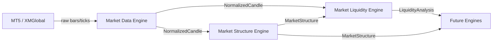

# Canon AI Trading — System Architecture

**Version:** Sprint 3 (Market Data + Market Structure + Market Liquidity)  
**Status:** Production-ready analysis pipeline (Sprints 1–3)  
**Symbol:** XAUUSD / GOLD.i# (XMGlobal via MT5)

This document describes the end-to-end system architecture for the implemented engine pipeline. It consolidates Sprint 1–3 deliverables and defines extension points for future engines.

**Related documentation:**

| Engine | Architecture | Public Interfaces |
|--------|--------------|-------------------|
| Market Data | [docs/market-data/ARCHITECTURE.md](./market-data/ARCHITECTURE.md) | [docs/market-data/PUBLIC_INTERFACES.md](./market-data/PUBLIC_INTERFACES.md) |
| Market Structure | [docs/market-structure/ARCHITECTURE.md](./market-structure/ARCHITECTURE.md) | [docs/market-structure/PUBLIC_INTERFACES.md](./market-structure/PUBLIC_INTERFACES.md) |
| Market Liquidity | [docs/market-liquidity/ARCHITECTURE.md](./market-liquidity/ARCHITECTURE.md) | [docs/market-liquidity/PUBLIC_INTERFACES.md](./market-liquidity/PUBLIC_INTERFACES.md) |

---

## 1. System Overview

Canon AI Trading is an engine-based platform that ingests gold market data from MetaTrader 5, runs independent analysis engines in sequence, and will eventually synthesize decisions and deliver explainable alerts.

### Current Implementation Scope (Sprints 1–3)

```
┌─────────────────────────────────────────────────────────────────────┐
│                        FastAPI Application                          │
│                     backend/main.py (lifespan)                      │
│              Market Data Engine started on app boot                 │
└───────────────────────────────┬─────────────────────────────────────┘
                                │
                                ▼
┌─────────────────────────────────────────────────────────────────────┐
│                     Analysis Engine Pipeline                      │
│                                                                     │
│   ┌──────────────┐    ┌──────────────────┐    ┌─────────────────┐  │
│   │ Market Data  │───▶│ Market Structure │───▶│ Market Liquidity│  │
│   │   Engine     │    │     Engine       │    │     Engine      │  │
│   │  (Sprint 1)  │    │   (Sprint 2)     │    │   (Sprint 3)    │  │
│   └──────────────┘    └──────────────────┘    └─────────────────┘  │
│         │                      │                       │           │
│         ▼                      ▼                       ▼           │
│  NormalizedCandle      MarketStructure         LiquidityAnalysis   │
└─────────────────────────────────────────────────────────────────────┘
                                │
                                ▼
                    Future: Smart Money, Decision, Risk, Notification
```

### Planned Full Platform (Future Sprints)

```
Market Data → Structure → Liquidity → Smart Money → Trend → Price Action
    → Macro/News/Volatility → Risk → Decision → Notification
```

Each engine is a self-contained module under `backend/engines/` with its own config, schemas, validator, detector(s), events, and tests.

---

## 2. Overall Engine Pipeline

### Sequential Analysis Flow

The implemented pipeline follows a strict dependency chain:

| Stage | Engine | Input | Output |
|-------|--------|-------|--------|
| 1 | **Market Data** | MT5 raw ticks/bars | `NormalizedCandle`, `NormalizedTick` |
| 2 | **Market Structure** | `NormalizedCandle[]` | `MarketStructure` |
| 3 | **Market Liquidity** | `NormalizedCandle[]` + `MarketStructure` | `LiquidityAnalysis` |

### Orchestration Model

Today, orchestration is **explicit and programmatic**:

```python
candles = market_data_engine.load_historical_candles(timeframe="H1")
structure = structure_engine.analyze(candles, timeframe="H1")
liquidity = liquidity_engine.analyze(candles, structure, timeframe="H1")
```

A central orchestrator service (future sprint) will:

1. Subscribe to `market.candle.closed` from Market Data
2. Trigger downstream engines in dependency order
3. Persist state and publish cross-engine events

### Engine Module Pattern

Every production engine follows the same skeleton:

```
backend/engines/<engine_name>/
├── __init__.py       # Public exports only
├── config.py         # Pydantic config + load_*_config()
├── schemas.py        # Frozen canonical output types
├── exceptions.py     # Prefixed error codes (MDE_, MSE_, LQE_, ...)
├── validator.py      # Input validation
├── engine.py         # Public orchestrator (DI-friendly)
├── detector.py       # Analysis orchestration (where applicable)
├── events.py         # Event envelope
├── publisher.py      # In-memory pub/sub
└── README.md
```

---

## 3. Data Flow

### 3.1 Market Data Engine (Sprint 1)

```
MT5 Terminal (XMGlobal)
        │
        ▼
MT5ConnectionManager ──► BrokerValidator ──► SymbolManager
        │
        ▼
HistoricalDataLoader / LiveMarketDataLoader
        │
        ▼
MarketDataNormalizer
        │
        ▼
DataValidator
        │
        ▼
NormalizedCandle / NormalizedTick
        │
        ▼
EventPublisher (market.tick.received, market.candle.updated, ...)
```

**Canonical output:** `NormalizedCandle`

| Field | Type | Notes |
|-------|------|-------|
| `symbol` | `str` | e.g. `GOLD.i#`, `XAUUSD` |
| `timeframe` | `str` | `H1`, `M15`, etc. |
| `open`, `high`, `low`, `close` | `Decimal` | OHLC |
| `volume` | `int` | Tick volume |
| `open_time_utc`, `close_time_utc` | `datetime` | UTC timestamps |
| `is_closed` | `bool` | Forming vs closed bar |

**Boundary rule:** Downstream engines import `NormalizedCandle` from the public package only. They never import MT5, broker, or normalizer internals.

### 3.2 Market Structure Engine (Sprint 2)

```
NormalizedCandle[]
        │
        ▼
StructureInputValidator
        │
        ▼
StructureDetector
  ├── SwingDetector (internal / external / primary lookback)
  ├── TrendAnalyzer (HH, HL, LH, LL, trend)
  ├── BOSDetector
  └── CHoCHDetector
        │
        ▼
MarketStructure
        │
        ▼
StructureEventPublisher
```

**Canonical output:** `MarketStructure`

Key fields consumed by Liquidity Engine:

- `swing_highs`, `swing_lows` — for equal high/low clustering
- `internal_structure` — internal swing highs/lows
- `current_trend`, `confidence`, `evidence`

**Boundary rule:** Market Structure imports only from `backend.engines.market_data` public API. No Liquidity, Smart Money, or Decision imports.

### 3.3 Market Liquidity Engine (Sprint 3)

```
NormalizedCandle[] + MarketStructure
        │
        ▼
LiquidityInputValidator
        │
        ▼
LiquidityDetector
  ├── ExternalLiquidityDetector (previous, weekly, daily, session H/L)
  ├── EqualLiquidityDetector (equal highs/lows, buy/sell side)
  ├── SweepDetector (sweeps, grabs)
  └── ZoneBuilder (liquidity zones)
        │
        ▼
LiquidityAnalysis
        │
        ▼
LiquidityEventPublisher
```

**Canonical output:** `LiquidityAnalysis`

| Category | Fields |
|----------|--------|
| Levels | `external_liquidity`, `internal_liquidity` |
| Equal clusters | `equal_highs`, `equal_lows` |
| Side bias | `buy_side_liquidity`, `sell_side_liquidity`, `bias` |
| Events | `sweeps`, `grabs`, `zones` |
| Metadata | `confidence`, `evidence`, `state` |

**Boundary rule:** Liquidity consumes `NormalizedCandle` (Sprint 1) and `MarketStructure` (Sprint 2) public types only.

### 3.3 Data Flow Diagram



---

## 4. Public Interfaces

### 4.1 Market Data Engine

**Package:** `backend.engines.market_data`

| Symbol | Kind |
|--------|------|
| `MarketDataEngine` | Orchestrator |
| `MarketDataConfig`, `load_market_data_config()` | Configuration |
| `NormalizedCandle`, `NormalizedTick` | Output schemas |
| `EventPublisher`, `MarketEvent` | Events |
| `EngineStatus`, `ValidationResult` | Status / validation |

**Key methods (`MarketDataEngine`):**

| Method | Returns |
|--------|---------|
| `start()` / `stop()` | Lifecycle |
| `load_historical_candles(symbol, timeframe, count)` | `list[NormalizedCandle]` |
| `get_latest_candle(symbol, timeframe)` | `NormalizedCandle` |
| `get_latest_tick(symbol)` | `NormalizedTick` |
| `validate_candles(candles)` | `ValidationResult` |
| `get_status()` | `EngineStatus` |

### 4.2 Market Structure Engine

**Package:** `backend.engines.market_structure`

| Symbol | Kind |
|--------|------|
| `MarketStructureEngine` | Orchestrator |
| `MarketStructureConfig`, `load_market_structure_config()` | Configuration |
| `MarketStructure`, `SwingPoint`, `StructureState` | Output schemas |
| `StructureEventPublisher`, `StructureAnalysisEvent` | Events |
| `TrendDirection`, `SwingLabel`, `BOSEvent`, `CHoCHEvent` | Enums / events |

**Key methods (`MarketStructureEngine`):**

| Method | Returns |
|--------|---------|
| `analyze(candles, *, timeframe, prior_state)` | `MarketStructure` |
| `analyze_candle(candle, history, *, prior_state)` | `MarketStructure` |
| `reset_state()` | Clears continuity state |
| `handle_config_updated(config)` | Hot reload |

### 4.3 Market Liquidity Engine

**Package:** `backend.engines.market_liquidity`

| Symbol | Kind |
|--------|------|
| `LiquidityEngine` | Orchestrator |
| `MarketLiquidityConfig`, `load_market_liquidity_config()` | Configuration |
| `LiquidityAnalysis`, `LiquidityLevel`, `LiquidityZone` | Output schemas |
| `LiquidityEventPublisher`, `LiquidityAnalysisEvent` | Events |
| `LiquiditySide`, `SweepDirection`, `SweepQuality` | Enums |

**Key methods (`LiquidityEngine`):**

| Method | Returns |
|--------|---------|
| `analyze(candles, structure, *, timeframe)` | `LiquidityAnalysis` |
| `detect_equal_highs(structure)` | `list[EqualLevelCluster]` |
| `detect_equal_lows(structure)` | `list[EqualLevelCluster]` |
| `detect_buy_side(equal_highs)` | `list[LiquidityLevel]` |
| `detect_sell_side(equal_lows)` | `list[LiquidityLevel]` |
| `detect_sweeps(candles, levels, timeframe)` | `list[LiquiditySweep]` |
| `detect_grabs(candles, sweeps, timeframe)` | `list[LiquidityGrab]` |
| `publish_events(analysis)` | Publishes all liquidity events |

---

## 5. Event Flow

Each engine publishes events through an in-memory publisher with wildcard (`"*"`) subscription support. Contract-style event names follow the `analysis.<engine>.<action>` pattern.

### 5.1 Market Data Events

| Event | Trigger |
|-------|---------|
| `market.connection.established` | MT5 connected |
| `market.connection.lost` | MT5 disconnected |
| `market.tick.received` | Live tick normalized |
| `market.candle.updated` | Forming candle updated |
| `market.candle.closed` | Bar closed (contract) |
| `market.data.validation_failed` | Validation issues |

### 5.2 Market Structure Events

| Event | Trigger |
|-------|---------|
| `SwingDetected` | Swing high/low confirmed |
| `BOSDetected` | Break of structure |
| `CHoCHDetected` | Change of character |
| `TrendChanged` | Trend classification shift |
| `StructureUpdated` | Full analysis complete |
| `analysis.structure.completed` | Contract completion event |
| `analysis.structure.bos_detected` | Contract BOS event |
| `analysis.structure.choch_detected` | Contract CHoCH event |
| `analysis.structure.bias_changed` | Contract trend change |

### 5.3 Market Liquidity Events

| Event | Trigger |
|-------|---------|
| `LiquidityDetectedEvent` | Liquidity level identified |
| `LiquiditySweepEvent` | Sweep detected |
| `LiquidityGrabEvent` | Grab after sweep |
| `LiquidityZoneEvent` | Zone created |
| `analysis.liquidity.completed` | Full analysis complete |
| `analysis.liquidity.pool_identified` | Contract pool event |
| `analysis.liquidity.sweep_detected` | Contract sweep event |

### 5.4 Event Envelope

All analysis engines use a consistent envelope:

```python
{
    "event_id": "uuid",
    "timestamp_utc": "ISO-8601",
    "symbol": "GOLD.i#",
    "source_engine": "market_structure | market_liquidity",
    "event_type": "BOSDetected | LiquiditySweepEvent | ...",
    "payload": { ... }
}
```

### 5.5 Future Event Bus

Today, publishers are **in-process only**. A future orchestrator will:

1. Bridge engine publishers to a global event bus
2. Route `market.candle.closed` → Structure → Liquidity → Smart Money
3. Persist events for audit and dashboard replay

---

## 6. Configuration Hierarchy

Configuration merges from three layers (highest priority first):

```
1. Constructor injection (tests, custom wiring)
2. config/settings.yaml (per-engine sections)
3. Pydantic model defaults (code)
4. Environment variables via Settings (.env) — Market Data only
```

### 6.1 YAML Structure

```yaml
app:                    # Application metadata
market_data:            # Sprint 1 — MT5, symbol, timeframes
market_structure:       # Sprint 2 — swing lookback, min candles
market_liquidity:       # Sprint 3 — tolerance, lookback, sessions
engines:                # Feature toggles per engine
logging:                # Log level
```

### 6.2 Engine Toggles

```yaml
engines:
  market_data: true
  market_structure: true
  market_liquidity: true
  smart_money: false      # Sprint 4+
  decision: false
  notification: false
```

Each engine's `load_*_config()` reads its YAML section and the corresponding `engines.*` toggle for `enabled`.

### 6.3 Config Loaders

| Engine | Loader | YAML Key |
|--------|--------|----------|
| Market Data | `load_market_data_config(settings, yaml_path)` | `market_data` |
| Market Structure | `load_market_structure_config(yaml_path)` | `market_structure` |
| Market Liquidity | `load_market_liquidity_config(yaml_path)` | `market_liquidity` |

### 6.4 Key Parameters by Engine

| Engine | Critical Parameters |
|--------|-------------------|
| Market Data | `symbol`, `broker`, `timeframes`, `history_bars`, `stale_threshold_sec` |
| Market Structure | `swing_lookback`, `internal/external_swing_lookback`, `min_candles`, `min_confidence` |
| Market Liquidity | `equal_high/low_tolerance`, `pip_size`, `minimum_cluster_size`, `lookback`, `session_filter` |

---

## 7. Extension Points for Future Engines

### 7.1 Adding a New Engine

1. Create `backend/engines/<engine_name>/` following the module pattern above
2. Define frozen Pydantic output schemas
3. Export public API exclusively through `__init__.py`
4. Add `load_<engine>_config()` and YAML section to `config/settings.yaml.example`
5. Add engine toggle under `engines:`
6. Write unit tests, integration pipeline test, and live verification script
7. Document under `docs/<engine-name>/`

### 7.2 Dependency Rules

| Rule | Description |
|------|-------------|
| **Downstream only** | Engines consume outputs from upstream engines, never vice versa |
| **Public API only** | Import from `backend.engines.<name>` package exports, not internal modules |
| **No cross-detector imports** | Detectors within an engine do not import sibling engines |
| **Single responsibility** | Each engine owns one analysis domain |

### 7.3 Planned Extension Chain

| Sprint | Engine | Consumes |
|--------|--------|----------|
| 4 | Smart Money | `NormalizedCandle`, `MarketStructure`, `LiquidityAnalysis` |
| 5+ | Trend, Price Action | Structure + prior analysis outputs |
| 6+ | Macro, News, Volatility | Candles + external data feeds |
| 7+ | Risk | All analysis outputs |
| 8+ | Decision | All analysis outputs → signals / NO TRADE |
| 9+ | Notification | Decision output → Telegram |

### 7.4 Orchestrator Extension Point

Future `backend/orchestrator/` (or similar) will expose:

```python
class AnalysisOrchestrator:
    def on_candle_closed(self, candle: NormalizedCandle) -> AnalysisBundle: ...
    def register_engine(self, engine: AnalysisEngineProtocol) -> None: ...
```

Engines implement a common protocol:

- `analyze(inputs) -> AnalysisResult`
- `publisher: EventPublisherProtocol`
- `config: BaseModel`
- `handle_config_updated(config) -> None`

### 7.5 FastAPI Integration Point

`backend/main.py` lifespan currently wires only Market Data:

```python
app.state.market_data_engine = market_data_engine
```

Future sprints will add:

```python
app.state.structure_engine = ...
app.state.liquidity_engine = ...
app.state.orchestrator = ...
```

---

## 8. Error Handling Strategy

### 8.1 Exception Hierarchy

All engines inherit from `CanonTradingError` (`backend/core/exceptions.py`) with prefixed codes:

| Engine | Base Exception | Code Prefix |
|--------|---------------|-------------|
| Market Data | `MarketDataError` | `MDE_` |
| Market Structure | `MarketStructureError` | `MSE_` |
| Market Liquidity | `MarketLiquidityError` | `LQE_` |

### 8.2 Error Categories

| Category | Strategy | Example |
|----------|----------|---------|
| **Insufficient data** | Raise; caller decides retry | `MSE_INSUFFICIENT_DATA`, `LQE_INSUFFICIENT_DATA` |
| **Validation failure** | Raise with error details | Invalid OHLC, mixed symbols, structure mismatch |
| **Unsupported timeframe** | Raise | Timeframe not in config |
| **Connection failure** | Raise; engine status degraded | `MDE_MT5_CONNECTION` |
| **Stale feed** | Raise on explicit check | `MDE_STALE_FEED` |
| **Duplicate state** | Raise | `LQE_DUPLICATE_ZONE` |
| **Gap detection** | Warn + include in ValidationResult | Weekend gaps on H1 (expected for GOLD) |

### 8.3 Fail-Fast vs. Degrade

| Layer | Behavior |
|-------|----------|
| Input validation | **Fail fast** — reject invalid candles/structure before analysis |
| MT5 connection | **Fail fast** on start; status reflects degraded state |
| Missing structure context | Liquidity proceeds if structure is `None`; enrichment reduced |
| Low confidence | Analysis completes; evidence notes threshold |

### 8.4 Logging

All engines use structured logging via `backend/core/logging.py`:

```python
logger.info("Analyzing market structure", extra={"symbol": ..., "timeframe": ..., "candles": ...})
```

FastAPI registers global exception handlers via `register_exception_handlers(app)`.

---

## 9. Testing Strategy

### 9.1 Test Pyramid

```
                    ┌─────────────┐
                    │ Live MT5    │  verify_*_pipeline.py
                    │ Verification│  (requires MT5 terminal)
                   ─┼─────────────┼─
                  / │ Integration │ \  test_*_pipeline.py
                 /  │   Tests     │  \ (synthetic candles, no MT5)
                /   └─────────────┘   \
               /    ┌─────────────┐    \
              /     │  Unit Tests │     \
             /      │  (per module)│      \
            ────────────────────────────────
```

**Current totals:** 92 tests (48 Sprint 1 + 21 Sprint 2 + 23 Sprint 3)

### 9.2 Unit Tests

Location: `tests/unit/engines/`

| Pattern | Description |
|---------|-------------|
| Synthetic candles | `make_candle()`, `build_bullish_structure_candles()` |
| Mock MT5 | `MockMT5Client` for Market Data tests |
| Config fixtures | Per-engine `*Config` with small lookbacks |
| DI injection | Pass mock publisher, detector, validator to engine constructor |
| Edge cases | Empty data, invalid OHLC, unsupported timeframes, duplicates |

### 9.3 Integration Tests

Location: `tests/integration/test_*_pipeline.py`

- Verify type contracts between engines
- No live MT5 required
- Example: `NormalizedCandle` → `MarketStructure` → `LiquidityAnalysis`

### 9.4 Live Verification Scripts

Location: `tests/integration/verify_*_pipeline.py`

| Script | Pipeline |
|--------|----------|
| `verify_market_data_pipeline.py` | MT5 → Market Data |
| `verify_market_structure_pipeline.py` | MT5 → MDE → MSE |
| `verify_market_liquidity_pipeline.py` | MT5 → MDE → MSE → Liquidity |

Each script:

1. Starts Market Data Engine
2. Pulls live GOLD.i# candles
3. Runs downstream analysis
4. Prints `[PASS]/[FAIL]` checklist
5. Returns exit code 0/1

### 9.5 Regression Policy

- Sprint N tests must never break when Sprint N+1 is added
- Prior sprint engine code is frozen (no modifications)
- New tests are additive only

---

## 10. Integration Strategy

### 10.1 Current Integration State

| Component | Integrated | Notes |
|-----------|------------|-------|
| Market Data → FastAPI lifespan | Yes | `app.state.market_data_engine` |
| Market Structure → FastAPI | No | Programmatic / test only |
| Market Liquidity → FastAPI | No | Programmatic / test only |
| Cross-engine orchestrator | No | Explicit call chain |
| Global event bus | No | In-memory per-engine publishers |
| SQLite persistence | No | Future sprint |
| Dashboard API | No | Future sprint |

### 10.2 Recommended Integration Phases

**Phase 1 — Engine Chain (Complete for Sprints 1–3)**

```
MT5 → MDE → MSE → LQE (programmatic)
```

**Phase 2 — Orchestrator (Next)**

- Wire `on_candle_closed` to trigger Structure → Liquidity
- Register engines in FastAPI lifespan
- Unified `AnalysisBundle` response type

**Phase 3 — Event Bus**

- Replace in-memory publishers with shared bus
- Enable async downstream processing
- Event audit log in SQLite

**Phase 4 — API + Dashboard**

- REST endpoints for latest analysis per timeframe
- WebSocket stream for live events
- React dashboard consumption

**Phase 5 — Decision + Notification**

- Decision Engine synthesizes all analysis outputs
- Notification Engine delivers Telegram alerts

### 10.3 Deployment Integration

```
┌──────────────┐     ┌──────────────┐     ┌──────────────┐
│  MT5 Terminal│     │ FastAPI      │     │  SQLite DB   │
│  (Windows)   │────▶│ Backend      │────▶│  (future)    │
└──────────────┘     └──────┬───────┘     └──────────────┘
                            │
                     ┌──────┴───────┐
                     │ Engine       │
                     │ Pipeline     │
                     └──────────────┘
```

- Backend runs via `uvicorn backend.main:app`
- MT5 must be running locally with XMGlobal login
- Symbol configured as `GOLD.i#` in local `.env` / `settings.yaml`

### 10.4 Cross-Sprint Integrity Rules

| Rule | Enforcement |
|------|-------------|
| Sprint 1 frozen | No edits to `backend/engines/market_data/` |
| Sprint 2 frozen | No edits to `backend/engines/market_structure/` |
| Public API stability | Downstream engines import only from `__init__.py` exports |
| Independent compilation | Each engine compiles and tests independently |

---

## 11. Directory Reference

```
backend/
├── main.py                          # FastAPI entry (MDE wired)
├── core/                            # Config, logging, exceptions
└── engines/
    ├── market_data/                 # Sprint 1 — PRODUCTION
    ├── market_structure/            # Sprint 2 — PRODUCTION
    ├── market_liquidity/            # Sprint 3 — PRODUCTION
    ├── smart_money/                 # Sprint 4 — placeholder
    ├── liquidity/                   # Sprint 0 — legacy placeholder
    ├── decision/                    # Future
    └── notification/                # Future

config/
├── settings.yaml.example            # All engine config sections
└── settings.yaml                    # Local (not committed)

tests/
├── unit/engines/                    # Per-engine unit tests
└── integration/
    ├── test_*_pipeline.py           # Synthetic pipeline tests
    └── verify_*_pipeline.py         # Live MT5 verification

docs/
├── SYSTEM_ARCHITECTURE.md           # This document
├── market-data/                     # Sprint 1 docs
├── market-structure/                # Sprint 2 docs
└── market-liquidity/                # Sprint 3 docs
```

---

## 12. Summary

The Canon AI Trading platform implements a layered, engine-based analysis pipeline. Market Data normalizes MT5 gold prices into canonical candles. Market Structure applies Smart Money Concepts to detect swings, trend, BOS, and CHoCH. Market Liquidity identifies institutional liquidity levels, equal highs/lows, sweeps, grabs, and zones.

Each engine is independently testable, configuration-driven, and event-capable. The system is designed for incremental extension: future engines consume upstream public outputs without modifying prior sprints. Orchestration, persistence, and user-facing delivery remain the next integration milestones.
