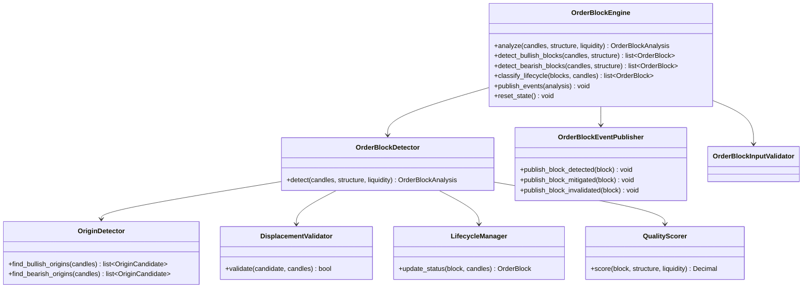

# Order Block Engine — Architecture Specification

**Engine ID:** `order_block`  
**Sprint:** 4.1 (Architecture only)  
**Version:** 0.1.0-spec  
**Status:** Architecture specification — not implemented  
**Symbol:** XAUUSD / GOLD.i#  
**Architecture Status:** FROZEN (Sprints 1–3 unchanged)

---

## Purpose

The Order Block Engine identifies institutional order block zones on gold price action. It consumes normalized candles and upstream analysis context (market structure and liquidity) to detect, classify, and lifecycle-manage order blocks without emitting trade signals.

Order blocks represent the last opposing candle before a displacement move — areas where institutional orders are hypothesized to remain unfilled or partially filled.

---

## Responsibilities

| In Scope | Description |
|----------|-------------|
| Order block detection | Identify bullish and bearish order block zones from candle sequences |
| Lifecycle classification | Label blocks as fresh, mitigated, or invalidated |
| Context enrichment | Use structure trend, BOS/CHoCH, and liquidity sweeps as supporting evidence |
| Event publishing | Emit order block lifecycle events |
| State continuity | Track active blocks across analysis cycles |
| Evidence generation | Human-readable reasoning for every detected block |

| Out of Scope | Owner |
|--------------|-------|
| Breaker blocks | Future sprint |
| Mitigation blocks (as distinct entity) | Future sprint |
| Fair value gaps | Future sprint |
| Trade signals / entries | Decision Engine |
| Risk sizing | Risk Engine |
| Telegram / dashboard | Notification / Presentation layers |
| AI inference | Future sprint |

---

## Dependencies

### Upstream (Required / Optional)

| Engine | Module | Required | Consumes |
|--------|--------|----------|----------|
| Market Data Engine | `backend.engines.market_data` | **Yes** | `NormalizedCandle` |
| Market Structure Engine | `backend.engines.market_structure` | **Recommended** | `MarketStructure` |
| Market Liquidity Engine | `backend.engines.market_liquidity` | **Optional** | `LiquidityAnalysis` |

### Internal

| Dependency | Description |
|------------|-------------|
| Configuration | `config/settings.yaml` → `order_block` section |
| Event publisher | In-memory pub/sub (consistent with Sprints 1–3) |
| Core utilities | `backend.core.config`, `backend.core.logging`, `backend.core.exceptions` |

### Downstream (Future)

| Consumer | Uses |
|----------|------|
| Smart Money Engine (future) | May aggregate order blocks with FVG/breakers |
| Decision Engine | Context only — no direct coupling in Sprint 4.1 |
| Dashboard | Visualization (future) |

---

## Inputs

| Input | Type | Source | Required |
|-------|------|--------|----------|
| `candles` | `list[NormalizedCandle]` | Market Data Engine | Yes |
| `structure` | `MarketStructure` | Market Structure Engine | Recommended |
| `liquidity` | `LiquidityAnalysis` | Market Liquidity Engine | No |
| `timeframe` | `str` | Caller / candle metadata | Yes |
| `prior_state` | `OrderBlockState` | Previous engine invocation | No |

### Input Constraints

- Minimum closed candle count per configuration (`min_candles`)
- Single symbol and single timeframe per analysis call
- Candles must be chronologically ordered
- Structure and liquidity symbol/timeframe must match candle batch when provided

---

## Outputs

### Primary Output: `OrderBlockAnalysis`

| Field | Type | Description |
|-------|------|-------------|
| `symbol` | `str` | Instrument identifier |
| `timeframe` | `str` | Analysis timeframe |
| `timestamp_utc` | `datetime` | Analysis timestamp (UTC) |
| `order_blocks` | `list[OrderBlock]` | All tracked order blocks |
| `fresh_blocks` | `list[OrderBlock]` | Untested blocks |
| `mitigated_blocks` | `list[OrderBlock]` | Blocks with price re-entry |
| `invalidated_blocks` | `list[OrderBlock]` | Broken or expired blocks |
| `bias` | `OrderBlockBias` | `bullish`, `bearish`, `neutral`, `undetermined` |
| `confidence` | `Decimal` | 0.0–1.0 |
| `evidence` | `list[str]` | Human-readable reasoning |
| `state` | `OrderBlockState` | Serializable continuity state |
| `events` | `list[OrderBlockEvent]` | Timeline of block lifecycle events |

### Order Block Entity: `OrderBlock`

| Field | Type | Description |
|-------|------|-------------|
| `block_id` | `str` | Unique identifier |
| `direction` | `OrderBlockDirection` | `bullish`, `bearish` |
| `status` | `OrderBlockStatus` | `fresh`, `mitigated`, `invalidated` |
| `high` | `Decimal` | Zone upper bound (wick/body rule per config) |
| `low` | `Decimal` | Zone lower bound |
| `origin_bar_index` | `int` | Bar index of origin candle |
| `origin_time_utc` | `datetime` | Origin candle open time |
| `displacement_bar_index` | `int` | Bar that confirmed displacement |
| `mitigation_bar_index` | `int \| None` | Bar that mitigated the block |
| `invalidation_bar_index` | `int \| None` | Bar that invalidated the block |
| `quality` | `OrderBlockQuality` | `high`, `medium`, `low` |
| `strength` | `Decimal` | 0.0–1.0 composite score |
| `structure_alignment` | `bool` | Aligns with current structure trend |
| `liquidity_confluence` | `bool` | Near swept liquidity level |
| `evidence` | `list[str]` | Block-specific reasoning |

---

## Component Architecture

### Planned Module Layout

```
backend/engines/market_order_block/     # Sprint 4.2+ implementation
├── __init__.py           # Public exports
├── config.py             # OrderBlockConfig + load_order_block_config()
├── schemas.py            # OrderBlockAnalysis, OrderBlock, enums
├── exceptions.py         # OBE_* errors
├── validator.py          # Input validation
├── detector.py           # Detection orchestrator
├── origin.py             # Origin candle identification
├── displacement.py       # Displacement move validation
├── lifecycle.py          # Fresh → mitigated → invalidated
├── quality.py            # Quality scoring
├── events.py             # OrderBlockAnalysisEvent envelope
├── publisher.py          # OrderBlockEventPublisher
└── engine.py             # OrderBlockEngine (public API)
```

### Class Diagram



---

## Validation Strategy

### Input Validation (`OrderBlockInputValidator`)

| Layer | Validates | On Failure |
|-------|-----------|------------|
| Candles | Non-empty, single symbol/timeframe, valid OHLC, no duplicate timestamps, chronological order | `OBE_VALIDATION_FAILED` |
| Candle count | `>= min_candles` closed candles | `OBE_INSUFFICIENT_DATA` |
| Timeframe | Must be in `config.timeframes` | `OBE_TIMEFRAME_UNSUPPORTED` |
| Structure context | Symbol/timeframe match when provided; non-empty swings optional | `OBE_INVALID_STRUCTURE` |
| Liquidity context | Symbol/timeframe match when provided | `OBE_INVALID_LIQUIDITY` |
| Block state | No duplicate `block_id` in active state | `OBE_DUPLICATE_BLOCK` |
| Prior state | Deserializable and consistent bar count | `OBE_STATE_CORRUPT` |

### Detection Validation

| Rule | Purpose |
|------|---------|
| Minimum displacement | Reject origin candidates without sufficient follow-through |
| Minimum quality score | Exclude blocks below `min_quality_score` |
| Maximum block age | Expire blocks beyond `max_block_age_bars` |
| Structure alignment gate | Optional filter when `require_structure_alignment=true` |

### Validation Philosophy

- **Fail fast** on malformed inputs before detection runs
- **Degrade gracefully** when optional context (structure, liquidity) is missing
- **Never force** block detection when evidence is insufficient (Constitution: NO TRADE is success)

---

## Logging Strategy

Structured logging via `backend/core/logging.py` (consistent with Sprints 1–3).

### Log Levels

| Level | Usage |
|-------|-------|
| `INFO` | Analysis start/complete, block counts, bias result |
| `DEBUG` | Origin candidates, displacement checks, lifecycle transitions |
| `WARNING` | Missing optional context, low confidence, config fallback |
| `ERROR` | Unrecoverable failures with `OBE_*` code in `extra` |

### Structured Fields

```python
logger.info(
    "Order block analysis complete",
    extra={
        "symbol": analysis.symbol,
        "timeframe": analysis.timeframe,
        "fresh": len(analysis.fresh_blocks),
        "mitigated": len(analysis.mitigated_blocks),
        "invalidated": len(analysis.invalidated_blocks),
        "bias": analysis.bias.value,
    },
)
```

### What Is Not Logged

- Raw MT5 credentials or connection tokens
- Full candle arrays (use counts only)
- Trade signals (engine emits none)

---

## Error Conditions

| Code | Condition | Engine Behavior |
|------|-----------|-----------------|
| `OBE_INSUFFICIENT_DATA` | Fewer candles than `min_candles` | Raise; no partial analysis |
| `OBE_VALIDATION_FAILED` | Invalid OHLC, duplicates, mixed symbols | Raise |
| `OBE_INVALID_STRUCTURE` | Structure context mismatch or corrupt | Raise when structure provided |
| `OBE_INVALID_LIQUIDITY` | Liquidity context mismatch | Raise when liquidity provided |
| `OBE_TIMEFRAME_UNSUPPORTED` | Timeframe not in config | Raise |
| `OBE_DUPLICATE_BLOCK` | Duplicate block ID in state | Raise |
| `OBE_STATE_CORRUPT` | Prior state unusable | Raise; caller may reset state |
| `OBE_ERROR` | Unexpected internal failure | Raise with details |

Error events published as `analysis.order_block.error` when publisher is available.

---

## Integration Points

| Integration | Sprint 4.1 Spec | Future Implementation |
|-------------|-----------------|----------------------|
| Programmatic pipeline | MDE → MSE → Liquidity → Order Block | Sprint 4.2 |
| FastAPI lifespan | Not wired | Orchestrator sprint |
| Event bus | In-memory publisher contract defined | Global bus sprint |
| SQLite persistence | Not specified | Future sprint |

### Pipeline Position

```
Market Data Engine
        │
        ▼
Market Structure Engine
        │
        ▼
Market Liquidity Engine
        │
        ▼
Order Block Engine          ← Sprint 4.1 architecture
        │
        ▼
Future: FVG, Breaker, Decision
```

---

## Future Extension Points

| Extension | Mechanism |
|-----------|-----------|
| Multi-timeframe confluence | Accept `OrderBlockAnalysis` from higher timeframes as context |
| Breaker block derivation | Consume invalidated order blocks (separate engine) |
| FVG overlap scoring | Optional `FairValueGap` input (separate engine) |
| Orchestrator registration | Implement `AnalysisEngineProtocol` |
| Global event bus | Replace in-memory publisher with shared bus adapter |
| Quality model tuning | Pluggable `QualityScorer` via dependency injection |

---

## Acceptance Criteria (Sprint 4.2 Implementation)

When implemented, the Order Block Engine must:

1. Detect bullish and bearish order blocks from `NormalizedCandle` batches
2. Classify each block as fresh, mitigated, or invalidated
3. Consume `MarketStructure` for trend/BOS/CHoCH alignment evidence
4. Optionally consume `LiquidityAnalysis` for sweep confluence
5. Publish all specified lifecycle events
6. Expose stable public API via `backend.engines.market_order_block`
7. Not modify Sprints 1, 2, or 3 code or public interfaces
8. Include unit tests, integration tests, and live verification script
9. Pass all tests independently and as part of full suite
10. Emit no trade signals, entries, stops, or targets

---

## Out of Scope (Sprint 4.1 and 4.2)

- Breaker block detection and classification
- Mitigation block as a separate entity type
- Fair value gap detection
- Entry / exit signal generation
- Risk assessment and position sizing
- Telegram notification delivery
- Dashboard UI components
- AI/ML model inference
- Modifications to Sprint 1, 2, or 3 engines

---

## Related Documents

| Document | Path |
|----------|------|
| Data Pipeline | [DATA_PIPELINE.md](./DATA_PIPELINE.md) |
| Public Interfaces | [PUBLIC_INTERFACES.md](./PUBLIC_INTERFACES.md) |
| Configuration | [CONFIGURATION.md](./CONFIGURATION.md) |
| Events | [EVENTS.md](./EVENTS.md) |
| System Architecture | [../../SYSTEM_ARCHITECTURE.md](../../SYSTEM_ARCHITECTURE.md) |
| Constitution | [../../CONSTITUTION.md](../../CONSTITUTION.md) |
