# Breaker Block Engine — Architecture Specification

**Engine ID:** `market_breaker`  
**Sprint:** 6.1 (Architecture only)  
**Version:** 0.1.0-spec  
**Status:** Architecture specification — not implemented  
**Symbol:** XAUUSD / GOLD.i#  
**Architecture Status:** FROZEN (Sprints 1–5 unchanged)

---

## Purpose

The Breaker Block Engine identifies institutional breaker block zones on gold price action. It consumes normalized candles and upstream analysis context (market structure, liquidity state, invalidated order blocks, and fair value gap state) to detect, confirm, classify, score, and lifecycle-manage breaker blocks without emitting trade signals.

Breaker blocks represent **failed institutional zones that flip polarity** — when a bullish order block is invalidated by a close below its zone, that zone may later act as bearish resistance on retest; conversely, an invalidated bearish order block may act as bullish support.

---

## Responsibilities

| In Scope | Description |
|----------|-------------|
| Breaker detection | Derive breaker candidates from invalidated order blocks (primary) and optionally invalidated FVGs |
| Polarity classification | Label breakers as bullish or bearish based on flipped zone role |
| Confirmation validation | Confirm breakers when price retests zone after invalidation |
| Lifecycle classification | Label breakers as candidate, confirmed, mitigated, invalidated, or expired |
| Mitigation tracking | Detect when price addresses the breaker zone per configuration |
| Invalidation tracking | Detect when breaker zone fails in opposing direction |
| Liquidity confluence | Score overlap with active liquidity zones and recent sweeps |
| FVG confluence | Score overlap with open/partial fair value gaps |
| Quality scoring | Composite strength score with configurable weights |
| Breaker expiration | Auto-expire breakers beyond configured age |
| Event publishing | Emit breaker lifecycle events |
| State continuity | Track active breakers across analysis cycles |
| Evidence generation | Human-readable reasoning for every detected breaker |

| Out of Scope | Owner |
|--------------|-------|
| Order block detection | Order Block Engine (Sprint 4) |
| Fair value gap detection | Fair Value Gap Engine (Sprint 5) |
| Mitigation blocks (as distinct entity) | Future sprint |
| Trade signals / entries | Decision Engine |
| Risk sizing | Risk Engine |
| Telegram / dashboard | Notification / Presentation layers |
| AI inference | Future sprint |

---

## Dependencies

### Upstream (Required / Optional)

| Engine | Module | Required | Consumes |
|--------|--------|----------|----------|
| Market Data Engine | `backend.engines.market_data` | **Yes** | `NormalizedCandle` |
| Market Structure Engine | `backend.engines.market_structure` | **Recommended** | `MarketStructure` |
| Market Liquidity Engine | `backend.engines.market_liquidity` | **Optional** | `LiquidityState` |
| Order Block Engine | `backend.engines.market_order_block` | **Yes** | `OrderBlock` (invalidated blocks only) |
| Fair Value Gap Engine | `backend.engines.market_fvg` | **Optional** | `FairValueGapState`, `FairValueGap` (invalidated gaps) |

### Input Boundary Rule

The Breaker Block Engine imports **only** the five upstream type categories listed above from public APIs. It does **not** consume `OrderBlockAnalysis`, `FairValueGapAnalysis`, `LiquidityAnalysis`, `NormalizedTick`, or any downstream engine types.

Callers are responsible for extracting:
- `invalidated_order_blocks` from `OrderBlockAnalysis.invalidated_blocks`
- `invalidated_fvgs` from `FairValueGapAnalysis.invalidated_gaps` (when FVG-derived breakers enabled)
- `FairValueGapState` from `FairValueGapAnalysis.state`
- `LiquidityState` from `LiquidityAnalysis.state` (or equivalent state accessor)

### Internal

| Dependency | Description |
|------------|-------------|
| Configuration | `config/settings.yaml` → `market_breaker` section |
| Event publisher | In-memory pub/sub (consistent with Sprints 1–5) |
| Core utilities | `backend.core.config`, `backend.core.logging`, `backend.core.exceptions` |

### Downstream (Future)

| Consumer | Uses |
|----------|------|
| Smart Money Engine (future) | May aggregate breakers with OBs and FVGs |
| Decision Engine | Context only — no direct coupling in Sprint 6.1 |
| Dashboard | Visualization (future) |

---

## Inputs

| Input | Type | Source | Required |
|-------|------|--------|----------|
| `candles` | `list[NormalizedCandle]` | Market Data Engine | Yes |
| `structure` | `MarketStructure` | Market Structure Engine | Recommended |
| `liquidity_state` | `LiquidityState` | Market Liquidity Engine | No |
| `invalidated_order_blocks` | `list[OrderBlock]` | Order Block Engine (extracted) | Yes |
| `fair_value_gap_state` | `FairValueGapState` | Fair Value Gap Engine | No |
| `invalidated_fvgs` | `list[FairValueGap]` | Fair Value Gap Engine (extracted) | No |
| `timeframe` | `str` | Caller / candle metadata | Yes |
| `prior_state` | `BreakerBlockState` | Previous engine invocation | No |

### Input Constraints

- Minimum closed candle count per configuration (`min_candles`)
- Single symbol and single timeframe per analysis call
- Candles must be chronologically ordered
- Structure symbol/timeframe must match candle batch when provided
- `invalidated_order_blocks` must contain only blocks with `status == invalidated`
- `LiquidityState` and `FairValueGapState` bar counts should be consistent with candle batch when provided
- Empty `invalidated_order_blocks` is valid — engine returns `undetermined` bias with no breakers (Constitution: NO TRADE is success)

---

## Outputs

### Primary Output: `BreakerBlockAnalysis`

| Field | Type | Description |
|-------|------|-------------|
| `symbol` | `str` | Instrument identifier |
| `timeframe` | `str` | Analysis timeframe |
| `timestamp_utc` | `datetime` | Analysis timestamp (UTC) |
| `breaker_blocks` | `list[BreakerBlock]` | All tracked breaker blocks |
| `candidate_breakers` | `list[BreakerBlock]` | Awaiting retest confirmation |
| `confirmed_breakers` | `list[BreakerBlock]` | Validated polarity-flip zones |
| `mitigated_breakers` | `list[BreakerBlock]` | Mitigated breakers |
| `invalidated_breakers` | `list[BreakerBlock]` | Failed breakers |
| `expired_breakers` | `list[BreakerBlock]` | Age-expired breakers |
| `bullish_breakers` | `list[BreakerBlock]` | Direction == bullish |
| `bearish_breakers` | `list[BreakerBlock]` | Direction == bearish |
| `bias` | `BreakerBlockBias` | `bullish`, `bearish`, `neutral`, `undetermined` |
| `confidence` | `Decimal` | 0.0–1.0 |
| `evidence` | `list[str]` | Human-readable reasoning |
| `state` | `BreakerBlockState` | Serializable continuity state |
| `events` | `list[BreakerBlockEvent]` | Timeline of breaker lifecycle events |

### Breaker Block Entity: `BreakerBlock`

| Field | Type | Description |
|-------|------|-------------|
| `breaker_id` | `str` | Unique identifier |
| `direction` | `BreakerBlockDirection` | `bullish`, `bearish` (post-flip role) |
| `status` | `BreakerBlockStatus` | Lifecycle status |
| `high` | `Decimal` | Zone upper bound |
| `low` | `Decimal` | Zone lower bound |
| `source_type` | `BreakerSourceType` | `order_block`, `fair_value_gap` |
| `source_id` | `str` | Origin block/gap ID |
| `source_direction` | `str` | Pre-flip direction of source zone |
| `invalidation_bar_index` | `int` | Bar that invalidated source zone |
| `invalidation_time_utc` | `datetime` | Invalidation timestamp |
| `formation_bar_index` | `int` | Bar at which breaker candidate registered |
| `formation_time_utc` | `datetime` | Candidate formation timestamp |
| `confirmation_bar_index` | `int \| None` | Bar that confirmed retest |
| `confirmation_time_utc` | `datetime \| None` | Confirmation timestamp |
| `mitigation_bar_index` | `int \| None` | Bar that mitigated the breaker |
| `invalidation_breaker_bar_index` | `int \| None` | Bar that invalidated the breaker |
| `expiration_bar_index` | `int \| None` | Bar at which breaker expired |
| `quality` | `BreakerBlockQuality` | `high`, `medium`, `low` |
| `strength` | `Decimal` | 0.0–1.0 composite score |
| `is_confirmed` | `bool` | Passed confirmation rules |
| `confirmation_reason` | `str` | Why breaker is or is not confirmed |
| `structure_alignment` | `bool` | Aligns with current structure trend |
| `liquidity_confluence` | `bool` | Overlaps liquidity zone or recent sweep |
| `fvg_confluence` | `bool` | Overlaps open/partial FVG |
| `liquidity_confluence_ids` | `list[str]` | Matched liquidity zone/sweep IDs |
| `fvg_confluence_ids` | `list[str]` | Matched FVG IDs |
| `premium_discount` | `PremiumDiscountZone` | Position relative to dealing range |
| `dealing_range_high` | `Decimal \| None` | Structure-derived range high |
| `dealing_range_low` | `Decimal \| None` | Structure-derived range low |
| `evidence` | `list[str]` | Breaker-specific reasoning |

### Continuity State: `BreakerBlockState`

| Field | Type | Description |
|-------|------|-------------|
| `active_breakers` | `list[BreakerBlock]` | Currently tracked breakers (candidate + confirmed) |
| `last_analysis_utc` | `datetime \| None` | Last analysis timestamp |
| `bar_count` | `int` | Candles processed |

---

## Canonical Schemas

### Enums

#### `BreakerBlockDirection`

| Value | Description |
|-------|-------------|
| `bullish` | Bullish breaker — former bearish zone now acting as demand support |
| `bearish` | Bearish breaker — former bullish zone now acting as supply resistance |

#### `BreakerBlockStatus`

| Value | Description |
|-------|-------------|
| `candidate` | Source zone invalidated; awaiting retest confirmation |
| `confirmed` | Price retested zone after invalidation — polarity flip validated |
| `mitigated` | Breaker zone addressed per mitigation rules |
| `invalidated` | Breaker failed — price closed beyond far boundary in opposing direction |
| `expired` | Breaker exceeded `max_breaker_age_bars` without resolution |

#### `BreakerBlockQuality`

| Value | Description |
|-------|-------------|
| `high` | Strong invalidation + confirmation + confluence |
| `medium` | Meets minimum criteria |
| `low` | Marginal — low confidence |

#### `BreakerBlockBias`

| Value | Description |
|-------|-------------|
| `bullish` | Dominant confirmed bullish breakers in discount |
| `bearish` | Dominant confirmed bearish breakers in premium |
| `neutral` | Balanced or no active confirmed breakers |
| `undetermined` | Insufficient data (Constitution: NO TRADE is success) |

#### `BreakerSourceType`

| Value | Description |
|-------|-------------|
| `order_block` | Derived from invalidated order block |
| `fair_value_gap` | Derived from invalidated fair value gap |

#### `BreakerBlockEventKind`

| Value | Description |
|-------|-------------|
| `BreakerBlockDetected` | New breaker candidate identified |
| `BullishBreakerBlockDetected` | New bullish breaker |
| `BearishBreakerBlockDetected` | New bearish breaker |
| `CandidateBreakerBlock` | Breaker registered as candidate |
| `ConfirmedBreakerBlock` | Breaker confirmation validated |
| `MitigatedBreakerBlock` | Breaker mitigated |
| `InvalidatedBreakerBlock` | Breaker invalidated |
| `ExpiredBreakerBlock` | Breaker expired |
| `LiquidityConfluenceBreaker` | Liquidity confluence detected |
| `FVGConfluenceBreaker` | FVG confluence detected |
| `BreakerBlockUpdated` | Full analysis complete |

### Supporting Types

#### `BreakerBlockEvent`

| Field | Type | Description |
|-------|------|-------------|
| `kind` | `BreakerBlockEventKind` | Event classification |
| `timestamp_utc` | `datetime` | Event time |
| `timeframe` | `str` | Analysis timeframe |
| `description` | `str` | Human-readable summary |
| `breaker_id` | `str \| None` | Affected breaker |
| `direction` | `BreakerBlockDirection \| None` | Breaker direction |
| `status` | `BreakerBlockStatus \| None` | Resulting status |
| `price` | `Decimal \| None` | Trigger price |
| `source_id` | `str \| None` | Origin block/gap ID |

All output schemas use frozen Pydantic models (`model_config = ConfigDict(frozen=True)`).

---

## Domain Concepts

### Bullish Breaker Block

Formed when a **bearish order block** (supply zone) is invalidated — price closes above the zone's upper boundary — and price later returns to retest that zone from above. The zone flips from resistance to support.

| Pre-Flip | Post-Flip |
|----------|-----------|
| Bearish OB (supply) | Bullish breaker (demand) |
| Invalidated by close above `high` | Confirmed on retest from above |

Institutional interpretation: trapped sellers at the failed supply zone provide support on revisit.

### Bearish Breaker Block

Formed when a **bullish order block** (demand zone) is invalidated — price closes below the zone's lower boundary — and price later returns to retest that zone from below. The zone flips from support to resistance.

| Pre-Flip | Post-Flip |
|----------|-----------|
| Bullish OB (demand) | Bearish breaker (supply) |
| Invalidated by close below `low` | Confirmed on retest from below |

Institutional interpretation: trapped buyers at the failed demand zone provide resistance on revisit.

### Breaker Formation (Candidate)

A breaker candidate is registered when:

1. An invalidated order block (or optionally invalidated FVG) is identified in upstream input
2. The invalidation occurred within the configured `lookback` window
3. The source zone meets minimum size and quality thresholds
4. No duplicate breaker exists for the same `source_id`

Candidate status means the polarity flip is **hypothesized but not yet confirmed** by price retest.

### Valid Breaker Confirmation

A candidate transitions to `confirmed` when price retests the breaker zone after invalidation per `confirmation_mode`:

| Mode | Confirmation Trigger |
|------|---------------------|
| `wick_touch` | Wick enters zone after invalidation bar |
| `body_touch` | Body enters zone after invalidation bar |
| `close_inside` | Close inside zone after invalidation bar |
| `rejection` | Touch + rejection candle (wick beyond zone, close outside in breaker direction) |

Additional gates (configurable):

| Gate | Purpose |
|------|---------|
| `require_displacement_after_invalidation` | Confirming move must show follow-through |
| `min_bars_after_invalidation` | Minimum bars between invalidation and retest |
| `max_bars_after_invalidation` | Retest must occur within window or candidate expires |
| `require_structure_alignment` | Breaker direction must align with structure trend |

### Breaker Lifecycle

```
invalidated source zone
        │
        ▼
   candidate ──(retest confirmed)──► confirmed
        │                                │
        │                                ├──► mitigated
        │                                │
        │                                └──► invalidated (failed)
        │
        └──► expired (age limit)
```

| Status | Condition (Conceptual) |
|--------|------------------------|
| **Candidate** | Source invalidated; zone registered; no retest yet |
| **Confirmed** | Price retested zone per confirmation rules |
| **Mitigated** | Price addressed zone per mitigation rules without breaker failure |
| **Invalidated** | Price closed beyond far boundary in direction that negates breaker role |
| **Expired** | Exceeded `max_breaker_age_bars` without confirmation or resolution |

### Breaker Mitigation

Mitigation occurs when price addresses the breaker zone without invalidating it:

| Trigger | Configuration |
|---------|---------------|
| Wick touch | `mitigation_mode: wick` |
| Body entry | `mitigation_mode: body` |
| Close inside zone | `mitigation_mode: close` |
| Partial traverse | `mitigation_percent` threshold |

Status transition: `confirmed` → `mitigated`.

Mitigation is distinct from invalidation — the breaker played its role but is no longer an active institutional target.

### Breaker Invalidation

A confirmed breaker is invalidated when price closes beyond the far boundary in the direction that negates the breaker's post-flip role:

| Breaker Direction | Invalidation |
|-------------------|--------------|
| Bullish breaker | Close below `low` |
| Bearish breaker | Close above `high` |

Invalidation mode configurable: `close`, `body`, `wick`.

### Breaker Expiration

Breakers exceeding `max_breaker_age_bars` without confirmation, mitigation, or invalidation transition to `expired`. Expired breakers remain in `expired_breakers` for evidence but are removed from `state.active_breakers`.

### Liquidity Confluence

When `LiquidityState` is provided:

| Criterion | Description |
|-----------|-------------|
| Zone overlap | Breaker `[low, high]` intersects active liquidity zone |
| Sweep proximity | Breaker within `liquidity_proximity_pips` of recent sweep level |
| Side alignment | Bullish breaker near buy-side sweep; bearish near sell-side sweep |

Produces `liquidity_confluence: true` and populates `liquidity_confluence_ids`.

### FVG Confluence

When `FairValueGapState` is provided:

| Criterion | Description |
|-----------|-------------|
| Zone overlap | Breaker boundaries intersect open/partial FVG |
| Direction alignment | Bullish breaker + bullish FVG in discount; bearish + bearish FVG in premium |
| CE proximity | Breaker midpoint within `fvg_ce_proximity_pips` of gap CE |

Produces `fvg_confluence: true` and populates `fvg_confluence_ids`.

### Premium / Discount Relationship

Derived from `MarketStructure` swing range (same model as FVG Engine):

```
equilibrium = (dealing_range_high + dealing_range_low) / 2

if breaker.midpoint > equilibrium + tolerance → premium
if breaker.midpoint < equilibrium - tolerance → discount
else → equilibrium
```

When structure is unavailable, `premium_discount` defaults to `equilibrium`.

### Breaker Quality Scoring

Composite score (0.0–1.0) from configurable weights:

| Factor | Default Weight | Source |
|--------|---------------|--------|
| Source block quality | 0.20 | Original `OrderBlock.strength` |
| Invalidation strength | 0.15 | Displacement beyond invalidation boundary |
| Confirmation quality | 0.20 | Rejection candle, displacement after retest |
| Structure alignment | 0.15 | `MarketStructure.current_trend` |
| Liquidity confluence | 0.10 | `LiquidityState` overlap/sweep |
| FVG confluence | 0.10 | `FairValueGapState` overlap |
| Premium/discount placement | 0.05 | Breaker in correct zone for direction |
| Freshness | 0.05 | Bars since confirmation |

Breakers below `min_quality_score` are excluded from output lists.

---

## Component Architecture

### Planned Module Layout

```
backend/engines/market_breaker/          # Sprint 6.2+ implementation
├── __init__.py           # Public exports
├── config.py             # BreakerBlockConfig + load_market_breaker_config()
├── schemas.py            # BreakerBlockAnalysis, BreakerBlock, enums
├── exceptions.py         # MBE_* errors
├── validator.py          # Input validation
├── detector.py           # Detection orchestrator
├── formation.py          # Derive candidates from invalidated OBs/FVGs
├── confirmation.py       # Valid breaker confirmation rules
├── lifecycle.py          # Candidate → confirmed → mitigated → invalidated → expired
├── mitigation.py         # Mitigation detection
├── confluence.py         # Liquidity + FVG confluence scoring
├── premium_discount.py   # Dealing range classification
├── quality.py            # Quality scoring
├── events.py             # BreakerBlockAnalysisEvent envelope
├── publisher.py          # BreakerBlockEventPublisher
└── engine.py             # BreakerBlockEngine (public API)
```

### Class Diagram

```mermaid
classDiagram
    class BreakerBlockEngine {
        +analyze(candles, structure, invalidated_order_blocks, ...) BreakerBlockAnalysis
        +detect_bullish_breakers(candles, invalidated_order_blocks) list~BreakerBlock~
        +detect_bearish_breakers(candles, invalidated_order_blocks) list~BreakerBlock~
        +classify_lifecycle(breakers, candles) list~BreakerBlock~
        +publish_events(analysis) void
        +reset_state() void
    }

    class BreakerBlockDetector {
        +detect(candles, structure, invalidated_order_blocks, ...) BreakerBlockAnalysis
    }

    class FormationDetector {
        +derive_from_order_blocks(invalidated_blocks) list~BreakerCandidate~
        +derive_from_fvgs(invalidated_fvgs) list~BreakerCandidate~
    }

    class ConfirmationValidator {
        +validate(candidate, candles) bool
        +compute_confirmation_reason(candidate, candles) str
    }

    class LifecycleManager {
        +update_status(breaker, candles) BreakerBlock
    }

    class MitigationTracker {
        +detect_mitigation(breaker, candles) bool
    }

    class ConfluenceScorer {
        +score_liquidity(breaker, liquidity_state) LiquidityConfluenceResult
        +score_fvg(breaker, fvg_state) FVGConfluenceResult
    }

    class PremiumDiscountClassifier {
        +classify(breaker, structure) PremiumDiscountZone
    }

    class QualityScorer {
        +score(breaker, structure, liquidity_state, fvg_state) Decimal
    }

    class BreakerBlockEventPublisher {
        +publish_breaker_detected(breaker) void
        +publish_breaker_confirmed(breaker) void
        +publish_breaker_mitigated(breaker) void
    }

    BreakerBlockEngine --> BreakerBlockDetector
    BreakerBlockEngine --> BreakerBlockInputValidator
    BreakerBlockEngine --> BreakerBlockEventPublisher
    BreakerBlockDetector --> FormationDetector
    BreakerBlockDetector --> ConfirmationValidator
    BreakerBlockDetector --> LifecycleManager
    BreakerBlockDetector --> MitigationTracker
    BreakerBlockDetector --> ConfluenceScorer
    BreakerBlockDetector --> PremiumDiscountClassifier
    BreakerBlockDetector --> QualityScorer
```



---

## Validation Strategy

### Input Validation (`BreakerBlockInputValidator`)

| Layer | Validates | On Failure |
|-------|-----------|------------|
| Candles | Non-empty, single symbol/timeframe, valid OHLC, no duplicate timestamps, chronological order | `MBE_VALIDATION_FAILED` |
| Candle count | `>= min_candles` closed candles | `MBE_INSUFFICIENT_DATA` |
| Timeframe | Must be in `config.timeframes` | `MBE_TIMEFRAME_UNSUPPORTED` |
| Structure context | Symbol/timeframe match when provided | `MBE_INVALID_STRUCTURE` |
| Liquidity state | Consistent bar count when provided | `MBE_INVALID_LIQUIDITY_STATE` |
| Invalidated order blocks | All blocks have `status == invalidated`; symbol/timeframe consistent | `MBE_INVALID_ORDER_BLOCKS` |
| Fair value gap state | Consistent bar count when provided | `MBE_INVALID_FVG_STATE` |
| Breaker state | No duplicate `breaker_id` in active state | `MBE_DUPLICATE_BREAKER` |
| Prior state | Deserializable and consistent bar count | `MBE_STATE_CORRUPT` |

### Detection Validation

| Rule | Purpose |
|------|---------|
| Minimum zone size | Reject sources below `min_zone_size_pips` |
| Minimum quality score | Exclude breakers below `min_quality_score` |
| Maximum breaker age | Expire breakers beyond `max_breaker_age_bars` |
| Structure alignment gate | Optional filter when `require_structure_alignment=true` |
| Duplicate source deduplication | One breaker per `source_id` |
| Confirmation window | Expire candidates beyond `max_bars_after_invalidation` |

### Validation Philosophy

- **Fail fast** on malformed inputs before detection runs
- **Degrade gracefully** when optional context (structure, liquidity state, FVG state) is missing
- **Never force** breaker detection when evidence is insufficient (Constitution: NO TRADE is success)
- **Empty invalidated blocks** is valid input — returns empty analysis with `undetermined` bias

---

## Logging Strategy

Structured logging via `backend/core/logging.py` (consistent with Sprints 1–5).

### Log Levels

| Level | Usage |
|-------|-------|
| `INFO` | Analysis start/complete, breaker counts, bias result |
| `DEBUG` | Formation candidates, confirmation checks, lifecycle transitions, confluence |
| `WARNING` | Missing optional context, low confidence, config fallback |
| `ERROR` | Unrecoverable failures with `MBE_*` code in `extra` |

### Structured Fields

```python
logger.info(
    "Breaker block analysis complete",
    extra={
        "symbol": analysis.symbol,
        "timeframe": analysis.timeframe,
        "candidate": len(analysis.candidate_breakers),
        "confirmed": len(analysis.confirmed_breakers),
        "mitigated": len(analysis.mitigated_breakers),
        "bias": analysis.bias.value,
    },
)
```

### What Is Not Logged

- Raw MT5 credentials or connection tokens
- Full candle arrays (use counts only)
- Trade signals (engine emits none)

---

## Error Conditions

| Code | Condition | Engine Behavior |
|------|-----------|-----------------|
| `MBE_INSUFFICIENT_DATA` | Fewer candles than `min_candles` | Raise; no partial analysis |
| `MBE_VALIDATION_FAILED` | Invalid OHLC, duplicates, mixed symbols | Raise |
| `MBE_INVALID_STRUCTURE` | Structure context mismatch or corrupt | Raise when structure provided |
| `MBE_INVALID_LIQUIDITY_STATE` | Liquidity state inconsistent | Raise when liquidity state provided |
| `MBE_INVALID_ORDER_BLOCKS` | Non-invalidated blocks or mismatched scope | Raise |
| `MBE_INVALID_FVG_STATE` | FVG state inconsistent | Raise when FVG state provided |
| `MBE_TIMEFRAME_UNSUPPORTED` | Timeframe not in config | Raise |
| `MBE_DUPLICATE_BREAKER` | Duplicate breaker ID in state | Raise |
| `MBE_STATE_CORRUPT` | Prior state unusable | Raise; caller may reset state |
| `MBE_ERROR` | Unexpected internal failure | Raise with details |

Error events published as `analysis.breaker.error` when publisher is available.

---

## Integration Points

| Integration | Sprint 6.1 Spec | Future Implementation |
|-------------|-----------------|----------------------|
| Programmatic pipeline | MDE → MSE → Liquidity → OB → FVG → Breaker | Sprint 6.2 |
| FastAPI lifespan | Not wired | Orchestrator sprint |
| Event bus | In-memory publisher contract defined | Global bus sprint |
| SQLite persistence | Not specified | Future sprint |

### Pipeline Position

```
Market Data Engine
        │
        ▼
Market Structure Engine
        │
        ▼
Market Liquidity Engine
        │
        ▼
Order Block Engine
        │
        ▼
Fair Value Gap Engine
        │
        ▼
Breaker Block Engine          ← Sprint 6.1 architecture
        │
        ▼
Future: Decision, Notification
```

---

## Future Extension Points

| Extension | Mechanism |
|-----------|-----------|
| Multi-timeframe breaker confluence | Accept confirmed breakers from higher timeframes as context |
| FVG-only breaker mode | Pluggable `FormationDetector` strategy for gap-derived breakers |
| Session-based filtering | Configurable session windows on confirmation |
| Orchestrator registration | Implement `AnalysisEngineProtocol` |
| Global event bus | Replace in-memory publisher with shared bus adapter |
| Quality model tuning | Pluggable `QualityScorer` via dependency injection |
| HTF auto-fetch | Orchestrator provides higher timeframe breakers automatically |
| Breaker + OB + FVG fusion scoring | Cross-engine composite (Decision Engine) |

---

## Future Implementation Plan (Sprint 6.2)

| Phase | Deliverable | Description |
|-------|-------------|-------------|
| 6.2.1 | Schemas + config | Pydantic models, enums, YAML loader, validation rules |
| 6.2.2 | Formation + confirmation | Derive candidates from invalidated OBs; confirmation logic |
| 6.2.3 | Lifecycle + mitigation | Full state machine; mitigation and invalidation tracking |
| 6.2.4 | Confluence + quality | Liquidity/FVG overlap; composite scoring |
| 6.2.5 | Events + publisher | Event envelope, publisher, engine orchestrator |
| 6.2.6 | Tests + verification | Unit tests, integration pipeline, live verification script |

Implementation must not modify Sprints 1–5 code or public interfaces.

---

## Acceptance Criteria (Sprint 6.2 Implementation)

When implemented, the Breaker Block Engine must:

1. Derive breaker candidates from invalidated order blocks in upstream input
2. Classify breakers as bullish or bearish based on polarity flip rules
3. Confirm breakers when price retests zone per configuration
4. Classify each breaker through the full lifecycle (candidate → confirmed → mitigated → invalidated → expired)
5. Consume `MarketStructure` for trend alignment and premium/discount classification
6. Optionally consume `LiquidityState` for zone/sweep confluence
7. Optionally consume `FairValueGapState` for FVG overlap confluence
8. Optionally derive breakers from invalidated FVGs when enabled
9. Publish all specified lifecycle events
10. Expose stable public API via `backend.engines.market_breaker`
11. Not modify Sprints 1, 2, 3, 4, or 5 code or public interfaces
12. Include unit tests, integration tests, and live verification script
13. Pass all tests independently and as part of full suite
14. Emit no trade signals, entries, stops, or targets

---

## Out of Scope (Sprint 6.1 and 6.2)

- Order block detection (consumed, not produced)
- Fair value gap detection (consumed, not produced)
- Mitigation block as a separate entity type
- Entry / exit signal generation
- Risk assessment and position sizing
- Telegram notification delivery
- Dashboard UI components
- AI/ML model inference
- Modifications to Sprint 1, 2, 3, 4, or 5 engines

---

## Related Documents

| Document | Path |
|----------|------|
| Data Pipeline | [DATA_PIPELINE.md](./DATA_PIPELINE.md) |
| Public Interfaces | [PUBLIC_INTERFACES.md](./PUBLIC_INTERFACES.md) |
| Configuration | [CONFIGURATION.md](./CONFIGURATION.md) |
| Events | [EVENTS.md](./EVENTS.md) |
| System Architecture | [../SYSTEM_ARCHITECTURE.md](../SYSTEM_ARCHITECTURE.md) |
| Constitution | [../CONSTITUTION.md](../CONSTITUTION.md) |
