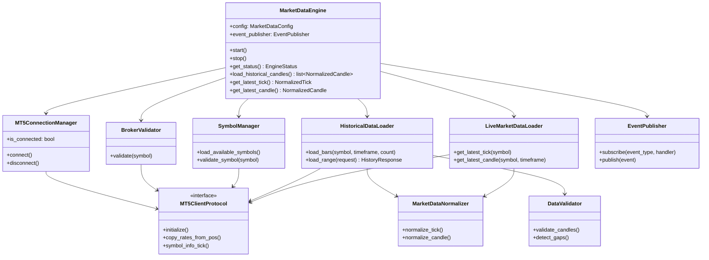

# Market Data Engine Architecture

**Engine ID:** `market_data`  
**Module path:** `backend/engines/market_data/`  
**Sprint:** 1 (implemented)  
**Broker:** XMGlobal via MetaTrader 5

---

## Purpose

The Market Data Engine connects to MetaTrader 5, retrieves live and historical OHLCV/tick data, normalizes it into canonical schemas, validates data quality, and publishes contract-compliant events. It contains no trading, analysis, or signal logic.

---

## Folder Structure

```
backend/engines/market_data/
├── __init__.py          # Public package exports
├── README.md            # Engine overview
├── engine.py            # MarketDataEngine orchestrator
├── config.py            # MarketDataConfig + YAML/env loader
├── connection.py        # MT5ConnectionManager
├── broker.py            # BrokerValidator
├── symbols.py           # SymbolManager
├── timeframes.py        # Timeframe enum and validation
├── mt5_protocol.py      # MT5ClientProtocol (injection interface)
├── mt5_client.py        # MT5Client wrapper + factory
├── historical.py        # HistoricalDataLoader
├── live.py              # LiveMarketDataLoader
├── normalizer.py        # MarketDataNormalizer
├── validator.py         # DataValidator
├── events.py            # EventPublisher + MarketEvent
├── schemas.py           # Pydantic output models
└── exceptions.py        # MDE_* error types
```

**Related project files:**

| Path | Role |
|------|------|
| `backend/main.py` | FastAPI lifespan — starts/stops `MarketDataEngine` |
| `config/settings.yaml` | YAML market data settings |
| `.env` | MT5 credentials and `TRADING_SYMBOL` |
| `tests/unit/engines/test_market_data_*.py` | Unit tests |
| `tests/integration/verify_market_data_pipeline.py` | Live integration verification |

---

## Components

| Component | Class | Responsibility |
|-----------|-------|----------------|
| Orchestrator | `MarketDataEngine` | Wires all subsystems; public entry point |
| Configuration | `MarketDataConfig` | Merged env + YAML settings |
| MT5 Connection | `MT5ConnectionManager` | Initialize, login verify, shutdown |
| Broker Validation | `BrokerValidator` | Connection, symbol, market status checks |
| Symbol Management | `SymbolManager` | Load and validate instrument metadata |
| Timeframes | `Timeframe` / helpers | M1–D1 validation and MT5 mapping |
| MT5 Client | `MT5Client` | Thin wrapper over MetaTrader5 Python API |
| Historical Loader | `HistoricalDataLoader` | OHLC bars by count or UTC range |
| Live Loader | `LiveMarketDataLoader` | Latest tick and forming candle |
| Normalizer | `MarketDataNormalizer` | MT5 raw → `NormalizedTick` / `NormalizedCandle` |
| Validator | `DataValidator` | Gaps, duplicates, OHLC, timestamps |
| Events | `EventPublisher` | In-memory contract event publishing |
| Schemas | Pydantic models | Typed inputs/outputs |

---

## Class Diagram



---

## Startup Flow

```
FastAPI lifespan (backend/main.py)
        │
        ▼
get_settings() + configure_logging()
        │
        ▼
load_market_data_config()
        │
        ▼
MarketDataEngine.__init__()
  ├── MarketDataNormalizer()
  ├── DataValidator()
  ├── EventPublisher()
  ├── MT5ConnectionManager
  ├── BrokerValidator
  ├── SymbolManager
  ├── HistoricalDataLoader
  └── LiveMarketDataLoader
        │
        ▼
MarketDataEngine.start()
  ├── MT5ConnectionManager.connect()
  ├── BrokerValidator.validate(symbol)
  ├── SymbolManager.load_available_symbols()
  └── SymbolManager.validate_symbol(symbol)
        │
        ▼
Engine ready (app.state.market_data_engine)
```

On shutdown: `MarketDataEngine.stop()` → `MT5ConnectionManager.disconnect()`.

---

## MT5 Connection Flow

```
MT5ConnectionManager.connect()
        │
        ▼
MT5Client.initialize(terminal_path)
        │── fail ──► MT5ConnectionError (MDE_CONN_FAILED)
        │            └── Event: market.connection.lost
        ▼
MT5Client.terminal_info()
        │── None ──► MT5ConnectionError
        ▼
_verify_login_session()
        │
        ├── account_info() exists ──► session OK
        │
        └── no session ──► MT5Client.login(login, password, server)
                │── fail ──► MT5AuthenticationError (MDE_AUTH_FAILED)
                ▼
        Event: market.connection.established
        _connected = True
```

---

## Historical Loader Flow

```
load_historical_candles() / load_historical_range()
        │
        ▼
SymbolManager.validate_symbol()
        │
        ▼
resolve_mt5_timeframe(timeframe)
        │
        ▼
MT5Client.copy_rates_from_pos()  OR  copy_rates_range()
        │── None ──► HistoryLoadError (MDE_HISTORY_FAILED)
        ▼
MarketDataNormalizer.normalize_candles()
  └── Last bar marked is_closed=False (forming candle)
        │
        ▼
DataValidator.validate_candles()
        │── gaps ──► Event: market.data.gap_detected
        ▼
Return list[NormalizedCandle] or HistoryResponse
        │
        └── (range only) Event: market.history.loaded
```

---

## Live Tick Flow

```
get_latest_tick(symbol)
        │
        ▼
Check config.tick_enabled
        │── false ──► SymbolUnavailableError
        ▼
MT5Client.symbol_info_tick(symbol)
        │── None ──► SymbolUnavailableError
        ▼
MarketDataNormalizer.normalize_tick()
        │
        ▼
Event: market.tick.received
        │
        ▼
Return NormalizedTick
```

---

## Normalization Flow

```
Raw MT5 data (numpy.void / named tuple)
        │
        ▼
MarketDataNormalizer._field(name)
  ├── getattr(raw, name)  — mock objects, ticks
  └── raw[name]           — numpy structured records
        │
        ├── Tick path ──► NormalizedTick
        │     bid, ask, spread, timestamp_utc, source=mt5_xmglobal
        │
        └── Candle path ──► NormalizedCandle
              OHLCV, open_time_utc, close_time_utc (= open + duration)
              is_closed flag preserved
```

---

## Validation Flow

```
DataValidator.validate_candles(candles)
        │
        ▼
Sort by open_time_utc
        │
        ▼
Per candle checks:
  ├── Duplicate open_time_utc
  ├── Timestamp alignment (epoch % timeframe seconds == 0)
  ├── Future timestamp (closed bars only; broker skew tolerated)
  └── OHLC consistency (high >= all, low <= all)
        │
        ▼
detect_gaps() — missing bars between consecutive candles
        │
        ▼
Return ValidationResult
  is_valid, gaps, duplicate_count, errors[]
```

---

## Event Publishing Flow

```
Component action
        │
        ▼
EventPublisher.publish_*()
        │
        ▼
MarketEvent envelope
  event_id, timestamp_utc, symbol, source_engine=market_data
        │
        ▼
Dispatch to subscribed handlers
  ├── exact event_type match
  └── wildcard "*" match
```

**Contract events produced:**

| Event | Trigger |
|-------|---------|
| `market.connection.established` | MT5 connect success |
| `market.connection.lost` | MT5 init/connect failure |
| `market.tick.received` | Live tick fetched |
| `market.candle.updated` | Forming candle fetched |
| `market.candle.closed` | Closed candle (reserved) |
| `market.data.gap_detected` | Gap in historical batch |
| `market.history.loaded` | Range history complete |

---

## Design Principles

- **Single responsibility** — data ingestion only; no analysis
- **External configuration** — no hardcoded credentials or symbols in code
- **Injectable MT5 client** — `MT5ClientProtocol` enables unit testing with mocks
- **Canonical schemas** — downstream engines consume `NormalizedTick` / `NormalizedCandle` only
- **Structured logging** — all components log via Python `logging` with `extra` context
