# Fair Value Gap Engine — Architecture Specification

**Engine ID:** `fair_value_gap`  
**Sprint:** 5.1 (Architecture only)  
**Version:** 0.1.0-spec  
**Status:** Architecture specification — not implemented  
**Symbol:** XAUUSD / GOLD.i#  
**Architecture Status:** FROZEN (Sprints 1–4 unchanged)

---

## Purpose

The Fair Value Gap (FVG) Engine identifies institutional fair value gap imbalances on gold price action. It consumes normalized candles and upstream analysis context (market structure, liquidity state, and order block state) to detect, classify, score, and lifecycle-manage fair value gaps without emitting trade signals.

Fair value gaps represent three-candle imbalance zones where price moved too fast to trade efficiently — areas where institutional rebalancing is hypothesized to occur on revisit.

---

## Responsibilities

| In Scope | Description |
|----------|-------------|
| FVG detection | Identify bullish and bearish fair value gaps from candle sequences |
| Gap boundary definition | Compute upper bound, lower bound, size, and CE midpoint |
| Lifecycle classification | Label gaps as open, partial, filled, mitigated, invalidated, or expired |
| Fill tracking | Monitor partial fills, full fills, and CE encroachment |
| Gap mitigation | Detect when price addresses the imbalance per configuration |
| Premium / discount context | Classify gap position relative to dealing range |
| Nested FVG resolution | Identify child gaps within parent gap boundaries |
| Multi-timeframe alignment | Score confluence when gaps align across timeframes |
| Quality scoring | Composite strength score with configurable weights |
| Gap expiration | Auto-expire gaps beyond configured age |
| Event publishing | Emit FVG lifecycle events |
| State continuity | Track active gaps across analysis cycles |
| Evidence generation | Human-readable reasoning for every detected gap |

| Out of Scope | Owner |
|--------------|-------|
| Order block detection | Order Block Engine (Sprint 4) |
| Breaker blocks | Future sprint |
| Mitigation blocks (as distinct entity) | Future sprint |
| Trade signals / entries | Decision Engine |
| Risk sizing | Risk Engine |
| Telegram / dashboard | Notification / Presentation layers |
| AI inference | Future sprint |

---

## Dependencies

### Upstream (Required / Optional)

| Engine | Module | Required | Consumes |
|--------|--------|----------|----------|
| Market Data Engine | `backend.engines.market_data` | **Yes** | `NormalizedCandle` |
| Market Structure Engine | `backend.engines.market_structure` | **Recommended** | `MarketStructure` |
| Market Liquidity Engine | `backend.engines.market_liquidity` | **Optional** | `LiquidityState` |
| Order Block Engine | `backend.engines.market_order_block` | **Optional** | `OrderBlockState` |

### Input Boundary Rule

The FVG Engine imports **only** the four types listed above from upstream public APIs. It does **not** consume `LiquidityAnalysis`, `OrderBlockAnalysis`, `NormalizedTick`, or any downstream engine types.

### Internal

| Dependency | Description |
|------------|-------------|
| Configuration | `config/settings.yaml` → `fair_value_gap` section |
| Event publisher | In-memory pub/sub (consistent with Sprints 1–4) |
| Core utilities | `backend.core.config`, `backend.core.logging`, `backend.core.exceptions` |

### Downstream (Future)

| Consumer | Uses |
|----------|------|
| Breaker Engine (future) | May derive breakers from invalidated FVGs |
| Decision Engine | Context only — no direct coupling in Sprint 5.1 |
| Dashboard | Visualization (future) |

---

## Inputs

| Input | Type | Source | Required |
|-------|------|--------|----------|
| `candles` | `list[NormalizedCandle]` | Market Data Engine | Yes |
| `structure` | `MarketStructure` | Market Structure Engine | Recommended |
| `liquidity_state` | `LiquidityState` | Market Liquidity Engine | No |
| `order_block_state` | `OrderBlockState` | Order Block Engine | No |
| `timeframe` | `str` | Caller / candle metadata | Yes |
| `prior_state` | `FairValueGapState` | Previous engine invocation | No |
| `higher_timeframe_gaps` | `list[FairValueGap]` | Prior MTF analysis calls | No |

### Input Constraints

- Minimum closed candle count per configuration (`min_candles`)
- Single symbol and single timeframe per analysis call
- Candles must be chronologically ordered
- Structure symbol/timeframe must match candle batch when provided
- `LiquidityState` and `OrderBlockState` bar counts should be consistent with candle batch when provided

---

## Outputs

### Primary Output: `FairValueGapAnalysis`

| Field | Type | Description |
|-------|------|-------------|
| `symbol` | `str` | Instrument identifier |
| `timeframe` | `str` | Analysis timeframe |
| `timestamp_utc` | `datetime` | Analysis timestamp (UTC) |
| `fair_value_gaps` | `list[FairValueGap]` | All tracked gaps |
| `open_gaps` | `list[FairValueGap]` | Untested gaps |
| `partial_gaps` | `list[FairValueGap]` | Partially filled gaps |
| `filled_gaps` | `list[FairValueGap]` | Fully filled gaps |
| `mitigated_gaps` | `list[FairValueGap]` | Mitigated gaps |
| `invalidated_gaps` | `list[FairValueGap]` | Broken gaps |
| `expired_gaps` | `list[FairValueGap]` | Age-expired gaps |
| `bullish_gaps` | `list[FairValueGap]` | Direction == bullish |
| `bearish_gaps` | `list[FairValueGap]` | Direction == bearish |
| `bias` | `FairValueGapBias` | `bullish`, `bearish`, `neutral`, `undetermined` |
| `confidence` | `Decimal` | 0.0–1.0 |
| `evidence` | `list[str]` | Human-readable reasoning |
| `state` | `FairValueGapState` | Serializable continuity state |
| `events` | `list[FairValueGapEvent]` | Timeline of gap lifecycle events |

### Fair Value Gap Entity: `FairValueGap`

| Field | Type | Description |
|-------|------|-------------|
| `gap_id` | `str` | Unique identifier |
| `direction` | `FairValueGapDirection` | `bullish`, `bearish` |
| `status` | `FairValueGapStatus` | Lifecycle status |
| `high` | `Decimal` | Gap upper boundary |
| `low` | `Decimal` | Gap lower boundary |
| `ce_price` | `Decimal` | Consequent Encroachment — 50% midpoint |
| `gap_size` | `Decimal` | Absolute price distance (`high - low`) |
| `gap_size_pips` | `Decimal` | Gap size in pips |
| `fill_percent` | `Decimal` | 0.0–100.0 fill percentage |
| `is_valid` | `bool` | Passes validity rules at detection |
| `validity_reason` | `str` | Why gap is valid or rejected |
| `origin_bar_index` | `int` | Bar index of middle (displacement) candle |
| `origin_time_utc` | `datetime` | Middle candle open time |
| `candle_a_index` | `int` | First candle of three-candle pattern |
| `candle_b_index` | `int` | Middle (impulse) candle |
| `candle_c_index` | `int` | Third candle of three-candle pattern |
| `fill_bar_index` | `int \| None` | Bar that achieved full fill |
| `mitigation_bar_index` | `int \| None` | Bar that mitigated the gap |
| `invalidation_bar_index` | `int \| None` | Bar that invalidated the gap |
| `expiration_bar_index` | `int \| None` | Bar at which gap expired |
| `quality` | `FairValueGapQuality` | `high`, `medium`, `low` |
| `strength` | `Decimal` | 0.0–1.0 composite score |
| `structure_alignment` | `bool` | Aligns with current structure trend |
| `liquidity_confluence` | `bool` | Near active liquidity zone or recent sweep |
| `order_block_confluence` | `bool` | Overlaps active order block |
| `premium_discount` | `PremiumDiscountZone` | `premium`, `discount`, `equilibrium` |
| `dealing_range_high` | `Decimal \| None` | Structure-derived range high |
| `dealing_range_low` | `Decimal \| None` | Structure-derived range low |
| `nested_parent_gap_id` | `str \| None` | Parent gap if nested |
| `nested_child_gap_ids` | `list[str]` | Child gaps within this gap |
| `mtf_alignment` | `MTFGapAlignment \| None` | Multi-timeframe alignment metadata |
| `evidence` | `list[str]` | Gap-specific reasoning |

### Continuity State: `FairValueGapState`

| Field | Type | Description |
|-------|------|-------------|
| `active_gaps` | `list[FairValueGap]` | Currently tracked gaps |
| `last_analysis_utc` | `datetime \| None` | Last analysis timestamp |
| `bar_count` | `int` | Candles processed |

---

## Canonical Schemas

### Enums

#### `FairValueGapDirection`

| Value | Description |
|-------|-------------|
| `bullish` | Bullish FVG — imbalance below impulse; gap between candle A high and candle C low |
| `bearish` | Bearish FVG — imbalance above impulse; gap between candle C high and candle A low |

#### `FairValueGapStatus`

| Value | Description |
|-------|-------------|
| `open` | Price has not entered the gap zone since formation |
| `partial` | Price entered gap; fill below configured full-fill threshold |
| `filled` | Gap fully traversed per `fill_mode` configuration |
| `mitigated` | Imbalance addressed — CE touched or mitigation threshold met |
| `invalidated` | Price closed beyond far boundary in opposing direction |
| `expired` | Gap exceeded `max_gap_age_bars` without resolution |

#### `FairValueGapQuality`

| Value | Description |
|-------|-------------|
| `high` | Strong impulse + structure alignment + confluence |
| `medium` | Meets minimum criteria |
| `low` | Marginal — low confidence |

#### `FairValueGapBias`

| Value | Description |
|-------|-------------|
| `bullish` | Dominant open/partial bullish gaps in discount |
| `bearish` | Dominant open/partial bearish gaps in premium |
| `neutral` | Balanced or no active gaps |
| `undetermined` | Insufficient data (Constitution: NO TRADE is success) |

#### `PremiumDiscountZone`

| Value | Description |
|-------|-------------|
| `premium` | Gap midpoint above dealing range equilibrium |
| `discount` | Gap midpoint below dealing range equilibrium |
| `equilibrium` | Gap midpoint within equilibrium tolerance |

#### `FairValueGapEventKind`

| Value | Description |
|-------|-------------|
| `FairValueGapDetected` | New gap identified |
| `BullishFairValueGapDetected` | New bullish gap |
| `BearishFairValueGapDetected` | New bearish gap |
| `OpenFairValueGap` | Gap confirmed open |
| `PartialFillFairValueGap` | Partial fill detected |
| `FilledFairValueGap` | Full fill detected |
| `MitigatedFairValueGap` | Gap mitigated |
| `InvalidatedFairValueGap` | Gap invalidated |
| `ExpiredFairValueGap` | Gap expired |
| `CEEncroached` | Consequent Encroachment level touched |
| `NestedFairValueGap` | Child gap nested within parent |
| `MTFAlignedFairValueGap` | Multi-timeframe alignment confirmed |
| `FairValueGapUpdated` | Full analysis complete |

### Supporting Types

#### `MTFGapAlignment`

| Field | Type | Description |
|-------|------|-------------|
| `aligned_timeframes` | `list[str]` | Timeframes participating in alignment |
| `alignment_direction` | `FairValueGapDirection` | Shared direction |
| `alignment_score` | `Decimal` | 0.0–1.0 confluence score |
| `parent_timeframe` | `str` | Higher timeframe reference |
| `parent_gap_id` | `str` | Higher timeframe gap ID |

#### `FairValueGapEvent`

| Field | Type | Description |
|-------|------|-------------|
| `kind` | `FairValueGapEventKind` | Event classification |
| `timestamp_utc` | `datetime` | Event time |
| `timeframe` | `str` | Analysis timeframe |
| `description` | `str` | Human-readable summary |
| `gap_id` | `str \| None` | Affected gap |
| `direction` | `FairValueGapDirection \| None` | Gap direction |
| `status` | `FairValueGapStatus \| None` | Resulting status |
| `price` | `Decimal \| None` | Trigger price (fill, CE, invalidation) |
| `fill_percent` | `Decimal \| None` | Fill percentage at event time |

All output schemas use frozen Pydantic models (`model_config = ConfigDict(frozen=True)`).

---

## Domain Concepts

### Bullish Fair Value Gap

A three-candle imbalance where the high of candle A is below the low of candle C, leaving an unfilled zone between them. Candle B is the impulse (displacement) candle. The gap zone spans from `low` = candle A high to `high` = candle C low.

Institutional interpretation: unfilled buy-side inefficiency; price may revisit from above to rebalance.

### Bearish Fair Value Gap

A three-candle imbalance where the low of candle A is above the high of candle C. The gap zone spans from `low` = candle C high to `high` = candle A low.

Institutional interpretation: unfilled sell-side inefficiency; price may revisit from below to rebalance.

### Gap Boundaries

| Boundary | Definition |
|----------|------------|
| `high` | Upper price limit of the imbalance zone |
| `low` | Lower price limit of the imbalance zone |
| `ce_price` | `(high + low) / 2` — Consequent Encroachment midpoint |
| `gap_size` | `high - low` (absolute price) |
| `gap_size_pips` | `gap_size / pip_size` |

Boundary computation is deterministic from the three-candle pattern indices and `NormalizedCandle` OHLC values. No wick/body mode variants are required for FVG (unlike order blocks); boundaries are always the unfilled price range between non-overlapping candles.

### Gap Validity

A detected gap candidate is valid when:

| Rule | Purpose |
|------|---------|
| `gap_size_pips >= min_gap_size_pips` | Exclude noise-level imbalances |
| Middle candle meets impulse criteria | Confirm displacement (configurable) |
| Gap not fully overlapped by prior gap | Prevent duplicate tracking |
| Within `lookback` window | Historical scope limit |
| Optional structure alignment gate | Reject counter-trend gaps when enabled |

Invalid candidates are excluded from `fair_value_gaps` but may be noted in debug logs.

### Partial Fills

Price enters the gap zone (wick or body per `entry_touch_mode`) but does not satisfy full-fill criteria.

| Metric | Description |
|--------|-------------|
| `fill_percent` | Percentage of gap traversed from entry side |
| CE partial | Price reaches `ce_price` but not far boundary — may trigger `CEEncroached` event |
| Status transition | `open` → `partial` on first entry |

### Full Fills

Price traverses the entire gap per `fill_mode`:

| Mode | Full Fill Condition |
|------|---------------------|
| `wick` | Wick reaches far boundary |
| `body` | Body reaches far boundary |
| `close` | Close reaches or crosses far boundary |
| `ce` | Close reaches CE (treated as mitigated, not filled) |

Status transition: `open` or `partial` → `filled`.

### Gap Mitigation

Mitigation occurs when price addresses the imbalance without invalidating the gap:

| Trigger | Configuration |
|---------|---------------|
| CE touch | `mitigation_mode: ce` |
| Partial fill threshold | `mitigation_fill_percent` (e.g., 50%) |
| Full fill | `mitigation_mode: full_fill` |

Status transition: `open` or `partial` → `mitigated`.

Mitigation is distinct from invalidation — the gap remains structurally valid but is no longer an active imbalance target.

### Gap Expiration

Gaps exceeding `max_gap_age_bars` without fill, mitigation, or invalidation transition to `expired`. Expired gaps remain in `expired_gaps` for evidence but are removed from `state.active_gaps`.

### Consequent Encroachment (CE)

The 50% midpoint of the gap (`ce_price`). Institutional traders use CE as a reaction level within the FVG:

- First touch may indicate partial mitigation
- Rejection at CE may preserve remaining gap as open
- CE encroachment is published as a distinct event for downstream consumers

### Premium / Discount Relationship

Derived from `MarketStructure` swing range (dealing range):

```
equilibrium = (dealing_range_high + dealing_range_low) / 2

if gap.ce_price > equilibrium + tolerance → premium
if gap.ce_price < equilibrium - tolerance → discount
else → equilibrium
```

| Zone | Trading Context (analysis only) |
|------|--------------------------------|
| `discount` | Bullish FVGs favored for rebalancing longs |
| `premium` | Bearish FVGs favored for rebalancing shorts |
| `equilibrium` | Neutral — reduced directional edge |

When structure is unavailable, `premium_discount` defaults to `equilibrium` and evidence notes `"Dealing range unavailable"`.

### Nested FVGs

A child gap whose `[low, high]` is fully contained within a parent gap's `[low, high]` on the same or lower timeframe:

| Field | Relationship |
|-------|-------------|
| `nested_parent_gap_id` | Child → parent reference |
| `nested_child_gap_ids` | Parent → children list |

Nested gaps inherit parent's MTF alignment bonus in quality scoring. Detection runs after primary gap identification.

### Multiple Timeframe Alignment

When `higher_timeframe_gaps` is provided (from prior analysis calls on higher timeframes):

| Alignment Criterion | Description |
|--------------------|-------------|
| Direction match | Bullish HTF gap + bullish LTF gap |
| Zone overlap | LTF gap boundaries intersect HTF gap boundaries |
| Status filter | HTF gap is `open` or `partial` |

Produces `MTFGapAlignment` with `alignment_score` and `aligned_timeframes`. Orchestrator responsibility: run HTF analysis before LTF and inject results.

### Gap Quality Scoring

Composite score (0.0–1.0) from configurable weights:

| Factor | Default Weight | Source |
|--------|---------------|--------|
| Impulse strength | 0.25 | Candle B body/range vs ATR proxy |
| Gap size | 0.15 | Normalized `gap_size_pips` |
| Structure alignment | 0.20 | `MarketStructure.current_trend` |
| BOS confirmation | 0.10 | Recent `bos_events` in gap direction |
| Liquidity confluence | 0.10 | `LiquidityState.active_zones` / `recent_sweeps` |
| Order block confluence | 0.10 | `OrderBlockState.active_blocks` overlap |
| Premium/discount placement | 0.05 | Gap in correct zone for direction |
| MTF alignment | 0.05 | `MTFGapAlignment.alignment_score` |

Gaps below `min_quality_score` are excluded from output lists.

---

## Component Architecture

### Planned Module Layout

```
backend/engines/market_fvg/          # Sprint 5.2+ implementation
├── __init__.py           # Public exports
├── config.py             # FairValueGapConfig + load_fair_value_gap_config()
├── schemas.py            # FairValueGapAnalysis, FairValueGap, enums
├── exceptions.py         # FVE_* errors
├── validator.py          # Input validation
├── detector.py           # Detection orchestrator
├── formation.py          # Three-candle pattern identification
├── boundaries.py         # Gap bounds, size, CE computation
├── lifecycle.py          # Open → partial → filled → mitigated → invalidated → expired
├── fill_tracker.py       # Partial and full fill monitoring
├── premium_discount.py   # Dealing range classification
├── nesting.py            # Nested FVG resolution
├── mtf_alignment.py      # Multi-timeframe confluence
├── quality.py            # Quality scoring
├── events.py             # FairValueGapAnalysisEvent envelope
├── publisher.py          # FairValueGapEventPublisher
└── engine.py             # FairValueGapEngine (public API)
```

### Class Diagram

```mermaid
classDiagram
    class FairValueGapEngine {
        +analyze(candles, structure, liquidity_state, order_block_state) FairValueGapAnalysis
        +detect_bullish_gaps(candles, structure) list~FairValueGap~
        +detect_bearish_gaps(candles, structure) list~FairValueGap~
        +classify_lifecycle(gaps, candles) list~FairValueGap~
        +publish_events(analysis) void
        +reset_state() void
    }

    class FairValueGapDetector {
        +detect(candles, structure, liquidity_state, order_block_state) FairValueGapAnalysis
    }

    class FormationDetector {
        +find_bullish_formations(candles) list~FormationCandidate~
        +find_bearish_formations(candles) list~FormationCandidate~
    }

    class BoundaryCalculator {
        +compute_bounds(candidate) GapBounds
        +compute_ce(high, low) Decimal
    }

    class LifecycleManager {
        +update_status(gap, candles) FairValueGap
    }

    class FillTracker {
        +compute_fill_percent(gap, candles) Decimal
        +detect_ce_touch(gap, candles) bool
    }

    class PremiumDiscountClassifier {
        +classify(gap, structure) PremiumDiscountZone
    }

    class NestingResolver {
        +resolve_parent_child(gaps) list~FairValueGap~
    }

    class MTFAlignmentScorer {
        +score(gap, higher_timeframe_gaps) MTFGapAlignment
    }

    class QualityScorer {
        +score(gap, structure, liquidity_state, order_block_state) Decimal
    }

    class FairValueGapEventPublisher {
        +publish_gap_detected(gap) void
        +publish_partial_fill(gap) void
        +publish_filled(gap) void
        +publish_mitigated(gap) void
    }

    FairValueGapEngine --> FairValueGapDetector
    FairValueGapEngine --> FairValueGapInputValidator
    FairValueGapEngine --> FairValueGapEventPublisher
    FairValueGapDetector --> FormationDetector
    FairValueGapDetector --> BoundaryCalculator
    FairValueGapDetector --> LifecycleManager
    FairValueGapDetector --> FillTracker
    FairValueGapDetector --> PremiumDiscountClassifier
    FairValueGapDetector --> NestingResolver
    FairValueGapDetector --> MTFAlignmentScorer
    FairValueGapDetector --> QualityScorer
```



---

## Validation Strategy

### Input Validation (`FairValueGapInputValidator`)

| Layer | Validates | On Failure |
|-------|-----------|------------|
| Candles | Non-empty, single symbol/timeframe, valid OHLC, no duplicate timestamps, chronological order | `FVE_VALIDATION_FAILED` |
| Candle count | `>= min_candles` closed candles | `FVE_INSUFFICIENT_DATA` |
| Timeframe | Must be in `config.timeframes` | `FVE_TIMEFRAME_UNSUPPORTED` |
| Structure context | Symbol/timeframe match when provided | `FVE_INVALID_STRUCTURE` |
| Liquidity state | Consistent bar count when provided | `FVE_INVALID_LIQUIDITY_STATE` |
| Order block state | Consistent bar count when provided | `FVE_INVALID_ORDER_BLOCK_STATE` |
| Gap state | No duplicate `gap_id` in active state | `FVE_DUPLICATE_GAP` |
| Prior state | Deserializable and consistent bar count | `FVE_STATE_CORRUPT` |

### Detection Validation

| Rule | Purpose |
|------|---------|
| Minimum gap size | Reject formations below `min_gap_size_pips` |
| Minimum quality score | Exclude gaps below `min_quality_score` |
| Maximum gap age | Expire gaps beyond `max_gap_age_bars` |
| Structure alignment gate | Optional filter when `require_structure_alignment=true` |
| Overlap deduplication | Prevent duplicate gaps on same bar indices |

### Validation Philosophy

- **Fail fast** on malformed inputs before detection runs
- **Degrade gracefully** when optional context (structure, liquidity state, order block state) is missing
- **Never force** gap detection when evidence is insufficient (Constitution: NO TRADE is success)

---

## Logging Strategy

Structured logging via `backend/core/logging.py` (consistent with Sprints 1–4).

### Log Levels

| Level | Usage |
|-------|-------|
| `INFO` | Analysis start/complete, gap counts, bias result |
| `DEBUG` | Formation candidates, fill checks, lifecycle transitions, nesting |
| `WARNING` | Missing optional context, low confidence, config fallback |
| `ERROR` | Unrecoverable failures with `FVE_*` code in `extra` |

### Structured Fields

```python
logger.info(
    "Fair value gap analysis complete",
    extra={
        "symbol": analysis.symbol,
        "timeframe": analysis.timeframe,
        "open": len(analysis.open_gaps),
        "partial": len(analysis.partial_gaps),
        "filled": len(analysis.filled_gaps),
        "mitigated": len(analysis.mitigated_gaps),
        "bias": analysis.bias.value,
    },
)
```

### What Is Not Logged

- Raw MT5 credentials or connection tokens
- Full candle arrays (use counts only)
- Trade signals (engine emits none)

---

## Error Conditions

| Code | Condition | Engine Behavior |
|------|-----------|-----------------|
| `FVE_INSUFFICIENT_DATA` | Fewer candles than `min_candles` | Raise; no partial analysis |
| `FVE_VALIDATION_FAILED` | Invalid OHLC, duplicates, mixed symbols | Raise |
| `FVE_INVALID_STRUCTURE` | Structure context mismatch or corrupt | Raise when structure provided |
| `FVE_INVALID_LIQUIDITY_STATE` | Liquidity state inconsistent | Raise when liquidity state provided |
| `FVE_INVALID_ORDER_BLOCK_STATE` | Order block state inconsistent | Raise when order block state provided |
| `FVE_TIMEFRAME_UNSUPPORTED` | Timeframe not in config | Raise |
| `FVE_DUPLICATE_GAP` | Duplicate gap ID in state | Raise |
| `FVE_STATE_CORRUPT` | Prior state unusable | Raise; caller may reset state |
| `FVE_ERROR` | Unexpected internal failure | Raise with details |

Error events published as `analysis.fvg.error` when publisher is available.

---

## Integration Points

| Integration | Sprint 5.1 Spec | Future Implementation |
|-------------|-----------------|----------------------|
| Programmatic pipeline | MDE → MSE → Liquidity → OB → FVG | Sprint 5.2 |
| FastAPI lifespan | Not wired | Orchestrator sprint |
| Event bus | In-memory publisher contract defined | Global bus sprint |
| SQLite persistence | Not specified | Future sprint |

### Pipeline Position

```
Market Data Engine
        │
        ▼
Market Structure Engine
        │
        ▼
Market Liquidity Engine
        │
        ▼
Order Block Engine
        │
        ▼
Fair Value Gap Engine          ← Sprint 5.1 architecture
        │
        ▼
Future: Breaker, Decision
```

---

## Future Extension Points

| Extension | Mechanism |
|-----------|-----------|
| Breaker derivation | Consume invalidated FVGs (separate engine) |
| Inversion FVG detection | Pluggable `FormationDetector` strategy |
| Session-based filtering | Configurable session windows on formation |
| Orchestrator registration | Implement `AnalysisEngineProtocol` |
| Global event bus | Replace in-memory publisher with shared bus adapter |
| Quality model tuning | Pluggable `QualityScorer` via dependency injection |
| HTF auto-fetch | Orchestrator provides `higher_timeframe_gaps` automatically |
| Gap + OB fusion scoring | Cross-engine composite (Decision Engine) |

---

## Acceptance Criteria (Sprint 5.2 Implementation)

When implemented, the Fair Value Gap Engine must:

1. Detect bullish and bearish fair value gaps from `NormalizedCandle` batches
2. Compute gap boundaries, size, CE, and fill percentage for each gap
3. Classify each gap through the full lifecycle (open → partial → filled → mitigated → invalidated → expired)
4. Consume `MarketStructure` for trend/BOS alignment and premium/discount classification
5. Optionally consume `LiquidityState` for zone/sweep confluence
6. Optionally consume `OrderBlockState` for block overlap confluence
7. Resolve nested FVGs and MTF alignment when context is provided
8. Publish all specified lifecycle events
9. Expose stable public API via `backend.engines.market_fvg`
10. Not modify Sprints 1, 2, 3, or 4 code or public interfaces
11. Include unit tests, integration tests, and live verification script
12. Pass all tests independently and as part of full suite
13. Emit no trade signals, entries, stops, or targets

---

## Out of Scope (Sprint 5.1 and 5.2)

- Breaker block detection
- Mitigation block as a separate entity type
- Order block detection (consumed, not produced)
- Entry / exit signal generation
- Risk assessment and position sizing
- Telegram notification delivery
- Dashboard UI components
- AI/ML model inference
- Modifications to Sprint 1, 2, 3, or 4 engines

---

## Related Documents

| Document | Path |
|----------|------|
| Data Pipeline | [DATA_PIPELINE.md](./DATA_PIPELINE.md) |
| Public Interfaces | [PUBLIC_INTERFACES.md](./PUBLIC_INTERFACES.md) |
| Configuration | [CONFIGURATION.md](./CONFIGURATION.md) |
| Events | [EVENTS.md](./EVENTS.md) |
| System Architecture | [../SYSTEM_ARCHITECTURE.md](../SYSTEM_ARCHITECTURE.md) |
| Constitution | [../CONSTITUTION.md](../CONSTITUTION.md) |
