# Mitigation Block Engine — Architecture Specification

**Engine ID:** `market_mitigation`  
**Sprint:** 7.1 (Architecture only)  
**Version:** 0.1.0-spec  
**Status:** Architecture specification — not implemented  
**Symbol:** XAUUSD / GOLD.i#  
**Architecture Status:** FROZEN (Sprints 1–6 unchanged)

---

## Purpose

The Mitigation Block Engine identifies institutional mitigation block zones on gold price action. It consumes normalized candles and upstream analysis context (market structure, liquidity state, order blocks, fair value gaps, and breaker blocks) to detect, confirm, classify, score, and lifecycle-manage mitigation blocks without emitting trade signals.

Mitigation blocks represent **the last opposing candle before a displacement leg** — institutional zones where unfilled orders may be addressed when price retraces. The engine tracks how price interacts with these zones (partial, full, multi-touch), their placement relative to internal and external structure, and their alignment across timeframes.

---

## Responsibilities

| In Scope | Description |
|----------|-------------|
| Mitigation block detection | Derive mitigation zones from displacement legs and upstream zone confluence |
| Direction classification | Label blocks as bullish or bearish based on opposing-candle + displacement context |
| Partial mitigation tracking | Detect when price partially addresses a zone per configuration |
| Full mitigation tracking | Detect when price fully traverses or consumes a zone |
| Multi-touch tracking | Record and count distinct price interactions with the same zone |
| Nested mitigation | Identify mitigation blocks contained within or overlapping OB/FVG/Breaker zones |
| Internal mitigation | Classify mitigation relative to internal structure swing range |
| External mitigation | Classify mitigation relative to external structure swing range |
| HTF mitigation alignment | Score alignment with higher-timeframe mitigation blocks |
| LTF mitigation nesting | Detect lower-timeframe blocks nested within HTF zones |
| Mitigation confirmation | Validate mitigation per configurable confirmation rules |
| Mitigation invalidation | Detect when zone fails in opposing direction |
| Quality scoring | Composite strength score with configurable weights |
| Fresh / used / expired lifecycle | Track untouched, consumed, and age-expired zones |
| Event publishing | Emit mitigation lifecycle events |
| State continuity | Track active mitigation blocks across analysis cycles |
| Evidence generation | Human-readable reasoning for every detected block |

| Out of Scope | Owner |
|--------------|-------|
| Order block detection | Order Block Engine (Sprint 4) |
| Fair value gap detection | Fair Value Gap Engine (Sprint 5) |
| Breaker block detection | Breaker Block Engine (Sprint 6) |
| Trade signals / entries | Decision Engine |
| Risk sizing | Risk Engine |
| Telegram / dashboard | Notification / Presentation layers |
| AI inference | Future sprint |

---

## Dependencies

### Upstream (Required / Optional)

| Engine | Module | Required | Consumes |
|--------|--------|----------|----------|
| Market Data Engine | `backend.engines.market_data` | **Yes** | `NormalizedCandle` |
| Market Structure Engine | `backend.engines.market_structure` | **Recommended** | `MarketStructure` |
| Market Liquidity Engine | `backend.engines.market_liquidity` | **Optional** | `LiquidityState` |
| Order Block Engine | `backend.engines.market_order_block` | **Recommended** | `OrderBlock` (fresh and mitigated) |
| Fair Value Gap Engine | `backend.engines.market_fvg` | **Optional** | `FairValueGapState`, `FairValueGap` |
| Breaker Block Engine | `backend.engines.market_breaker` | **Optional** | `BreakerBlock` (candidate and confirmed) |

### Input Boundary Rule

The Mitigation Block Engine imports **only** the six upstream type categories listed above from public APIs. It does **not** consume `OrderBlockAnalysis`, `FairValueGapAnalysis`, `LiquidityAnalysis`, `BreakerBlockAnalysis`, `NormalizedTick`, or any downstream engine types.

Callers are responsible for extracting:
- `order_blocks` from `OrderBlockAnalysis.order_blocks` (or partitioned fresh/mitigated lists)
- `FairValueGapState` from `FairValueGapAnalysis.state`
- `active_gaps` from `FairValueGapState.active_gaps` when needed
- `LiquidityState` from `LiquidityAnalysis.state` (or equivalent state accessor)
- `breaker_blocks` from `BreakerBlockAnalysis.breaker_blocks` (or confirmed/candidate partitions)

### Internal

| Dependency | Description |
|------------|-------------|
| Configuration | `config/settings.yaml` → `market_mitigation` section |
| Event publisher | In-memory pub/sub (consistent with Sprints 1–6) |
| Core utilities | `backend.core.config`, `backend.core.logging`, `backend.core.exceptions` |

### Downstream (Future)

| Consumer | Uses |
|----------|------|
| Smart Money Engine (future) | May aggregate mitigation blocks with OBs, FVGs, and breakers |
| Decision Engine | Context only — no direct coupling in Sprint 7.1 |
| Dashboard | Visualization (future) |

---

## Inputs

| Input | Type | Source | Required |
|-------|------|--------|----------|
| `candles` | `list[NormalizedCandle]` | Market Data Engine | Yes |
| `structure` | `MarketStructure` | Market Structure Engine | Recommended |
| `liquidity_state` | `LiquidityState` | Market Liquidity Engine | No |
| `order_blocks` | `list[OrderBlock]` | Order Block Engine (extracted) | Recommended |
| `fair_value_gap_state` | `FairValueGapState` | Fair Value Gap Engine | No |
| `breaker_blocks` | `list[BreakerBlock]` | Breaker Block Engine (extracted) | No |
| `htf_mitigation_blocks` | `list[MitigationBlock]` | Caller / HTF analysis | No |
| `timeframe` | `str` | Caller / candle metadata | Yes |
| `prior_state` | `MitigationBlockState` | Previous engine invocation | No |

### Input Constraints

- Minimum closed candle count per configuration (`min_candles`)
- Single symbol and single timeframe per analysis call
- Candles must be chronologically ordered
- Structure symbol/timeframe must match candle batch when provided
- `LiquidityState`, `FairValueGapState` bar counts should be consistent with candle batch when provided
- Order blocks and breaker blocks must have consistent symbol/timeframe scope
- Empty upstream zone lists are valid — engine may still detect standalone mitigation blocks from candles + structure
- Insufficient displacement evidence returns `undetermined` bias (Constitution: NO TRADE is success)

---

## Outputs

### Primary Output: `MitigationBlockAnalysis`

| Field | Type | Description |
|-------|------|-------------|
| `symbol` | `str` | Instrument identifier |
| `timeframe` | `str` | Analysis timeframe |
| `timestamp_utc` | `datetime` | Analysis timestamp (UTC) |
| `mitigation_blocks` | `list[MitigationBlock]` | All tracked mitigation blocks |
| `fresh_blocks` | `list[MitigationBlock]` | Untouched zones |
| `partial_blocks` | `list[MitigationBlock]` | Partially mitigated zones |
| `confirmed_blocks` | `list[MitigationBlock]` | Confirmed mitigation zones |
| `used_blocks` | `list[MitigationBlock]` | Fully consumed zones |
| `invalidated_blocks` | `list[MitigationBlock]` | Failed zones |
| `expired_blocks` | `list[MitigationBlock]` | Age-expired zones |
| `bullish_blocks` | `list[MitigationBlock]` | Direction == bullish |
| `bearish_blocks` | `list[MitigationBlock]` | Direction == bearish |
| `nested_blocks` | `list[MitigationBlock]` | Nested within another zone |
| `internal_blocks` | `list[MitigationBlock]` | Internal structure placement |
| `external_blocks` | `list[MitigationBlock]` | External structure placement |
| `htf_aligned_blocks` | `list[MitigationBlock]` | HTF confluence present |
| `bias` | `MitigationBlockBias` | `bullish`, `bearish`, `neutral`, `undetermined` |
| `confidence` | `Decimal` | 0.0–1.0 |
| `evidence` | `list[str]` | Human-readable reasoning |
| `state` | `MitigationBlockState` | Serializable continuity state |
| `events` | `list[MitigationBlockEvent]` | Timeline of lifecycle events |

### Mitigation Block Entity: `MitigationBlock`

| Field | Type | Description |
|-------|------|-------------|
| `block_id` | `str` | Unique identifier |
| `direction` | `MitigationBlockDirection` | `bullish`, `bearish` |
| `status` | `MitigationBlockStatus` | Lifecycle status |
| `high` | `Decimal` | Zone upper bound |
| `low` | `Decimal` | Zone lower bound |
| `origin_bar_index` | `int` | Opposing candle bar index |
| `origin_time_utc` | `datetime` | Formation timestamp |
| `displacement_bar_index` | `int` | Displacement leg start bar |
| `displacement_time_utc` | `datetime` | Displacement timestamp |
| `formation_bar_index` | `int` | Bar at which block registered |
| `formation_time_utc` | `datetime` | Registration timestamp |
| `mitigation_percent` | `Decimal` | 0.0–100.0 zone traverse |
| `touch_count` | `int` | Distinct price interactions |
| `first_touch_bar_index` | `int \| None` | First interaction bar |
| `last_touch_bar_index` | `int \| None` | Most recent interaction bar |
| `confirmation_bar_index` | `int \| None` | Confirmation bar |
| `confirmation_time_utc` | `datetime \| None` | Confirmation timestamp |
| `used_bar_index` | `int \| None` | Full mitigation bar |
| `invalidation_bar_index` | `int \| None` | Invalidation bar |
| `expiration_bar_index` | `int \| None` | Expiration bar |
| `quality` | `MitigationBlockQuality` | `high`, `medium`, `low` |
| `strength` | `Decimal` | 0.0–1.0 composite score |
| `is_confirmed` | `bool` | Passed confirmation rules |
| `confirmation_reason` | `str` | Why block is or is not confirmed |
| `structure_scope` | `StructureScope` | `internal`, `external`, `undetermined` |
| `structure_alignment` | `bool` | Aligns with current structure trend |
| `liquidity_confluence` | `bool` | Overlaps liquidity zone or recent sweep |
| `order_block_confluence` | `bool` | Overlaps active order block |
| `fvg_confluence` | `bool` | Overlaps open/partial FVG |
| `breaker_confluence` | `bool` | Overlaps confirmed breaker |
| `is_nested` | `bool` | Contained within parent zone |
| `parent_zone_id` | `str \| None` | Parent OB/FVG/Breaker/MB ID |
| `parent_zone_type` | `MitigationSourceType \| None` | Parent entity type |
| `child_block_ids` | `list[str]` | Nested child mitigation blocks |
| `htf_aligned` | `bool` | Aligns with HTF mitigation block |
| `htf_block_ids` | `list[str]` | Matched HTF block IDs |
| `ltf_nested` | `bool` | Has nested LTF blocks within zone |
| `ltf_block_ids` | `list[str]` | Nested LTF block IDs |
| `confluence_ids` | `list[str]` | All matched upstream zone IDs |
| `premium_discount` | `PremiumDiscountZone` | Position relative to dealing range |
| `dealing_range_high` | `Decimal \| None` | Structure-derived range high |
| `dealing_range_low` | `Decimal \| None` | Structure-derived range low |
| `evidence` | `list[str]` | Block-specific reasoning |

### Continuity State: `MitigationBlockState`

| Field | Type | Description |
|-------|------|-------------|
| `active_blocks` | `list[MitigationBlock]` | Currently tracked blocks (fresh + partial + confirmed) |
| `last_analysis_utc` | `datetime \| None` | Last analysis timestamp |
| `bar_count` | `int` | Candles processed |

---

## Canonical Schemas

### Enums

#### `MitigationBlockDirection`

| Value | Description |
|-------|-------------|
| `bullish` | Bullish mitigation block — last bearish candle before bullish displacement |
| `bearish` | Bearish mitigation block — last bullish candle before bearish displacement |

#### `MitigationBlockStatus`

| Value | Description |
|-------|-------------|
| `fresh` | Newly formed; no price interaction |
| `partial` | Price partially addressed zone per mitigation rules |
| `confirmed` | Mitigation confirmed per confirmation rules |
| `used` | Zone fully consumed — no longer active target |
| `invalidated` | Zone failed — broken in opposing direction |
| `expired` | Block exceeded `max_block_age_bars` without resolution |

#### `MitigationBlockQuality`

| Value | Description |
|-------|-------------|
| `high` | Strong displacement + confluence + confirmation |
| `medium` | Meets minimum criteria |
| `low` | Marginal — low confidence |

#### `MitigationBlockBias`

| Value | Description |
|-------|-------------|
| `bullish` | Dominant confirmed bullish blocks in discount |
| `bearish` | Dominant confirmed bearish blocks in premium |
| `neutral` | Balanced or no active confirmed blocks |
| `undetermined` | Insufficient data (Constitution: NO TRADE is success) |

#### `StructureScope`

| Value | Description |
|-------|-------------|
| `internal` | Zone within internal structure swing range |
| `external` | Zone within external structure swing range |
| `undetermined` | Structure context unavailable or inconclusive |

#### `MitigationSourceType`

| Value | Description |
|-------|-------------|
| `displacement` | Standalone displacement-derived mitigation block |
| `order_block` | Derived from or nested within order block |
| `fair_value_gap` | Derived from or nested within FVG |
| `breaker_block` | Derived from or nested within breaker block |
| `mitigation_block` | Nested within another mitigation block |

#### `MitigationBlockEventKind`

| Value | Description |
|-------|-------------|
| `MitigationBlockDetected` | New mitigation block identified |
| `BullishMitigationBlockDetected` | New bullish mitigation block |
| `BearishMitigationBlockDetected` | New bearish mitigation block |
| `FreshMitigationBlock` | Block registered as fresh |
| `PartialMitigationBlock` | Partial mitigation detected |
| `FullMitigationBlock` | Full mitigation detected |
| `MultiTouchMitigationBlock` | Additional touch recorded |
| `ConfirmedMitigationBlock` | Mitigation confirmed |
| `UsedMitigationBlock` | Zone fully consumed |
| `InvalidatedMitigationBlock` | Block invalidated |
| `ExpiredMitigationBlock` | Block expired |
| `NestedMitigationBlock` | Nested relationship detected |
| `InternalMitigationBlock` | Internal structure scope classified |
| `ExternalMitigationBlock` | External structure scope classified |
| `HTFMitigationAligned` | HTF alignment detected |
| `LTFMitigationNested` | LTF nesting detected |
| `LiquidityConfluenceMitigation` | Liquidity confluence detected |
| `OrderBlockConfluenceMitigation` | Order block confluence detected |
| `FVGConfluenceMitigation` | FVG confluence detected |
| `BreakerConfluenceMitigation` | Breaker confluence detected |
| `MitigationBlockUpdated` | Full analysis complete |

### Supporting Types

#### `MitigationBlockEvent`

| Field | Type | Description |
|-------|------|-------------|
| `kind` | `MitigationBlockEventKind` | Event classification |
| `timestamp_utc` | `datetime` | Event time |
| `timeframe` | `str` | Analysis timeframe |
| `description` | `str` | Human-readable summary |
| `block_id` | `str \| None` | Affected block |
| `direction` | `MitigationBlockDirection \| None` | Block direction |
| `status` | `MitigationBlockStatus \| None` | Resulting status |
| `price` | `Decimal \| None` | Trigger price |
| `touch_count` | `int \| None` | Current touch count |
| `mitigation_percent` | `Decimal \| None` | Current mitigation percent |
| `parent_zone_id` | `str \| None` | Parent zone when nested |

#### `MitigationTouch`

| Field | Type | Description |
|-------|------|-------------|
| `bar_index` | `int` | Touch bar index |
| `timestamp_utc` | `datetime` | Touch timestamp |
| `touch_price` | `Decimal` | Interaction price |
| `touch_mode` | `str` | `wick`, `body`, or `close` |
| `mitigation_percent_after` | `Decimal` | Cumulative percent after touch |

#### `MTFMitigationAlignment`

| Field | Type | Description |
|-------|------|-------------|
| `aligned_timeframes` | `list[str]` | Matched HTF timeframes |
| `alignment_direction` | `MitigationBlockDirection` | Shared direction |
| `alignment_score` | `Decimal` | 0.0–1.0 overlap score |
| `parent_timeframe` | `str` | HTF source timeframe |
| `parent_block_id` | `str` | HTF block ID |

All output schemas use frozen Pydantic models (`model_config = ConfigDict(frozen=True)`).

---

## Domain Concepts

### Bullish Mitigation Block

Formed by the **last bearish candle before a bullish displacement leg**. The zone represents institutional sell-side orders that were not fully filled before price impulsively moved higher.

| Component | Rule |
|-----------|------|
| Opposing candle | Last closed bearish candle before displacement |
| Displacement | Bullish leg with minimum pip/range threshold |
| Zone bounds | Configurable: `body`, `wick`, or `full_candle` |
| Institutional role | Demand zone — price may return to mitigate unfilled sells |

### Bearish Mitigation Block

Formed by the **last bullish candle before a bearish displacement leg**. The zone represents institutional buy-side orders that were not fully filled before price impulsively moved lower.

| Component | Rule |
|-----------|------|
| Opposing candle | Last closed bullish candle before displacement |
| Displacement | Bearish leg with minimum pip/range threshold |
| Zone bounds | Configurable: `body`, `wick`, or `full_candle` |
| Institutional role | Supply zone — price may return to mitigate unfilled buys |

### Partial Mitigation

Price enters the mitigation zone but does not fully traverse it:

| Trigger | Configuration |
|---------|---------------|
| Wick entry | `mitigation_mode: wick` |
| Body entry | `mitigation_mode: body` |
| Zone traverse | `mitigation_percent` below `full_mitigation_percent` |

Status transition: `fresh` → `partial`. `mitigation_percent` updated cumulatively across touches.

### Full Mitigation

Price fully addresses the zone per configuration:

| Trigger | Configuration |
|---------|---------------|
| Full traverse | `mitigation_percent >= full_mitigation_percent` |
| Close inside | `mitigation_mode: close` with full traverse |
| CE reach | `ce_mitigation_enabled: true` — midpoint reached |

Status transition: `partial` → `confirmed` → `used` (when fully consumed).

### Multi-Touch Mitigation

Price interacts with the zone on multiple distinct bars:

| Rule | Description |
|------|-------------|
| Touch deduplication | Same bar does not increment `touch_count` twice |
| Minimum bar gap | `min_bars_between_touches` separates distinct touches |
| Cumulative percent | `mitigation_percent` accumulates across touches |
| Event emission | `MultiTouchMitigationBlock` when `touch_count` increments |

### Nested Mitigation Blocks

A mitigation block is nested when its zone boundaries are fully contained within or substantially overlap a parent zone:

| Parent Type | Nesting Rule |
|-------------|--------------|
| Order block | MB zone inside OB `[low, high]` |
| Fair value gap | MB zone inside FVG `[low, high]` |
| Breaker block | MB zone inside breaker `[low, high]` |
| Mitigation block | MB zone inside parent MB `[low, high]` |

Produces `is_nested: true`, `parent_zone_id`, and `NestedMitigationBlock` event.

### Internal Mitigation

Mitigation block formed or confirmed within the **internal structure** swing range:

| Criterion | Source |
|-----------|--------|
| Swing range | `MarketStructure.internal_structure` swing high/low |
| Placement | Block midpoint within internal dealing range |
| BOS context | Displacement aligned with internal BOS when available |

Produces `structure_scope: internal` and `InternalMitigationBlock` event.

### External Mitigation

Mitigation block formed or confirmed within the **external structure** swing range:

| Criterion | Source |
|-----------|--------|
| Swing range | `MarketStructure.external_structure` swing high/low |
| Placement | Block midpoint within external dealing range |
| BOS context | Displacement aligned with external BOS when available |

Produces `structure_scope: external` and `ExternalMitigationBlock` event.

### HTF Mitigation

When `htf_mitigation_blocks` is provided, the engine scores alignment:

| Criterion | Description |
|-----------|-------------|
| Direction match | Same `MitigationBlockDirection` |
| Zone overlap | LTF block overlaps HTF block boundaries |
| Premium/discount | Both in correct zone for direction |
| Minimum overlap | `htf_overlap_min_percent` threshold |

Produces `htf_aligned: true`, `htf_block_ids`, and `HTFMitigationAligned` event.

### LTF Mitigation

Lower-timeframe blocks nested within the current timeframe zone:

| Criterion | Description |
|-----------|-------------|
| Zone containment | LTF block fully inside current block |
| Direction match | Same direction preferred |
| Active status | LTF block in `fresh`, `partial`, or `confirmed` |

Produces `ltf_nested: true`, `ltf_block_ids`, and `LTFMitigationNested` event.

### Mitigation Confirmation

A block transitions to `confirmed` when price interaction meets confirmation rules:

| Mode | Confirmation Trigger |
|------|---------------------|
| `wick_touch` | Wick enters zone |
| `body_touch` | Body enters zone |
| `close_inside` | Close inside zone |
| `rejection` | Touch + rejection candle in block direction |
| `displacement_after` | Follow-through displacement after touch |

Additional gates (configurable):

| Gate | Purpose |
|------|---------|
| `require_displacement_after_touch` | Confirming move must show follow-through |
| `min_bars_after_formation` | Minimum bars before first valid touch |
| `require_structure_alignment` | Block direction must align with structure trend |
| `min_touch_count` | Minimum touches before confirmation |

### Mitigation Invalidation

A block is invalidated when price closes beyond the far boundary in the direction that negates the block's institutional role:

| Block Direction | Invalidation |
|-----------------|--------------|
| Bullish mitigation block | Close below `low` |
| Bearish mitigation block | Close above `high` |

Invalidation mode configurable: `close`, `body`, `wick`.

A `used` block may also be invalidated if price subsequently breaks through the zone in the opposing direction (configurable via `invalidate_used_blocks`).

### Fresh, Used, and Expired Mitigation

| Classification | Condition |
|----------------|-----------|
| **Fresh** | `status == fresh` — no price interaction since formation |
| **Used** | `status == used` — zone fully consumed per full mitigation rules |
| **Expired** | `status == expired` — exceeded `max_block_age_bars` without confirmation, use, or invalidation |

Used blocks remain in `used_blocks` for evidence but are removed from `state.active_blocks`.

### Premium / Discount Relationship

Derived from `MarketStructure` swing range (same model as FVG and Breaker engines):

```
equilibrium = (dealing_range_high + dealing_range_low) / 2

if block.midpoint > equilibrium + tolerance → premium
if block.midpoint < equilibrium - tolerance → discount
else → equilibrium
```

When structure is unavailable, `premium_discount` defaults to `equilibrium`.

### Mitigation Quality Scoring Philosophy

Quality scoring is **evidence-weighted, not signal-generating**. The engine never promotes a low-quality block to actionable status — it scores transparency for downstream consumers.

Principles:

1. **Displacement is primary** — without a valid displacement leg, no block is formed
2. **Confluence amplifies, never substitutes** — upstream zone overlap increases score but cannot create a block alone
3. **Confirmation is gated** — unconfirmed blocks receive capped strength scores
4. **Freshness decays** — older untouched blocks score lower unless HTF-aligned
5. **NO TRADE is success** — blocks below `min_quality_score` are excluded from partitioned output lists

Composite score (0.0–1.0) from configurable weights:

| Factor | Default Weight | Source |
|--------|---------------|--------|
| Displacement strength | 0.20 | Pip/range of displacement leg |
| Structure alignment | 0.15 | `MarketStructure.current_trend` |
| Structure scope | 0.10 | Internal vs external placement |
| Liquidity confluence | 0.10 | `LiquidityState` overlap/sweep |
| Order block confluence | 0.10 | Overlap with active OB |
| FVG confluence | 0.10 | Overlap with open/partial FVG |
| Breaker confluence | 0.05 | Overlap with confirmed breaker |
| HTF alignment | 0.10 | HTF block overlap |
| Confirmation quality | 0.05 | Rejection candle, displacement after touch |
| Freshness | 0.05 | Bars since formation |

---

## Component Architecture

### Planned Module Layout

```
backend/engines/market_mitigation/          # Sprint 7.2+ implementation
├── __init__.py           # Public exports
├── config.py             # MitigationBlockConfig + load_market_mitigation_config()
├── schemas.py            # MitigationBlockAnalysis, MitigationBlock, enums
├── exceptions.py         # MMBE_* errors
├── validator.py          # Input validation
├── detector.py           # Detection orchestrator
├── formation.py          # Derive blocks from displacement legs
├── touch.py              # Multi-touch and partial/full mitigation tracking
├── confirmation.py       # Mitigation confirmation rules
├── lifecycle.py          # Fresh → partial → confirmed → used → invalidated → expired
├── nesting.py            # Nested block and parent-child relationships
├── structure_scope.py    # Internal/external classification
├── mtf.py                # HTF/LTF alignment scoring
├── confluence.py         # Liquidity + OB + FVG + Breaker confluence
├── premium_discount.py   # Dealing range classification
├── quality.py            # Quality scoring
├── events.py             # MitigationBlockAnalysisEvent envelope
├── publisher.py          # MitigationBlockEventPublisher
└── engine.py             # MitigationBlockEngine (public API)
```

### Class Diagram

```mermaid
classDiagram
    class MitigationBlockEngine {
        +analyze(candles, structure, order_blocks, ...) MitigationBlockAnalysis
        +detect_bullish_blocks(candles, structure) list~MitigationBlock~
        +detect_bearish_blocks(candles, structure) list~MitigationBlock~
        +classify_lifecycle(blocks, candles) list~MitigationBlock~
        +publish_events(analysis) void
        +reset_state() void
    }

    class MitigationBlockDetector {
        +detect(candles, structure, order_blocks, ...) MitigationBlockAnalysis
    }

    class FormationDetector {
        +derive_from_displacement(candles, structure) list~MitigationCandidate~
        +derive_from_confluence(candles, order_blocks, fvgs, breakers) list~MitigationCandidate~
    }

    class TouchTracker {
        +record_touch(block, candle) MitigationBlock
        +compute_mitigation_percent(block, candle) Decimal
    }

    class ConfirmationValidator {
        +validate(block, candles) bool
        +compute_confirmation_reason(block, candles) str
    }

    class LifecycleManager {
        +update_status(block, candles) MitigationBlock
    }

    class NestingClassifier {
        +detect_nesting(block, zones) NestingResult
    }

    class StructureScopeClassifier {
        +classify(block, structure) StructureScope
    }

    class MTFAligner {
        +score_htf(block, htf_blocks) MTFMitigationAlignment
        +detect_ltf_nesting(block, ltf_blocks) list~str~
    }

    class ConfluenceScorer {
        +score_all(block, liquidity, obs, fvgs, breakers) ConfluenceResult
    }

    class QualityScorer {
        +score(block, structure, confluence) Decimal
    }

    class MitigationBlockEventPublisher {
        +publish_block_detected(block) void
        +publish_partial_mitigation(block) void
        +publish_confirmed(block) void
    }

    MitigationBlockEngine --> MitigationBlockDetector
    MitigationBlockEngine --> MitigationBlockInputValidator
    MitigationBlockEngine --> MitigationBlockEventPublisher
    MitigationBlockDetector --> FormationDetector
    MitigationBlockDetector --> TouchTracker
    MitigationBlockDetector --> ConfirmationValidator
    MitigationBlockDetector --> LifecycleManager
    MitigationBlockDetector --> NestingClassifier
    MitigationBlockDetector --> StructureScopeClassifier
    MitigationBlockDetector --> MTFAligner
    MitigationBlockDetector --> ConfluenceScorer
    MitigationBlockDetector --> QualityScorer
```



---

## Lifecycle

```
displacement leg identified
        │
        ▼
     fresh ──(partial touch)──► partial ──(confirmation)──► confirmed
        │                         │                            │
        │                         │                            ├──► used (full mitigation)
        │                         │                            │
        │                         │                            └──► invalidated (failed)
        │                         │
        │                         └──► used (direct full mitigation)
        │
        └──► expired (age limit)
```

| Status | Condition (Conceptual) |
|--------|------------------------|
| **Fresh** | Block registered; no price interaction |
| **Partial** | Price partially addressed zone |
| **Confirmed** | Mitigation validated per confirmation rules |
| **Used** | Zone fully consumed per full mitigation rules |
| **Invalidated** | Zone broken in opposing direction |
| **Expired** | Exceeded `max_block_age_bars` without resolution |

### State Transitions

| From | To | Trigger |
|------|-----|---------|
| — | `fresh` | New block detected from displacement |
| `fresh` | `partial` | First partial zone interaction |
| `fresh` | `used` | Direct full mitigation (single touch) |
| `partial` | `confirmed` | Confirmation rules satisfied |
| `partial` | `used` | Full mitigation without explicit confirmation gate |
| `confirmed` | `used` | Full mitigation percent reached |
| `fresh` / `partial` / `confirmed` | `invalidated` | Opposing boundary break |
| `fresh` / `partial` / `confirmed` | `expired` | Age limit exceeded |

---

## Invalidation Rules

| Rule | Condition | Configurable |
|------|-----------|--------------|
| Opposing close break | Close beyond far boundary negates block role | `invalidation_mode` |
| Pre-confirmation break | Fresh/partial block broken before confirmation | Always active |
| Post-use break | Used block subsequently broken | `invalidate_used_blocks` |
| Structure shift | CHoCH against block direction | `invalidate_on_choch` (optional) |
| Upstream invalidation | Parent OB/FVG/Breaker invalidated | `invalidate_on_parent_invalidated` |

---

## Dependency Injection

Consistent with Sprints 1–6:

```python
MitigationBlockEngine(
    config: MitigationBlockConfig | None = None,
    detector: MitigationBlockDetector | None = None,
    validator: MitigationBlockInputValidator | None = None,
    publisher: MitigationBlockEventPublisher | None = None,
)
```

| Dependency | Default | Override Purpose |
|------------|---------|------------------|
| `config` | Loaded from YAML | Test isolation, parameter tuning |
| `detector` | `MitigationBlockDetector(config)` | Algorithm testing |
| `validator` | `MitigationBlockInputValidator(config)` | Validation testing |
| `publisher` | `MitigationBlockEventPublisher()` | Event capture in tests |

Internal components (`FormationDetector`, `TouchTracker`, `QualityScorer`, etc.) are constructed by `MitigationBlockDetector` and are not injected at the engine level unless extended in future sprints.

---

## Validation Strategy

### Input Validation (`MitigationBlockInputValidator`)

| Layer | Validates | On Failure |
|-------|-----------|------------|
| Candles | Non-empty, single symbol/timeframe, valid OHLC, no duplicate timestamps, chronological order | `MMBE_VALIDATION_FAILED` |
| Candle count | `>= min_candles` closed candles | `MMBE_INSUFFICIENT_DATA` |
| Timeframe | Must be in `config.timeframes` | `MMBE_TIMEFRAME_UNSUPPORTED` |
| Structure context | Symbol/timeframe match when provided | `MMBE_INVALID_STRUCTURE` |
| Liquidity state | Consistent bar count when provided | `MMBE_INVALID_LIQUIDITY_STATE` |
| Order blocks | Symbol/timeframe consistent when provided | `MMBE_INVALID_ORDER_BLOCKS` |
| FVG state | Consistent bar count when provided | `MMBE_INVALID_FVG_STATE` |
| Breaker blocks | Symbol/timeframe consistent when provided | `MMBE_INVALID_BREAKER_BLOCKS` |
| HTF blocks | Valid direction and bounds when provided | `MMBE_INVALID_HTF_BLOCKS` |
| Prior state | No duplicate `block_id` in active state | `MMBE_DUPLICATE_BLOCK` |
| Prior state | Deserializable and consistent bar count | `MMBE_STATE_CORRUPT` |

### Detection Validation

| Rule | Purpose |
|------|---------|
| Minimum displacement size | Reject legs below `min_displacement_pips` |
| Minimum zone size | Reject blocks below `min_zone_size_pips` |
| Minimum quality score | Exclude blocks below `min_quality_score` |
| Maximum block age | Expire blocks beyond `max_block_age_bars` |
| Structure alignment gate | Optional filter when `require_structure_alignment=true` |
| Duplicate deduplication | One block per unique origin candle + direction |
| Touch window | Ignore touches before `min_bars_after_formation` |

### Validation Philosophy

- **Fail fast** on malformed inputs before detection runs
- **Degrade gracefully** when optional context (structure, liquidity, OB, FVG, breaker) is missing
- **Never force** block detection when displacement evidence is insufficient (Constitution: NO TRADE is success)
- **Empty upstream lists** are valid — engine may detect standalone displacement blocks

---

## Logging Strategy

Structured logging via `backend/core/logging.py` (consistent with Sprints 1–6).

### Log Levels

| Level | Usage |
|-------|-------|
| `INFO` | Analysis start/complete, block counts, bias result |
| `DEBUG` | Formation candidates, touch tracking, lifecycle transitions, confluence, nesting |
| `WARNING` | Missing optional context, low confidence, config fallback |
| `ERROR` | Unrecoverable failures with `MMBE_*` code in `extra` |

### Structured Fields

```python
logger.info(
    "Mitigation block analysis complete",
    extra={
        "symbol": analysis.symbol,
        "timeframe": analysis.timeframe,
        "fresh": len(analysis.fresh_blocks),
        "partial": len(analysis.partial_blocks),
        "confirmed": len(analysis.confirmed_blocks),
        "used": len(analysis.used_blocks),
        "bias": analysis.bias.value,
    },
)
```

### What Is Not Logged

- Raw MT5 credentials or connection tokens
- Full candle arrays (use counts only)
- Trade signals (engine emits none)

---

## Error Conditions

| Code | Condition | Engine Behavior |
|------|-----------|-----------------|
| `MMBE_INSUFFICIENT_DATA` | Fewer candles than `min_candles` | Raise; no partial analysis |
| `MMBE_VALIDATION_FAILED` | Invalid OHLC, duplicates, mixed symbols | Raise |
| `MMBE_INVALID_STRUCTURE` | Structure context mismatch or corrupt | Raise when structure provided |
| `MMBE_INVALID_LIQUIDITY_STATE` | Liquidity state inconsistent | Raise when liquidity state provided |
| `MMBE_INVALID_ORDER_BLOCKS` | Mismatched scope or corrupt blocks | Raise when order blocks provided |
| `MMBE_INVALID_FVG_STATE` | FVG state inconsistent | Raise when FVG state provided |
| `MMBE_INVALID_BREAKER_BLOCKS` | Mismatched scope or corrupt breakers | Raise when breaker blocks provided |
| `MMBE_INVALID_HTF_BLOCKS` | Invalid HTF block input | Raise when HTF blocks provided |
| `MMBE_TIMEFRAME_UNSUPPORTED` | Timeframe not in config | Raise |
| `MMBE_DUPLICATE_BLOCK` | Duplicate block ID in state | Raise |
| `MMBE_STATE_CORRUPT` | Prior state unusable | Raise; caller may reset state |
| `MMBE_ERROR` | Unexpected internal failure | Raise with details |

Error events published as `analysis.mitigation.error` when publisher is available.

---

## Performance Considerations

| Concern | Strategy |
|---------|----------|
| Candle scan | Single forward pass for displacement detection; O(n) per analysis |
| Touch tracking | Incremental update against `prior_state.active_blocks` only |
| Nesting detection | Spatial index on zone bounds; avoid O(n²) pairwise comparison when block count > threshold |
| Confluence scoring | Pre-index upstream zones by price range before block scoring |
| HTF alignment | Only evaluate when `htf_mitigation_blocks` provided |
| State merge | Merge by `block_id`; skip unchanged blocks for lifecycle re-evaluation |
| Memory | Remove used/invalidated/expired from `active_blocks`; cap `events` timeline per cycle |
| Hot path | Validator → detector → publisher; no I/O in detection loop |

Target: complete H1 analysis with 500 candles and 20 active blocks in < 100ms on reference hardware (Sprint 7.2 benchmark).

---

## Integration Points

| Integration | Sprint 7.1 Spec | Future Implementation |
|-------------|-----------------|----------------------|
| Programmatic pipeline | MDE → MSE → Liquidity → OB → FVG → Breaker → Mitigation | Sprint 7.2 |
| FastAPI lifespan | Not wired | Orchestrator sprint |
| Event bus | In-memory publisher contract defined | Global bus sprint |
| SQLite persistence | Not specified | Future sprint |

### Pipeline Position

```
Market Data Engine
        │
        ▼
Market Structure Engine
        │
        ▼
Market Liquidity Engine
        │
        ▼
Order Block Engine
        │
        ▼
Fair Value Gap Engine
        │
        ▼
Breaker Block Engine
        │
        ▼
Mitigation Block Engine          ← Sprint 7.1 architecture
        │
        ▼
Future: Decision, Notification
```

---

## Future Extension Points

| Extension | Mechanism |
|-----------|-----------|
| Multi-timeframe auto-fetch | Orchestrator provides HTF blocks automatically |
| Session-based filtering | Configurable session windows on formation |
| Orchestrator registration | Implement `AnalysisEngineProtocol` |
| Global event bus | Replace in-memory publisher with shared bus adapter |
| Quality model tuning | Pluggable `QualityScorer` via dependency injection |
| Custom zone bound strategies | Pluggable `FormationDetector` zone mode |
| Cross-engine fusion scoring | Composite with Decision Engine |
| Mitigation block → OB correlation | Bidirectional reference IDs in future sprint |

---

## Future Implementation Plan (Sprint 7.2)

| Phase | Deliverable | Description |
|-------|-------------|-------------|
| 7.2.1 | Schemas + config | Pydantic models, enums, YAML loader, validation rules |
| 7.2.2 | Formation + displacement | Derive blocks from opposing candles and displacement legs |
| 7.2.3 | Touch + lifecycle | Partial/full mitigation, multi-touch, state machine |
| 7.2.4 | Nesting + structure scope | Nested blocks, internal/external classification |
| 7.2.5 | MTF + confluence + quality | HTF/LTF alignment, upstream confluence, composite scoring |
| 7.2.6 | Events + publisher | Event envelope, publisher, engine orchestrator |
| 7.2.7 | Tests + verification | Unit tests, integration pipeline, live verification script |

Implementation must not modify Sprints 1–6 code or public interfaces.

---

## Acceptance Criteria (Sprint 7.2 Implementation)

When implemented, the Mitigation Block Engine must:

1. Detect bullish and bearish mitigation blocks from displacement legs
2. Track partial and full mitigation with configurable thresholds
3. Record multi-touch interactions with deduplication
4. Classify nested blocks relative to OB/FVG/Breaker/MB parent zones
5. Classify internal and external structure scope
6. Score HTF alignment when HTF blocks provided
7. Confirm mitigation per configurable rules
8. Invalidate blocks when opposing boundary broken
9. Classify blocks through full lifecycle (fresh → partial → confirmed → used → invalidated → expired)
10. Consume `MarketStructure` for trend alignment and premium/discount
11. Optionally consume `LiquidityState`, order blocks, FVG state, and breaker blocks for confluence
12. Publish all specified lifecycle events
13. Expose stable public API via `backend.engines.market_mitigation`
14. Not modify Sprints 1–6 code or public interfaces
15. Include unit tests, integration tests, and live verification script
16. Pass all tests independently and as part of full suite
17. Emit no trade signals, entries, stops, or targets

---

## Out of Scope (Sprint 7.1 and 7.2)

- Order block detection (consumed, not produced)
- Fair value gap detection (consumed, not produced)
- Breaker block detection (consumed, not produced)
- Entry / exit signal generation
- Risk assessment and position sizing
- Telegram notification delivery
- Dashboard UI components
- AI/ML model inference
- Modifications to Sprint 1–6 engines

---

## Related Documents

| Document | Path |
|----------|------|
| Data Pipeline | [DATA_PIPELINE.md](./DATA_PIPELINE.md) |
| Public Interfaces | [PUBLIC_INTERFACES.md](./PUBLIC_INTERFACES.md) |
| Configuration | [CONFIGURATION.md](./CONFIGURATION.md) |
| Events | [EVENTS.md](./EVENTS.md) |
| System Architecture | [../SYSTEM_ARCHITECTURE.md](../SYSTEM_ARCHITECTURE.md) |
| Constitution | [../CONSTITUTION.md](../CONSTITUTION.md) |
