# Premium / Discount Engine — Architecture Specification

**Engine ID:** `market_premium_discount`  
**Sprint:** 8.1 (Architecture only)  
**Version:** 0.1.0-spec  
**Status:** Architecture specification — not implemented  
**Symbol:** XAUUSD / GOLD.i#  
**Architecture Status:** FROZEN (Sprints 1–7 unchanged)

---

## Purpose

The Premium / Discount Engine is the **canonical institutional pricing context layer** for the Canon AI Trading platform. It consumes normalized candles, market structure, liquidity state, and institutional zone outputs (order blocks, fair value gaps, breaker blocks, mitigation blocks) to derive dealing ranges, classify price location relative to equilibrium, assemble premium and discount arrays, compute Fibonacci dealing range levels and optimal trade entry zones, score multi-timeframe alignment, detect nested zone relationships, and produce a composite institutional pricing context — without emitting trade signals.

Per the Constitution: **NO TRADE is success**. When dealing range evidence is insufficient, the engine returns `undetermined` bias and explicit evidence rather than forcing a premium or discount classification.

---

## Responsibilities

| In Scope | Description |
|----------|-------------|
| Dealing range construction | Derive swing-anchored high/low/equilibrium from structure |
| Swing anchor selection | Select authoritative swing high and swing low for range bounds |
| External range | Build dealing range from external structure swings |
| Internal range | Build dealing range from internal structure swings |
| Premium zone classification | Classify price and zones above equilibrium |
| Discount zone classification | Classify price and zones below equilibrium |
| Equilibrium computation | Compute and track 50% midpoint with tolerance band |
| Premium arrays | Aggregate institutional zones in premium territory |
| Discount arrays | Aggregate institutional zones in discount territory |
| Internal premium / discount | Classify relative to internal dealing range |
| HTF premium / discount | Incorporate higher-timeframe pricing context |
| MTF premium alignment | Score LTF premium aligned with HTF premium |
| MTF discount alignment | Score LTF discount aligned with HTF discount |
| Nested premium zones | Detect premium zones nested within parent premium context |
| Nested discount zones | Detect discount zones nested within parent discount context |
| Fibonacci dealing range | Compute configurable Fibonacci levels within range |
| Optimal trade entry zone | Derive OTE band within premium or discount |
| Institutional pricing context | Composite narrative for Decision Engine consumption |
| Quality scoring | Evidence-weighted range and placement scoring |
| Event publishing | Emit premium/discount lifecycle and context events |
| State continuity | Track active dealing ranges across analysis cycles |
| Evidence generation | Human-readable reasoning for every classification |

| Out of Scope | Owner |
|--------------|-------|
| Order block detection | Order Block Engine (Sprint 4) |
| Fair value gap detection | Fair Value Gap Engine (Sprint 5) |
| Breaker block detection | Breaker Block Engine (Sprint 6) |
| Mitigation block detection | Mitigation Block Engine (Sprint 7) |
| Swing detection | Market Structure Engine (Sprint 2) |
| Trade signals / entries | Decision Engine |
| Risk sizing | Risk Engine |
| Telegram / dashboard | Notification / Presentation layers |
| AI inference | Future sprint |
| Upstream engine refactoring | Future consolidation sprint |

---

## Dependencies

### Upstream (Required / Optional)

| Engine | Module | Required | Consumes |
|--------|--------|----------|----------|
| Market Data Engine | `backend.engines.market_data` | **Yes** | `NormalizedCandle` |
| Market Structure Engine | `backend.engines.market_structure` | **Recommended** | `MarketStructure`, `SwingPoint` |
| Market Liquidity Engine | `backend.engines.market_liquidity` | **Optional** | `LiquidityState` |
| Order Block Engine | `backend.engines.market_order_block` | **Optional** | `OrderBlock` |
| Fair Value Gap Engine | `backend.engines.market_fvg` | **Optional** | `FairValueGapState`, `FairValueGap` |
| Breaker Block Engine | `backend.engines.market_breaker` | **Optional** | `BreakerBlock` |
| Mitigation Block Engine | `backend.engines.market_mitigation` | **Optional** | `MitigationBlock` |

### Input Boundary Rule

The Premium / Discount Engine imports **only** the seven upstream type categories listed above from public APIs. It does **not** consume analysis envelopes, `NormalizedTick`, or downstream engine types.

Callers are responsible for extracting:
- `order_blocks` from `OrderBlockAnalysis.order_blocks`
- `FairValueGapState` from `FairValueGapAnalysis.state`
- `active_gaps` from `FairValueGapState.active_gaps` when needed
- `LiquidityState` from `LiquidityAnalysis.state`
- `breaker_blocks` from `BreakerBlockAnalysis.breaker_blocks`
- `mitigation_blocks` from `MitigationBlockAnalysis.mitigation_blocks`
- `htf_premium_discount_context` from prior HTF analysis (optional)

### Internal

| Dependency | Description |
|------------|-------------|
| Configuration | `config/settings.yaml` → `market_premium_discount` section |
| Event publisher | In-memory pub/sub (consistent with Sprints 1–7) |
| Core utilities | `backend.core.config`, `backend.core.logging`, `backend.core.exceptions` |

### Downstream (Future)

| Consumer | Uses |
|----------|------|
| Decision Engine | Institutional pricing context, OTE zones, MTF alignment |
| Dashboard | Dealing range visualization (future) |

---

## Inputs

| Input | Type | Source | Required |
|-------|------|--------|----------|
| `candles` | `list[NormalizedCandle]` | Market Data Engine | Yes |
| `structure` | `MarketStructure` | Market Structure Engine | Recommended |
| `liquidity_state` | `LiquidityState` | Market Liquidity Engine | No |
| `order_blocks` | `list[OrderBlock]` | Order Block Engine | No |
| `fair_value_gap_state` | `FairValueGapState` | Fair Value Gap Engine | No |
| `breaker_blocks` | `list[BreakerBlock]` | Breaker Block Engine | No |
| `mitigation_blocks` | `list[MitigationBlock]` | Mitigation Block Engine | No |
| `htf_premium_discount_context` | `PremiumDiscountContext \| None` | Caller / HTF analysis | No |
| `current_price` | `Decimal` | Caller / latest candle close | Recommended |
| `timeframe` | `str` | Caller / candle metadata | Yes |
| `prior_state` | `PremiumDiscountState` | Previous engine invocation | No |

### Input Constraints

- Minimum closed candle count per configuration (`min_candles`)
- Single symbol and single timeframe per analysis call
- Candles must be chronologically ordered
- Structure symbol/timeframe must match candle batch when provided
- Empty upstream zone lists are valid — engine may still derive dealing range from structure + candles
- Insufficient swing evidence returns `undetermined` bias (Constitution: NO TRADE is success)

---

## Outputs

### Primary Output: `PremiumDiscountAnalysis`

| Field | Type | Description |
|-------|------|-------------|
| `symbol` | `str` | Instrument identifier |
| `timeframe` | `str` | Analysis timeframe |
| `timestamp_utc` | `datetime` | Analysis timestamp (UTC) |
| `current_price` | `Decimal` | Reference price for classification |
| `dealing_range` | `DealingRange` | Primary active dealing range |
| `external_range` | `DealingRange` | External structure dealing range |
| `internal_range` | `DealingRange` | Internal structure dealing range |
| `swing_high` | `SwingAnchor` | Active range swing high anchor |
| `swing_low` | `SwingAnchor` | Active range swing low anchor |
| `premium_zone` | `PriceZoneBand` | Premium territory bounds |
| `discount_zone` | `PriceZoneBand` | Discount territory bounds |
| `equilibrium` | `EquilibriumLevel` | 50% midpoint and tolerance band |
| `price_location` | `PremiumDiscountZone` | Current price location |
| `premium_arrays` | `list[InstitutionalArray]` | Zones clustered in premium |
| `discount_arrays` | `list[InstitutionalArray]` | Zones clustered in discount |
| `internal_premium` | `PriceZoneBand \| None` | Internal-range premium band |
| `internal_discount` | `PriceZoneBand \| None` | Internal-range discount band |
| `htf_premium` | `HTFPricingContext \| None` | HTF premium context |
| `htf_discount` | `HTFPricingContext \| None` | HTF discount context |
| `mtf_premium_alignment` | `MTFPremiumDiscountAlignment \| None` | MTF premium alignment |
| `mtf_discount_alignment` | `MTFPremiumDiscountAlignment \| None` | MTF discount alignment |
| `nested_premium_zones` | `list[NestedZoneContext]` | Nested premium relationships |
| `nested_discount_zones` | `list[NestedZoneContext]` | Nested discount relationships |
| `fibonacci_range` | `FibonacciDealingRange` | Fibonacci levels within dealing range |
| `ote_zone` | `OptimalTradeEntryZone \| None` | OTE band when derivable |
| `institutional_context` | `InstitutionalPricingContext` | Composite pricing narrative |
| `bias` | `PremiumDiscountBias` | `premium`, `discount`, `equilibrium`, `neutral`, `undetermined` |
| `confidence` | `Decimal` | 0.0–1.0 |
| `quality` | `PremiumDiscountQuality` | `high`, `medium`, `low` |
| `strength` | `Decimal` | 0.0–1.0 composite score |
| `evidence` | `list[str]` | Human-readable reasoning |
| `state` | `PremiumDiscountState` | Serializable continuity state |
| `events` | `list[PremiumDiscountEvent]` | Timeline of context events |

### Dealing Range Entity: `DealingRange`

| Field | Type | Description |
|-------|------|-------------|
| `range_id` | `str` | Unique identifier |
| `scope` | `DealingRangeScope` | `external`, `internal`, `primary` |
| `high` | `Decimal` | Range upper bound |
| `low` | `Decimal` | Range lower bound |
| `equilibrium` | `Decimal` | `(high + low) / 2` |
| `range_size` | `Decimal` | `high - low` |
| `swing_high` | `SwingAnchor` | High anchor swing |
| `swing_low` | `SwingAnchor` | Low anchor swing |
| `formation_bar_index` | `int` | Bar when range became active |
| `formation_time_utc` | `datetime` | Range activation timestamp |
| `is_valid` | `bool` | Range passes validation rules |
| `invalidation_reason` | `str \| None` | Why range is invalid when applicable |
| `quality` | `PremiumDiscountQuality` | Range quality tier |
| `strength` | `Decimal` | 0.0–1.0 range strength score |
| `evidence` | `list[str]` | Range-specific reasoning |

### Swing Anchor: `SwingAnchor`

| Field | Type | Description |
|-------|------|-------------|
| `price` | `Decimal` | Swing price level |
| `timestamp_utc` | `datetime` | Swing timestamp |
| `bar_index` | `int` | Swing bar index |
| `kind` | `SwingKind` | `swing_high` or `swing_low` |
| `label` | `SwingLabel` | HH, HL, LH, LL, or none |
| `quality_score` | `Decimal` | 0.0–1.0 swing quality factor |

### Institutional Array: `InstitutionalArray`

| Field | Type | Description |
|-------|------|-------------|
| `array_id` | `str` | Unique identifier |
| `territory` | `PremiumDiscountZone` | `premium` or `discount` |
| `scope` | `DealingRangeScope` | Range scope used for classification |
| `zone_entries` | `list[ArrayZoneEntry]` | Member institutional zones |
| `cluster_high` | `Decimal` | Array upper bound |
| `cluster_low` | `Decimal` | Array lower bound |
| `entry_count` | `int` | Number of member zones |
| `dominant_direction` | `str \| None` | Bullish/bearish dominance when inferable |
| `confluence_score` | `Decimal` | 0.0–1.0 array confluence |
| `evidence` | `list[str]` | Array reasoning |

### Array Zone Entry: `ArrayZoneEntry`

| Field | Type | Description |
|-------|------|-------------|
| `zone_id` | `str` | Source zone identifier |
| `zone_type` | `InstitutionalZoneType` | OB, FVG, breaker, mitigation, liquidity |
| `high` | `Decimal` | Zone upper bound |
| `low` | `Decimal` | Zone lower bound |
| `midpoint` | `Decimal` | Zone midpoint |
| `direction` | `str \| None` | Zone direction when applicable |
| `status` | `str \| None` | Zone lifecycle status |
| `strength` | `Decimal` | Upstream zone strength when available |
| `distance_from_equilibrium_pips` | `Decimal` | Distance from range equilibrium |
| `placement_score` | `Decimal` | 0.0–1.0 placement quality within territory |

### Fibonacci Dealing Range: `FibonacciDealingRange`

| Field | Type | Description |
|-------|------|-------------|
| `range_id` | `str` | Parent dealing range ID |
| `direction` | `FibDirection` | `bullish` (low→high) or `bearish` (high→low) |
| `levels` | `list[FibonacciLevel]` | Computed Fibonacci price levels |
| `ote_low_level` | `Decimal` | OTE lower Fib bound (default 0.62) |
| `ote_high_level` | `Decimal` | OTE upper Fib bound (default 0.79) |
| `equilibrium_level` | `Decimal` | 0.50 level price |

### Optimal Trade Entry Zone: `OptimalTradeEntryZone`

| Field | Type | Description |
|-------|------|-------------|
| `ote_id` | `str` | Unique identifier |
| `territory` | `PremiumDiscountZone` | `premium` or `discount` |
| `direction` | `FibDirection` | Expected trade direction context |
| `high` | `Decimal` | OTE upper bound |
| `low` | `Decimal` | OTE lower bound |
| `fib_low_ratio` | `Decimal` | Lower Fib ratio (default 0.62) |
| `fib_high_ratio` | `Decimal` | Upper Fib ratio (default 0.79) |
| `overlapping_zone_ids` | `list[str]` | Institutional zones overlapping OTE |
| `quality` | `PremiumDiscountQuality` | OTE quality tier |
| `strength` | `Decimal` | 0.0–1.0 OTE strength |
| `evidence` | `list[str]` | OTE reasoning |

### Institutional Pricing Context: `InstitutionalPricingContext`

| Field | Type | Description |
|-------|------|-------------|
| `narrative` | `list[str]` | Ordered institutional pricing statements |
| `current_price_location` | `PremiumDiscountZone` | Where price sits now |
| `preferred_buy_territory` | `PremiumDiscountZone` | Typically discount |
| `preferred_sell_territory` | `PremiumDiscountZone` | Typically premium |
| `active_dealing_range_scope` | `DealingRangeScope` | Primary range in use |
| `structure_trend` | `TrendDirection \| None` | From MarketStructure when available |
| `liquidity_bias` | `str \| None` | Liquidity sweep context summary |
| `dominant_array_territory` | `PremiumDiscountZone \| None` | Where most confluence sits |
| `mtf_aligned` | `bool` | HTF and LTF territory agreement |
| `ote_available` | `bool` | OTE zone derivable |
| `confidence` | `Decimal` | Context confidence 0.0–1.0 |

### Continuity State: `PremiumDiscountState`

| Field | Type | Description |
|-------|------|-------------|
| `active_dealing_range` | `DealingRange \| None` | Current primary range |
| `active_external_range` | `DealingRange \| None` | Current external range |
| `active_internal_range` | `DealingRange \| None` | Current internal range |
| `last_price_location` | `PremiumDiscountZone` | Last classified price location |
| `last_analysis_utc` | `datetime \| None` | Last analysis timestamp |
| `bar_count` | `int` | Candles processed |

---

## Canonical Schemas

### Enums

#### `PremiumDiscountZone`

| Value | Description |
|-------|-------------|
| `premium` | Above dealing range equilibrium |
| `discount` | Below dealing range equilibrium |
| `equilibrium` | Within equilibrium tolerance band |

#### `PremiumDiscountBias`

| Value | Description |
|-------|-------------|
| `premium` | Price and context favor premium-side institutional activity |
| `discount` | Price and context favor discount-side institutional activity |
| `equilibrium` | Price near equilibrium with balanced context |
| `neutral` | Balanced premium/discount arrays without dominant territory |
| `undetermined` | Insufficient dealing range evidence (Constitution: NO TRADE is success) |

#### `PremiumDiscountQuality`

| Value | Description |
|-------|-------------|
| `high` | Strong swings, structure alignment, confluence |
| `medium` | Meets minimum criteria |
| `low` | Marginal — low confidence |

#### `DealingRangeScope`

| Value | Description |
|-------|-------------|
| `external` | External structure swing range |
| `internal` | Internal structure swing range |
| `primary` | Active primary range per configuration |

#### `InstitutionalZoneType`

| Value | Description |
|-------|-------------|
| `order_block` | Order block zone |
| `fair_value_gap` | Fair value gap zone |
| `breaker_block` | Breaker block zone |
| `mitigation_block` | Mitigation block zone |
| `liquidity` | Liquidity zone from LiquidityState |

#### `FibDirection`

| Value | Description |
|-------|-------------|
| `bullish` | Fib measured from range low toward high (discount OTE for longs) |
| `bearish` | Fib measured from range high toward low (premium OTE for shorts) |

#### `PremiumDiscountEventKind`

| Value | Description |
|-------|-------------|
| `DealingRangeEstablished` | New dealing range activated |
| `DealingRangeUpdated` | Existing range bounds revised |
| `DealingRangeInvalidated` | Range failed validation |
| `SwingHighAnchored` | Swing high selected as range anchor |
| `SwingLowAnchored` | Swing low selected as range anchor |
| `PremiumZoneEntered` | Price entered premium territory |
| `DiscountZoneEntered` | Price entered discount territory |
| `EquilibriumReached` | Price entered equilibrium band |
| `PremiumArrayFormed` | Premium array assembled |
| `DiscountArrayFormed` | Discount array assembled |
| `InternalPremiumClassified` | Internal premium band computed |
| `InternalDiscountClassified` | Internal discount band computed |
| `HTFPremiumContext` | HTF premium context applied |
| `HTFDiscountContext` | HTF discount context applied |
| `MTFPremiumAligned` | MTF premium alignment detected |
| `MTFDiscountAligned` | MTF discount alignment detected |
| `NestedPremiumZone` | Nested premium relationship detected |
| `NestedDiscountZone` | Nested discount relationship detected |
| `FibonacciRangeComputed` | Fibonacci levels computed |
| `OTEZoneDerived` | OTE zone derived |
| `InstitutionalContextUpdated` | Composite context refreshed |
| `PremiumDiscountUpdated` | Full analysis complete |

All output schemas use frozen Pydantic models (`model_config = ConfigDict(frozen=True)`).

---

## Domain Concepts

### Dealing Range

The dealing range is the foundational institutional pricing frame. It is constructed from a confirmed **swing high** and **swing low** pair:

```
equilibrium = (range_high + range_low) / 2
premium_zone = [equilibrium + tolerance, range_high]
discount_zone = [range_low, equilibrium - tolerance]
```

| Component | Rule |
|-----------|------|
| Swing high | Latest valid swing high per anchor selection rules |
| Swing low | Latest valid swing low per anchor selection rules |
| Range validity | `range_high > range_low` and `range_size >= min_range_size_pips` |
| Primary scope | Selected by `primary_range_mode` (`external`, `internal`, or `auto`) |

When structure is unavailable, dealing range cannot be established; `bias` defaults to `undetermined`.

### Swing High / Swing Low

Swing anchors are sourced from `MarketStructure.swing_highs` and `MarketStructure.swing_lows`, with fallback to `internal_structure` or `external_structure` last swings per configuration.

| Selection Mode | Behavior |
|----------------|----------|
| `latest_confirmed` | Most recent confirmed swing of each kind within lookback |
| `range_extreme` | Highest high and lowest low within lookback window |
| `structure_state` | Use `StructureState.last_swing_high/low` directly |

Swing quality scoring considers label (HH/HL/LH/LL), recency, and BOS/CHoCH proximity.

### External Range vs Internal Range

| Range | Source | Use |
|-------|--------|-----|
| **External** | `MarketStructure.external_structure` swings | Macro institutional frame |
| **Internal** | `MarketStructure.internal_structure` swings | Intra-leg micro frame |

Both ranges are computed every cycle. The **primary** dealing range drives bias, arrays, and OTE unless configured otherwise.

### Premium Zone / Discount Zone / Equilibrium

| Territory | Definition |
|-----------|------------|
| **Premium** | Price or zone midpoint above `equilibrium + tolerance` |
| **Discount** | Price or zone midpoint below `equilibrium - tolerance` |
| **Equilibrium** | Within tolerance band of 50% midpoint |

Classification uses zone midpoint for institutional zones and `current_price` for live price location.

### Premium Arrays / Discount Arrays

Arrays cluster institutional zones sharing the same territory:

| Step | Action |
|------|--------|
| 1 | Classify each zone (OB, FVG, breaker, mitigation, liquidity) into premium or discount |
| 2 | Filter to active statuses per configuration |
| 3 | Group zones within `array_cluster_pips` proximity |
| 4 | Score cluster confluence from member zone strengths and overlap |
| 5 | Emit `PremiumArrayFormed` or `DiscountArrayFormed` when cluster count meets threshold |

### Internal Premium / Internal Discount

Computed from the **internal dealing range** independently of the external range. Used for intra-leg precision when external range spans a large macro move.

### HTF Premium / HTF Discount

When `htf_premium_discount_context` is provided:

| Field | Usage |
|-------|-------|
| HTF `price_location` | HTF territory reference |
| HTF `dealing_range` | HTF equilibrium and bounds |
| HTF `premium_arrays` / `discount_arrays` | HTF institutional clustering |

LTF analysis compares against HTF to produce alignment scores.

### Multi-Timeframe Premium / Discount Alignment

| Criterion | Premium Alignment | Discount Alignment |
|-----------|-------------------|-------------------|
| Territory match | LTF and HTF both premium | LTF and HTF both discount |
| Range overlap | LTF range overlaps HTF range ≥ threshold | Same |
| Array confluence | LTF premium array overlaps HTF premium array | LTF discount array overlaps HTF discount array |
| Direction context | Structure trend supports premium-side activity | Structure trend supports discount-side activity |

Alignment score 0.0–1.0; event emitted when score ≥ `mtf_alignment_min_score`.

### Nested Premium / Discount Zones

A zone is nested when contained within a parent institutional zone **and** both share the same premium/discount territory:

```
if child.bounds ⊆ parent.bounds (≥ nest_overlap_min_percent)
   and classify(child) == classify(parent):
    nested context recorded
```

Parent types: order block, FVG, breaker, mitigation, liquidity zone, or array cluster.

### Fibonacci Dealing Range

Fibonacci levels projected within the active dealing range:

| Level | Default Ratio | Role |
|-------|---------------|------|
| Range low | 0.000 | Anchor |
| Discount deep | 0.236 | Deep discount reference |
| Discount | 0.382 | Discount reference |
| Equilibrium | 0.500 | 50% — premium/discount divider |
| OTE start | 0.620 | OTE lower bound |
| OTE end | 0.705 | OTE sweet spot |
| OTE upper | 0.790 | OTE upper bound |
| Range high | 1.000 | Anchor |

Ratios configurable via `fibonacci.levels`. Direction determines whether ratios measure from low (bullish) or high (bearish).

### Optimal Trade Entry Zone (OTE)

The OTE band represents the institutional retracement pocket where entries are contextually favored (analysis only — no signals emitted):

| Context | OTE Territory | Fib Span |
|---------|---------------|----------|
| Bullish / long context | Discount | 0.62 – 0.79 from range low |
| Bearish / short context | Premium | 0.62 – 0.79 from range high |

OTE strength increases when overlapping active institutional zones exist within the band.

### Institutional Pricing Context

Composite narrative assembled from all sub-analyses:

1. Active dealing range scope and bounds
2. Current price location relative to equilibrium
3. Dominant array territory and member count
4. HTF alignment status
5. OTE availability and overlapping zones
6. Structure trend and liquidity sweep context
7. Distance from equilibrium quality factor

---

## Quality Scoring Philosophy

Quality scoring is **evidence-weighted, not signal-generating**. The engine never promotes weak dealing range evidence to actionable context.

Principles:

1. **Swings are primary** — without valid swing anchors, range is `undetermined`
2. **Structure confirms range** — BOS/CHoCH and trend alignment amplify range quality
3. **Confluence amplifies, never substitutes** — upstream zone overlap increases array scores but cannot create a range alone
4. **HTF alignment is a multiplier** — not a hard gate unless configured
5. **Freshness decays** — stale ranges score lower unless re-confirmed by structure events
6. **NO TRADE is success** — `undetermined` bias when evidence insufficient

Composite score (0.0–1.0) from configurable weights:

| Factor | Default Weight | Source |
|--------|---------------|--------|
| Swing quality | 0.15 | Swing label, recency, confirmation |
| Structure quality | 0.15 | Trend clarity, BOS recency, structure confidence |
| Liquidity confirmation | 0.10 | Sweep near range boundary or equilibrium |
| HTF alignment | 0.15 | MTF territory and range overlap |
| FVG alignment | 0.08 | Open/partial FVG in correct territory |
| Order block alignment | 0.08 | Active OB in correct territory |
| Breaker alignment | 0.07 | Confirmed breaker in correct territory |
| Mitigation alignment | 0.07 | Active mitigation in correct territory |
| Freshness | 0.05 | Bars since range establishment |
| Distance from equilibrium | 0.10 | Price placement relative to EQ for bias clarity |

---

## Component Architecture

### Planned Module Layout

```
backend/engines/market_premium_discount/     # Sprint 8.2+ implementation
├── __init__.py              # Public exports
├── config.py                # PremiumDiscountConfig + loader
├── schemas.py               # PremiumDiscountAnalysis, DealingRange, enums
├── exceptions.py            # PD_* errors
├── validator.py             # Input validation
├── detector.py              # Analysis orchestrator
├── dealing_range.py         # Range construction from swings
├── swing_anchor.py          # Swing high/low selection and quality
├── classifier.py            # Premium/discount/equilibrium classification
├── arrays.py                # Premium and discount array assembly
├── internal_range.py        # Internal premium/discount bands
├── mtf.py                   # HTF context and MTF alignment
├── nesting.py               # Nested zone detection
├── fibonacci.py             # Fibonacci dealing range levels
├── ote.py                   # Optimal trade entry zone derivation
├── institutional.py         # Institutional pricing context assembly
├── quality.py               # Quality scoring
├── events.py                # PremiumDiscountAnalysisEvent envelope
├── publisher.py             # PremiumDiscountEventPublisher
└── engine.py                # PremiumDiscountEngine (public API)
```

### Class Diagram

```mermaid
classDiagram
    class PremiumDiscountEngine {
        +analyze(candles, structure, ...) PremiumDiscountAnalysis
        +build_dealing_range(structure) DealingRange
        +classify_price(price, range) PremiumDiscountZone
        +assemble_arrays(zones, range) tuple
        +derive_ote(range, zones) OptimalTradeEntryZone
        +publish_events(analysis) void
        +reset_state() void
    }

    class PremiumDiscountDetector {
        +detect(candles, structure, zones, ...) PremiumDiscountAnalysis
    }

    class DealingRangeBuilder {
        +build_external(structure) DealingRange
        +build_internal(structure) DealingRange
        +select_primary(external, internal) DealingRange
    }

    class SwingAnchorSelector {
        +select_high(structure) SwingAnchor
        +select_low(structure) SwingAnchor
        +score_quality(swing) Decimal
    }

    class TerritoryClassifier {
        +classify_price(price, range) PremiumDiscountZone
        +classify_zone(zone, range) PremiumDiscountZone
    }

    class ArrayAssembler {
        +assemble_premium(zones, range) list~InstitutionalArray~
        +assemble_discount(zones, range) list~InstitutionalArray~
    }

    class MTFAligner {
        +apply_htf_context(htf_context) HTFPricingContext
        +score_premium_alignment(ltf, htf) MTFPremiumDiscountAlignment
        +score_discount_alignment(ltf, htf) MTFPremiumDiscountAlignment
    }

    class FibonacciProjector {
        +project(range, direction) FibonacciDealingRange
    }

    class OTEBuilder {
        +derive(range, fib, zones) OptimalTradeEntryZone
    }

    class InstitutionalContextBuilder {
        +build(analysis_parts) InstitutionalPricingContext
    }

    class QualityScorer {
        +score_range(range, structure, confluence) Decimal
        +score_analysis(analysis) Decimal
    }

    PremiumDiscountEngine --> PremiumDiscountDetector
    PremiumDiscountEngine --> PremiumDiscountInputValidator
    PremiumDiscountEngine --> PremiumDiscountEventPublisher
    PremiumDiscountDetector --> DealingRangeBuilder
    PremiumDiscountDetector --> SwingAnchorSelector
    PremiumDiscountDetector --> TerritoryClassifier
    PremiumDiscountDetector --> ArrayAssembler
    PremiumDiscountDetector --> MTFAligner
    PremiumDiscountDetector --> FibonacciProjector
    PremiumDiscountDetector --> OTEBuilder
    PremiumDiscountDetector --> InstitutionalContextBuilder
    PremiumDiscountDetector --> QualityScorer
```



---

## Lifecycle

```
swing pair identified
        │
        ▼
 dealing range established ──(structure break)──► dealing range invalidated
        │
        ├── price enters premium ──► PremiumZoneEntered
        ├── price enters discount ──► DiscountZoneEntered
        ├── price enters equilibrium ──► EquilibriumReached
        │
        ├── arrays assembled ──► PremiumArrayFormed / DiscountArrayFormed
        ├── fibonacci projected ──► FibonacciRangeComputed
        └── OTE derived ──► OTEZoneDerived
```

| State | Condition (Conceptual) |
|-------|------------------------|
| **Range active** | Valid swing pair; `is_valid == true` |
| **Range invalidated** | Opposing structure break beyond boundary |
| **Territory transition** | Price crosses equilibrium ± tolerance |
| **Context refresh** | Each analysis cycle updates institutional context |

---

## Invalidation Rules

| Rule | Condition | Configurable |
|------|-----------|--------------|
| Opposing BOS break | Close beyond range boundary negates range | `invalidate_on_bos` |
| CHoCH against range | Counter-trend CHoCH invalidates directional frame | `invalidate_on_choch` |
| Stale range | Range age exceeds `max_range_age_bars` | Always active |
| Insufficient size | Range below `min_range_size_pips` | Always active |
| Swing superseded | New swing pair replaces anchors | `swing_replacement_mode` |

---

## Dependency Injection

Consistent with Sprints 1–7:

```python
PremiumDiscountEngine(
    config: PremiumDiscountConfig | None = None,
    detector: PremiumDiscountDetector | None = None,
    validator: PremiumDiscountInputValidator | None = None,
    publisher: PremiumDiscountEventPublisher | None = None,
)
```

---

## Validation Strategy

### Input Validation (`PremiumDiscountInputValidator`)

| Layer | Validates | On Failure |
|-------|-----------|------------|
| Candles | Non-empty, single symbol/timeframe, valid OHLC, chronological | `PD_VALIDATION_FAILED` |
| Candle count | `>= min_candles` | `PD_INSUFFICIENT_DATA` |
| Timeframe | In `config.timeframes` | `PD_TIMEFRAME_UNSUPPORTED` |
| Structure | Symbol/timeframe match when provided | `PD_INVALID_STRUCTURE` |
| Liquidity state | Consistent bar count when provided | `PD_INVALID_LIQUIDITY_STATE` |
| Order blocks | Consistent scope when provided | `PD_INVALID_ORDER_BLOCKS` |
| FVG state | Consistent bar count when provided | `PD_INVALID_FVG_STATE` |
| Breaker blocks | Consistent scope when provided | `PD_INVALID_BREAKER_BLOCKS` |
| Mitigation blocks | Consistent scope when provided | `PD_INVALID_MITIGATION_BLOCKS` |
| HTF context | Valid range and territory when provided | `PD_INVALID_HTF_CONTEXT` |
| Prior state | Deserializable and consistent | `PD_STATE_CORRUPT` |

### Detection Validation

| Rule | Purpose |
|------|---------|
| Minimum range size | Reject ranges below `min_range_size_pips` |
| Minimum swing quality | Reject anchors below `min_swing_quality_score` |
| Minimum quality score | Exclude weak context below `min_quality_score` |
| Maximum range age | Invalidate ranges beyond `max_range_age_bars` |

---

## Error Conditions

| Code | Condition | Engine Behavior |
|------|-----------|-----------------|
| `PD_INSUFFICIENT_DATA` | Fewer candles than `min_candles` | Raise; no partial analysis |
| `PD_VALIDATION_FAILED` | Invalid OHLC, duplicates, mixed symbols | Raise |
| `PD_INVALID_STRUCTURE` | Structure context mismatch or corrupt | Raise when structure provided |
| `PD_INVALID_LIQUIDITY_STATE` | Liquidity state inconsistent | Raise when liquidity state provided |
| `PD_INVALID_ORDER_BLOCKS` | Mismatched scope or corrupt blocks | Raise when order blocks provided |
| `PD_INVALID_FVG_STATE` | FVG state inconsistent | Raise when FVG state provided |
| `PD_INVALID_BREAKER_BLOCKS` | Mismatched scope or corrupt breakers | Raise when breaker blocks provided |
| `PD_INVALID_MITIGATION_BLOCKS` | Mismatched scope or corrupt blocks | Raise when mitigation blocks provided |
| `PD_INVALID_HTF_CONTEXT` | Invalid HTF context input | Raise when HTF context provided |
| `PD_TIMEFRAME_UNSUPPORTED` | Timeframe not in config | Raise |
| `PD_DEALING_RANGE_INVALID` | Range construction failed after structure provided | Return `undetermined` bias; note in evidence |
| `PD_STATE_CORRUPT` | Prior state unusable | Raise; caller may reset state |
| `PD_ERROR` | Unexpected internal failure | Raise with details |

Error events published as `analysis.premium_discount.error` when publisher is available.

---

## Performance Considerations

| Concern | Strategy |
|---------|----------|
| Swing selection | O(n) scan of structure swings within lookback |
| Zone classification | Single pass over upstream zone lists |
| Array clustering | Sort by price; linear cluster merge |
| MTF alignment | Only evaluate when HTF context provided |
| Nesting detection | Spatial index on zone bounds when count > threshold |
| State merge | Incremental update of active dealing range |

Target: complete H1 analysis with 500 candles and 50 upstream zones in < 50ms on reference hardware (Sprint 8.2 benchmark).

---

## Integration Points

### Pipeline Position

```
Market Data Engine
        │
        ▼
Market Structure Engine
        │
        ▼
Market Liquidity Engine
        │
        ▼
Order Block Engine
        │
        ▼
Fair Value Gap Engine
        │
        ▼
Breaker Block Engine
        │
        ▼
Mitigation Block Engine
        │
        ▼
Premium / Discount Engine          ← Sprint 8.1 architecture
        │
        ▼
Decision Engine (future)
```

---

## Future Extension Points

| Extension | Mechanism |
|-----------|-----------|
| Upstream consolidation | Replace embedded premium/discount in Sprints 5–7 with this engine's output |
| Multi-timeframe auto-fetch | Orchestrator provides HTF context automatically |
| Session-based range filtering | Configurable session windows on range selection |
| Global event bus | Replace in-memory publisher with shared bus adapter |
| Dashboard overlays | Dealing range and OTE visualization |

---

## Future Implementation Plan (Sprint 8.2)

| Phase | Deliverable | Description |
|-------|-------------|-------------|
| 8.2.1 | Schemas + config | Pydantic models, enums, YAML loader, validation rules |
| 8.2.2 | Dealing range + swings | Range construction, swing anchor selection |
| 8.2.3 | Classification + arrays | Territory classification, premium/discount arrays |
| 8.2.4 | MTF + nesting | HTF context, alignment scoring, nested zones |
| 8.2.5 | Fibonacci + OTE + institutional | Fib levels, OTE derivation, context assembly |
| 8.2.6 | Quality + events + publisher | Scoring, event envelope, publisher, engine orchestrator |
| 8.2.7 | Tests + verification | Unit tests, integration pipeline, live verification script |

Implementation must not modify Sprints 1–7 code or public interfaces.

---

## Acceptance Criteria (Sprint 8.2 Implementation)

When implemented, the Premium / Discount Engine must:

1. Construct dealing ranges from structure swing anchors
2. Classify external and internal ranges independently
3. Classify current price and institutional zones into premium, discount, or equilibrium
4. Assemble premium and discount arrays from upstream zones
5. Compute Fibonacci dealing range levels
6. Derive OTE zones when range evidence sufficient
7. Score HTF premium/discount alignment when HTF context provided
8. Detect nested premium and discount zone relationships
9. Produce institutional pricing context with full evidence chain
10. Publish all specified lifecycle and context events
11. Expose stable public API via `backend.engines.market_premium_discount`
12. Not modify Sprints 1–7 code or public interfaces
13. Include unit tests, integration tests, and live verification script
14. Emit no trade signals, entries, stops, or targets

---

## Related Documents

| Document | Path |
|----------|------|
| Data Pipeline | [DATA_PIPELINE.md](./DATA_PIPELINE.md) |
| Public Interfaces | [PUBLIC_INTERFACES.md](./PUBLIC_INTERFACES.md) |
| Configuration | [CONFIGURATION.md](./CONFIGURATION.md) |
| Events | [EVENTS.md](./EVENTS.md) |
| Constitution | [../CONSTITUTION.md](../CONSTITUTION.md) |
