# Kill Zones & Trading Sessions Engine — Architecture Specification

**Engine ID:** `market_sessions`  
**Sprint:** 9.1 (Architecture only)  
**Version:** 0.1.0-spec  
**Status:** Architecture specification — not implemented  
**Symbol:** XAUUSD / GOLD.i#  
**Architecture Status:** FROZEN (Sprints 1–8 unchanged)

---

## Purpose

The Kill Zones & Trading Sessions Engine is the **canonical temporal context layer** for the Canon AI Trading platform. It resolves broker-normalized UTC time into institutional session and kill-zone windows, tracks session transitions and overlaps, computes daily/weekly/monthly opens, derives session highs and lows, opening range and initial balance from normalized candles, applies time-of-day filters, and scores session quality — without emitting trade signals.

Per the Constitution: **NO TRADE is success**. When temporal context is ambiguous (weekend, holiday, insufficient candle evidence), the engine returns `inactive` or `undetermined` states with explicit evidence rather than forcing a high-quality session classification.

---

## Responsibilities

| In Scope | Description |
|----------|-------------|
| Sydney session | Identify Sydney session window, phase, and quality |
| Tokyo session | Identify Tokyo session window, phase, and quality |
| London session | Identify London session window, phase, and quality |
| New York session | Identify New York session window, phase, and quality |
| Asian kill zone | ICT-style Asian kill zone detection and scoring |
| London open kill zone | London open kill zone detection and scoring |
| New York kill zone | New York kill zone detection and scoring |
| London close kill zone | London close kill zone detection and scoring |
| Session transitions | Detect and forecast session boundary crossings |
| Session overlaps | Identify concurrent sessions (e.g. London + New York) |
| Daily open | Resolve current trading day open price and time |
| Weekly open | Resolve current trading week open price and time |
| Monthly open | Resolve current trading month open price and time |
| Session highs / lows | Track per-session extreme prices from candles |
| Opening range | Compute configurable post-open price range |
| Initial balance | Compute configurable initial balance range |
| Time-of-day filters | Produce allow/block windows for downstream engines |
| Weekend handling | Classify weekend and pre/post-weekend states |
| DST handling | Adjust session boundaries via IANA timezone rules |
| Holiday handling | Apply configurable holiday calendar exclusions |
| Broker timezone normalization | Map broker server time to UTC reference frame |
| Quality scoring | Evidence-weighted session, kill zone, and overlap scoring |
| Event publishing | Emit session lifecycle and temporal context events |
| State continuity | Track active session state across analysis cycles |
| Evidence generation | Human-readable reasoning for every classification |

| Out of Scope | Owner |
|--------------|-------|
| Swing / structure detection | Market Structure Engine (Sprint 2) |
| External liquidity session H/L | Market Liquidity Engine (Sprint 3) — consumed optionally |
| Premium / discount classification | Premium / Discount Engine (Sprint 8) |
| Economic calendar events | News & Macro Engine |
| Trade signals / entries | Decision Engine |
| Risk sizing | Risk Engine |
| Telegram / dashboard | Notification / Presentation layers |
| AI inference | Future sprint |
| Upstream engine refactoring | Future consolidation sprint |

---

## Dependencies

### Upstream (Required / Optional)

| Engine | Module | Required | Consumes |
|--------|--------|----------|----------|
| Market Data Engine | `backend.engines.market_data` | **Yes** | `NormalizedCandle` |
| Market Structure Engine | `backend.engines.market_structure` | **Optional** | `MarketStructure` |
| Market Liquidity Engine | `backend.engines.market_liquidity` | **Optional** | `LiquidityState` |
| Premium / Discount Engine | `backend.engines.market_premium_discount` | **Optional** | `PremiumDiscountAnalysis` |

### Input Boundary Rule

The Kill Zones & Sessions Engine imports **only** the four upstream type categories listed above from public APIs. It does **not** consume analysis envelopes, `NormalizedTick`, or downstream engine types.

Callers are responsible for extracting:
- `LiquidityState` from `LiquidityAnalysis.state`
- `PremiumDiscountAnalysis` from prior pipeline stage
- `broker_timezone` from broker metadata or configuration

### Internal

| Dependency | Description |
|------------|-------------|
| Configuration | `config/settings.yaml` → `market_sessions` section |
| Event publisher | In-memory pub/sub (consistent with Sprints 1–8) |
| Core utilities | `backend.core.config`, `backend.core.logging`, `backend.core.exceptions` |
| Timezone database | `zoneinfo` (stdlib) for IANA timezone resolution |

### Downstream (Future)

| Consumer | Uses |
|----------|------|
| Decision Engine | Session context, kill zone quality, time-of-day filters |
| Risk Engine | Optional session context for exposure windows |
| Dashboard | Session overlay visualization (future) |

---

## Inputs

| Input | Type | Source | Required |
|-------|------|--------|----------|
| `candles` | `list[NormalizedCandle]` | Market Data Engine | Yes |
| `timestamp_utc` | `datetime` | Caller / system clock | Yes |
| `structure` | `MarketStructure` | Market Structure Engine | No |
| `liquidity_state` | `LiquidityState` | Market Liquidity Engine | No |
| `premium_discount` | `PremiumDiscountAnalysis` | Premium / Discount Engine | No |
| `broker_timezone` | `str` | Caller / config | Recommended |
| `timeframe` | `str` | Caller / candle metadata | Yes |
| `prior_state` | `MarketSessionsState` | Previous engine invocation | No |

### Input Constraints

- Minimum closed candle count per configuration (`min_candles`)
- Single symbol and single timeframe per analysis call
- Candles must be chronologically ordered
- `timestamp_utc` must be timezone-aware UTC
- Weekend/holiday states are valid outputs — not errors
- Insufficient candle evidence for opening range / IB returns `undetermined` with evidence

---

## Outputs

### Primary Output: `SessionAnalysis`

| Field | Type | Description |
|-------|------|-------------|
| `symbol` | `str` | Instrument identifier |
| `timeframe` | `str` | Analysis timeframe |
| `timestamp_utc` | `datetime` | Analysis reference time (UTC) |
| `broker_timezone` | `str` | Normalized broker IANA timezone |
| `market_availability` | `MarketAvailability` | `open`, `closed`, `pre_open`, `post_close` |
| `active_sessions` | `list[TradingSessionState]` | All currently active sessions |
| `primary_session` | `TradingSessionId \| None` | Dominant session by priority rules |
| `session_phase` | `SessionPhase` | Aggregate phase for primary session |
| `kill_zones` | `list[KillZoneState]` | All configured kill zones with active flag |
| `active_kill_zones` | `list[KillZoneState]` | Subset where `is_active == true` |
| `overlaps` | `list[SessionOverlap]` | Active session overlaps |
| `next_transition` | `SessionTransition \| None` | Next boundary crossing |
| `recent_transitions` | `list[SessionTransition]` | Recent crossings within lookback |
| `daily_open` | `PeriodOpen \| None` | Current trading day open |
| `weekly_open` | `PeriodOpen \| None` | Current trading week open |
| `monthly_open` | `PeriodOpen \| None` | Current trading month open |
| `session_extremes` | `list[SessionExtreme]` | Per-session high/low for current day |
| `opening_range` | `OpeningRange \| None` | Active opening range for primary session |
| `initial_balance` | `InitialBalance \| None` | Active initial balance for primary session |
| `time_of_day_filter` | `TimeOfDayFilter` | Allow/block recommendation |
| `calendar_context` | `CalendarContext` | Weekend, DST, holiday flags |
| `volatility_profile` | `VolatilityProfile` | `low`, `moderate`, `high`, `undetermined` |
| `liquidity_availability` | `LiquidityAvailability` | Relative liquidity assessment |
| `quality` | `SessionQualityTier` | `high`, `medium`, `low` |
| `confidence` | `Decimal` | 0.0–1.0 |
| `strength` | `Decimal` | 0.0–1.0 composite score |
| `evidence` | `list[str]` | Human-readable reasoning |
| `state` | `MarketSessionsState` | Serializable continuity state |
| `events` | `list[MarketSessionsEvent]` | Timeline of temporal events |

### Trading Session State: `TradingSessionState`

| Field | Type | Description |
|-------|------|-------------|
| `session_id` | `TradingSessionId` | `sydney`, `tokyo`, `london`, `new_york` |
| `display_name` | `str` | Human-readable label |
| `is_active` | `bool` | Whether session window is active at `timestamp_utc` |
| `phase` | `SessionPhase` | `pre_open`, `opening`, `mid`, `closing`, `inactive` |
| `window_start_utc` | `datetime` | Session start for current cycle |
| `window_end_utc` | `datetime` | Session end for current cycle |
| `elapsed_minutes` | `int` | Minutes since session start |
| `remaining_minutes` | `int` | Minutes until session end |
| `quality` | `SessionQualityTier` | Session-specific quality tier |
| `quality_score` | `Decimal` | 0.0–1.0 session quality |
| `volatility_profile` | `VolatilityProfile` | Session-relative volatility |
| `evidence` | `list[str]` | Session-specific reasoning |

### Kill Zone State: `KillZoneState`

| Field | Type | Description |
|-------|------|-------------|
| `kill_zone_id` | `KillZoneId` | `asian`, `london_open`, `new_york`, `london_close` |
| `display_name` | `str` | Human-readable label |
| `parent_session` | `TradingSessionId` | Primary parent session |
| `is_active` | `bool` | Whether kill zone window is active |
| `window_start_utc` | `datetime` | Kill zone start for current cycle |
| `window_end_utc` | `datetime` | Kill zone end for current cycle |
| `elapsed_minutes` | `int` | Minutes since kill zone start |
| `remaining_minutes` | `int` | Minutes until kill zone end |
| `quality` | `SessionQualityTier` | Kill zone quality tier |
| `quality_score` | `Decimal` | 0.0–1.0 kill zone quality |
| `volatility_profile` | `VolatilityProfile` | Kill zone volatility |
| `liquidity_score` | `Decimal` | 0.0–1.0 liquidity availability |
| `historical_score` | `Decimal` | 0.0–1.0 historical performance factor |
| `evidence` | `list[str]` | Kill zone reasoning |

### Session Overlap: `SessionOverlap`

| Field | Type | Description |
|-------|------|-------------|
| `overlap_id` | `str` | Unique identifier (e.g. `london_new_york`) |
| `sessions` | `list[TradingSessionId]` | Participating sessions |
| `window_start_utc` | `datetime` | Overlap start |
| `window_end_utc` | `datetime` | Overlap end |
| `is_active` | `bool` | Active at reference time |
| `quality` | `SessionQualityTier` | Overlap quality tier |
| `quality_score` | `Decimal` | 0.0–1.0 overlap quality |
| `volatility_profile` | `VolatilityProfile` | Overlap volatility |
| `evidence` | `list[str]` | Overlap reasoning |

### Session Transition: `SessionTransition`

| Field | Type | Description |
|-------|------|-------------|
| `transition_id` | `str` | Unique identifier |
| `session_id` | `TradingSessionId` | Session crossing boundary |
| `transition_type` | `TransitionType` | `session_start`, `session_end`, `kill_zone_start`, `kill_zone_end` |
| `transition_time_utc` | `datetime` | Boundary timestamp |
| `from_phase` | `SessionPhase` | Phase before transition |
| `to_phase` | `SessionPhase` | Phase after transition |
| `is_imminent` | `bool` | Within configured imminent window |

### Period Open: `PeriodOpen`

| Field | Type | Description |
|-------|------|-------------|
| `period_type` | `PeriodType` | `daily`, `weekly`, `monthly` |
| `open_price` | `Decimal` | Open price for period |
| `open_time_utc` | `datetime` | Timestamp of period open candle |
| `bar_index` | `int \| None` | Candle index when derivable |
| `broker_midnight_utc` | `datetime \| None` | Broker day boundary in UTC |
| `is_confirmed` | `bool` | Open candle is closed |
| `evidence` | `list[str]` | Open resolution reasoning |

### Session Extreme: `SessionExtreme`

| Field | Type | Description |
|-------|------|-------------|
| `session_id` | `TradingSessionId` | Session identifier |
| `session_high` | `Decimal` | Highest price during session so far |
| `session_low` | `Decimal` | Lowest price during session so far |
| `high_time_utc` | `datetime` | Timestamp of session high |
| `low_time_utc` | `datetime` | Timestamp of session low |
| `range_size_pips` | `Decimal` | Session range in pips |
| `is_complete` | `bool` | Session ended — extremes final |

### Opening Range: `OpeningRange`

| Field | Type | Description |
|-------|------|-------------|
| `range_id` | `str` | Unique identifier |
| `session_id` | `TradingSessionId` | Parent session |
| `high` | `Decimal` | OR high |
| `low` | `Decimal` | OR low |
| `midpoint` | `Decimal` | `(high + low) / 2` |
| `range_size_pips` | `Decimal` | Range width in pips |
| `formation_start_utc` | `datetime` | OR window start |
| `formation_end_utc` | `datetime` | OR window end |
| `duration_minutes` | `int` | Configured OR duration |
| `is_complete` | `bool` | OR formation window closed |
| `breakout_direction` | `BreakoutDirection \| None` | `bullish`, `bearish`, `none`, `undetermined` |
| `quality` | `SessionQualityTier` | OR quality tier |
| `strength` | `Decimal` | 0.0–1.0 OR strength |
| `evidence` | `list[str]` | OR reasoning |

### Initial Balance: `InitialBalance`

| Field | Type | Description |
|-------|------|-------------|
| `balance_id` | `str` | Unique identifier |
| `session_id` | `TradingSessionId` | Parent session |
| `high` | `Decimal` | IB high |
| `low` | `Decimal` | IB low |
| `midpoint` | `Decimal` | `(high + low) / 2` |
| `range_size_pips` | `Decimal` | IB width in pips |
| `formation_start_utc` | `datetime` | IB window start |
| `formation_end_utc` | `datetime` | IB window end |
| `duration_minutes` | `int` | Configured IB duration |
| `is_complete` | `bool` | IB formation window closed |
| `extension_high` | `Decimal \| None` | Price extension above IB high |
| `extension_low` | `Decimal \| None` | Price extension below IB low |
| `quality` | `SessionQualityTier` | IB quality tier |
| `strength` | `Decimal` | 0.0–1.0 IB strength |
| `evidence` | `list[str]` | IB reasoning |

### Time-of-Day Filter: `TimeOfDayFilter`

| Field | Type | Description |
|-------|------|-------------|
| `filter_mode` | `FilterMode` | `allow_list`, `block_list`, `kill_zone_only`, `disabled` |
| `is_allowed` | `bool` | Whether current time passes filter |
| `active_windows` | `list[str]` | Matching window identifiers |
| `blocked_reasons` | `list[str]` | Reasons when `is_allowed == false` |
| `next_allowed_utc` | `datetime \| None` | Next time filter permits analysis |

### Calendar Context: `CalendarContext`

| Field | Type | Description |
|-------|------|-------------|
| `is_weekend` | `bool` | Saturday/Sunday per broker calendar |
| `is_holiday` | `bool` | Configured holiday |
| `holiday_name` | `str \| None` | Holiday label when applicable |
| `is_dst_transition` | `bool` | DST shift within configured window |
| `dst_offset_minutes` | `int` | Current UTC offset delta from standard time |
| `trading_day_id` | `str` | Broker-normalized trading day identifier |
| `week_id` | `str` | ISO week identifier |
| `month_id` | `str` | Year-month identifier |

### Continuity State: `MarketSessionsState`

| Field | Type | Description |
|-------|------|-------------|
| `last_primary_session` | `TradingSessionId \| None` | Last primary session |
| `last_session_phase` | `SessionPhase` | Last aggregate phase |
| `session_extremes_cache` | `dict[str, SessionExtreme]` | Cached extremes by session |
| `active_opening_ranges` | `dict[str, OpeningRange]` | Active OR by session |
| `active_initial_balances` | `dict[str, InitialBalance]` | Active IB by session |
| `last_daily_open` | `PeriodOpen \| None` | Cached daily open |
| `last_weekly_open` | `PeriodOpen \| None` | Cached weekly open |
| `last_monthly_open` | `PeriodOpen \| None` | Cached monthly open |
| `last_analysis_utc` | `datetime \| None` | Last analysis timestamp |
| `bar_count` | `int` | Candles processed |

---

## Canonical Schemas

### Enums

#### `TradingSessionId`

| Value | Description |
|-------|-------------|
| `sydney` | Sydney session |
| `tokyo` | Tokyo session |
| `london` | London session |
| `new_york` | New York session |

#### `KillZoneId`

| Value | Description |
|-------|-------------|
| `asian` | Asian kill zone (Tokyo/Sydney overlap window) |
| `london_open` | London open kill zone |
| `new_york` | New York kill zone (NY open / London–NY overlap) |
| `london_close` | London close kill zone |

#### `SessionPhase`

| Value | Description |
|-------|-------------|
| `pre_open` | Before session official start |
| `opening` | Session open / kill zone opening phase |
| `mid` | Mid-session |
| `closing` | Session wind-down |
| `inactive` | Session not active |

#### `TransitionType`

| Value | Description |
|-------|-------------|
| `session_start` | Trading session began |
| `session_end` | Trading session ended |
| `kill_zone_start` | Kill zone window began |
| `kill_zone_end` | Kill zone window ended |
| `overlap_start` | Session overlap began |
| `overlap_end` | Session overlap ended |

#### `MarketAvailability`

| Value | Description |
|-------|-------------|
| `open` | Market tradable per broker calendar |
| `closed` | Weekend, holiday, or maintenance |
| `pre_open` | Before daily open |
| `post_close` | After daily close |

#### `VolatilityProfile`

| Value | Description |
|-------|-------------|
| `low` | Below median session volatility |
| `moderate` | Near median session volatility |
| `high` | Above median session volatility |
| `undetermined` | Insufficient candle evidence |

#### `LiquidityAvailability`

| Value | Description |
|-------|-------------|
| `high` | Strong spread/volume/liquidity evidence |
| `moderate` | Normal conditions |
| `low` | Thin liquidity |
| `undetermined` | Insufficient evidence |

#### `SessionQualityTier`

| Value | Description |
|-------|-------------|
| `high` | Favorable session/kill zone context |
| `medium` | Meets minimum criteria |
| `low` | Marginal — low confidence |

#### `FilterMode`

| Value | Description |
|-------|-------------|
| `allow_list` | Only listed windows permitted |
| `block_list` | Listed windows blocked |
| `kill_zone_only` | Only active kill zones permitted |
| `disabled` | Filter always passes |

#### `PeriodType`

| Value | Description |
|-------|-------------|
| `daily` | Trading day open |
| `weekly` | Trading week open |
| `monthly` | Trading month open |

#### `BreakoutDirection`

| Value | Description |
|-------|-------------|
| `bullish` | Price broke above OR high |
| `bearish` | Price broke below OR low |
| `none` | No breakout yet |
| `undetermined` | OR incomplete or ambiguous |

#### `MarketSessionsEventKind`

| Value | Description |
|-------|-------------|
| `SessionStarted` | Trading session began |
| `SessionEnded` | Trading session ended |
| `KillZoneEntered` | Kill zone window entered |
| `KillZoneExited` | Kill zone window exited |
| `OverlapStarted` | Session overlap began |
| `OverlapEnded` | Session overlap ended |
| `DailyOpenResolved` | Daily open price identified |
| `WeeklyOpenResolved` | Weekly open price identified |
| `MonthlyOpenResolved` | Monthly open price identified |
| `SessionHighUpdated` | Session high revised |
| `SessionLowUpdated` | Session low revised |
| `OpeningRangeComplete` | Opening range formation finished |
| `OpeningRangeBreakout` | Price broke opening range |
| `InitialBalanceComplete` | Initial balance formation finished |
| `InitialBalanceExtension` | Price extended beyond IB |
| `TimeFilterBlocked` | Current time blocked by filter |
| `WeekendDetected` | Weekend state entered |
| `HolidayDetected` | Holiday state entered |
| `DSTTransition` | DST offset change detected |
| `SessionAnalysisUpdated` | Full analysis cycle complete |

All output schemas use frozen Pydantic models (`model_config = ConfigDict(frozen=True)`).

---

## Domain Concepts

### Trading Sessions

Sessions are **configurable UTC windows** derived from IANA timezone anchors, then normalized to UTC for analysis. Default anchors use institutional forex conventions for XAUUSD:

| Session | Default IANA Anchor | Default UTC Window (Standard Time) | Notes |
|---------|---------------------|-------------------------------------|-------|
| **Sydney** | `Australia/Sydney` | 21:00 – 06:00 UTC | Wraps midnight; early liquidity |
| **Tokyo** | `Asia/Tokyo` | 00:00 – 09:00 UTC | Asian core session |
| **London** | `Europe/London` | 07:00 – 16:00 UTC | European core session |
| **New York** | `America/New_York` | 12:00 – 21:00 UTC | US core session |

Session boundaries shift automatically when DST transitions occur in anchor timezones. All boundaries are **configuration-driven** — no hardcoded times in implementation code.

### Session Phase Classification

| Phase | Rule (Conceptual) |
|-------|-------------------|
| `pre_open` | Within `pre_open_minutes` before session start |
| `opening` | First `opening_phase_minutes` after session start, or inside parent kill zone |
| `mid` | Between opening and closing phases |
| `closing` | Last `closing_phase_minutes` before session end |
| `inactive` | Outside session window |

### Kill Zones

Kill zones are **high-probability institutional time windows** nested within or adjacent to sessions:

| Kill Zone | Default UTC Window | Parent Session | Institutional Context |
|-----------|-------------------|----------------|----------------------|
| **Asian** | 00:00 – 03:00 | Tokyo / Sydney | Asian liquidity formation |
| **London Open** | 07:00 – 10:00 | London | London open volatility |
| **New York** | 12:00 – 15:00 | New York | NY open + London overlap |
| **London Close** | 15:00 – 17:00 | London | London close rebalancing |

Kill zones may overlap sessions. A reference time can activate multiple kill zones simultaneously (e.g. New York kill zone during London–NY overlap).

### Session Overlaps

Configured overlap pairs define concurrent session activity:

| Overlap ID | Sessions | Default UTC Window |
|------------|----------|-------------------|
| `sydney_tokyo` | Sydney + Tokyo | 00:00 – 06:00 |
| `london_new_york` | London + New York | 12:00 – 16:00 |

Overlap quality scoring weights liquidity and volatility higher than single-session windows.

### Daily / Weekly / Monthly Opens

| Open | Resolution Rule |
|------|-----------------|
| **Daily** | First tradable candle at broker day boundary (`broker_day_start_hour` in broker timezone, converted to UTC) |
| **Weekly** | First tradable candle of broker week (configurable week start weekday) |
| **Monthly** | First tradable candle of calendar month in broker timezone |

Opens require at least one closed candle at or after the boundary. Pre-open states return `is_confirmed: false`.

### Session Highs and Lows

For each active or completed session on the current trading day:

```
session_high = max(candle.high) for candles within session window
session_low  = min(candle.low)  for candles within session window
```

Session extremes update incrementally as new closed candles arrive. When `LiquidityState` is provided, extremes are cross-validated against liquidity session H/L levels when available.

### Opening Range (OR)

The opening range is the high/low envelope during the first N minutes after session open:

| Parameter | Default | Description |
|-----------|---------|-------------|
| `duration_minutes` | 30 | OR formation window |
| `min_candles` | 2 | Minimum closed candles required |
| `breakout_buffer_pips` | 2.0 | Pips beyond boundary to confirm breakout |

OR is computed per session when that session is primary or explicitly configured.

### Initial Balance (IB)

Initial balance follows market profile conventions — typically the first hour of the session:

| Parameter | Default | Description |
|-----------|---------|-------------|
| `duration_minutes` | 60 | IB formation window |
| `min_candles` | 4 | Minimum closed candles (M15) |
| `extension_threshold_pips` | 5.0 | Minimum extension beyond IB to record |

IB extensions track price exploration beyond balance boundaries after formation completes.

### Time-of-Day Filters

Downstream engines consume `TimeOfDayFilter` to gate analysis:

| Mode | Behavior |
|------|----------|
| `allow_list` | Only configured session/kill zone IDs pass |
| `block_list` | Configured IDs blocked; all others pass |
| `kill_zone_only` | Pass only when inside an active kill zone |
| `disabled` | Always pass |

Constitution alignment: blocking analysis outside favorable windows is valid — **NO TRADE is success**.

### Weekend Handling

| State | Rule |
|-------|------|
| `is_weekend: true` | Broker-local Saturday/Sunday unless `weekend_trading_enabled` |
| `market_availability: closed` | No session/kill zone activation |
| Evidence | `"Weekend — temporal context inactive"` |

Gold (XAUUSD) trades continuously through most weekends on retail brokers; configuration may set `weekend_trading_enabled: true` with reduced quality scoring.

### DST Handling

| Mechanism | Description |
|-----------|-------------|
| IANA `zoneinfo` | Session anchors use timezone database |
| `is_dst_transition` | Flag when reference time within `dst_transition_window_hours` of offset change |
| Boundary recalculation | Session/kill zone UTC windows recomputed each analysis cycle |
| Evidence | DST status included in all session reasoning |

### Holiday Handling

Configurable holiday calendar (YAML list or external file path):

| Behavior | Description |
|----------|-------------|
| `is_holiday: true` | Sessions inactive; `market_availability: closed` |
| Partial holidays | Optional reduced session set via `partial_holiday_sessions` |
| Evidence | Holiday name in `calendar_context` |

### Broker Timezone Normalization

All internal computation uses **UTC**. Broker timezone serves as the reference for:

- Daily open boundary
- Week/month boundaries
- Weekend classification
- Display metadata in evidence strings

Conversion pipeline:

```
broker_local_time = timestamp_utc.astimezone(ZoneInfo(broker_timezone))
utc_windows       = resolve_sessions(reference_utc, broker_timezone, config)
```

---

## Quality Scoring Philosophy

Quality scoring is **evidence-weighted, not signal-generating**. The engine never promotes weak temporal context to actionable quality.

Principles:

1. **Time is primary** — session/kill zone activation derives from configured windows
2. **Candles confirm volatility** — OR/IB and volatility profile require candle evidence
3. **Liquidity amplifies** — spread/volume proxies and liquidity engine data increase scores
4. **Historical performance is optional** — rolling stats modulate quality when enabled
5. **Weekends/holidays degrade gracefully** — closed market is valid output, not failure
6. **NO TRADE is success** — `inactive` / `undetermined` when evidence insufficient

Composite score (0.0–1.0) from configurable weights:

| Factor | Default Weight | Source |
|--------|---------------|--------|
| Session quality | 0.20 | Phase, overlap, calendar cleanliness |
| Kill zone quality | 0.20 | Active kill zone tier and timing |
| Overlap quality | 0.15 | Active overlap presence and duration |
| Volatility | 0.15 | Candle-derived volatility vs session baseline |
| Liquidity availability | 0.15 | Volume/spread + LiquidityState |
| Historical performance | 0.15 | Rolling hit-rate / range expansion stats |

---

## Component Architecture

### Planned Module Layout

```
backend/engines/market_sessions/          # Sprint 9.2+ implementation
├── __init__.py              # Public exports
├── config.py                # MarketSessionsConfig + loader
├── schemas.py               # SessionAnalysis, KillZoneState, enums
├── exceptions.py            # MS_* errors
├── validator.py             # Input validation
├── detector.py              # Analysis orchestrator
├── timezone.py              # Broker TZ normalization, DST resolution
├── calendar.py              # Weekend and holiday handling
├── sessions.py              # Session window resolution and phases
├── kill_zones.py            # Kill zone activation and scoring
├── overlaps.py              # Session overlap detection
├── transitions.py           # Boundary crossing detection and forecast
├── opens.py                 # Daily, weekly, monthly open resolution
├── extremes.py              # Session high/low tracking
├── opening_range.py         # Opening range computation
├── initial_balance.py       # Initial balance computation
├── filters.py               # Time-of-day filter evaluation
├── quality.py               # Quality scoring
├── events.py                # MarketSessionsAnalysisEvent envelope
├── publisher.py             # MarketSessionsEventPublisher
└── engine.py                # MarketSessionsEngine (public API)
```

### Class Diagram

```mermaid
classDiagram
    class MarketSessionsEngine {
        +analyze(candles, timestamp_utc, ...) SessionAnalysis
        +resolve_sessions(timestamp_utc) list~TradingSessionState~
        +resolve_kill_zones(timestamp_utc) list~KillZoneState~
        +compute_opening_range(candles, session) OpeningRange
        +compute_initial_balance(candles, session) InitialBalance
        +evaluate_time_filter(context) TimeOfDayFilter
        +publish_events(analysis) void
        +reset_state() void
    }

    class MarketSessionsDetector {
        +detect(candles, timestamp_utc, ...) SessionAnalysis
    }

    class TimezoneNormalizer {
        +to_broker_local(timestamp_utc, tz) datetime
        +resolve_utc_window(anchor_tz, local_start, local_end) tuple
        +is_dst_transition(timestamp_utc, tz) bool
    }

    class CalendarResolver {
        +is_weekend(broker_local) bool
        +is_holiday(broker_local) bool
        +market_availability(context) MarketAvailability
    }

    class SessionResolver {
        +resolve_active_sessions(timestamp_utc) list~TradingSessionState~
        +classify_phase(session, timestamp_utc) SessionPhase
        +select_primary(sessions) TradingSessionId
    }

    class KillZoneResolver {
        +resolve_kill_zones(timestamp_utc, sessions) list~KillZoneState~
        +score_kill_zone(kz, candles) Decimal
    }

    class OverlapDetector {
        +detect_overlaps(sessions, timestamp_utc) list~SessionOverlap~
    }

    class OpenResolver {
        +resolve_daily_open(candles, broker_tz) PeriodOpen
        +resolve_weekly_open(candles, broker_tz) PeriodOpen
        +resolve_monthly_open(candles, broker_tz) PeriodOpen
    }

    class ExtremesTracker {
        +update(session, candles) SessionExtreme
    }

    class OpeningRangeBuilder {
        +build(candles, session) OpeningRange
    }

    class InitialBalanceBuilder {
        +build(candles, session) InitialBalance
    }

    class TimeOfDayFilterEvaluator {
        +evaluate(context, config) TimeOfDayFilter
    }

    class QualityScorer {
        +score_session(session, factors) Decimal
        +score_kill_zone(kz, factors) Decimal
        +score_analysis(analysis) Decimal
    }

    MarketSessionsEngine --> MarketSessionsDetector
    MarketSessionsEngine --> MarketSessionsInputValidator
    MarketSessionsEngine --> MarketSessionsEventPublisher
    MarketSessionsDetector --> TimezoneNormalizer
    MarketSessionsDetector --> CalendarResolver
    MarketSessionsDetector --> SessionResolver
    MarketSessionsDetector --> KillZoneResolver
    MarketSessionsDetector --> OverlapDetector
    MarketSessionsDetector --> OpenResolver
    MarketSessionsDetector --> ExtremesTracker
    MarketSessionsDetector --> OpeningRangeBuilder
    MarketSessionsDetector --> InitialBalanceBuilder
    MarketSessionsDetector --> TimeOfDayFilterEvaluator
    MarketSessionsDetector --> QualityScorer
```



---

## Lifecycle

```
calendar resolved (weekend/holiday/DST)
        │
        ▼
sessions activated ──(boundary)──► session ended
        │
        ├── kill zone entered ──► KillZoneEntered
        ├── kill zone exited ──► KillZoneExited
        ├── overlap started ──► OverlapStarted
        │
        ├── daily/weekly/monthly open resolved
        ├── session extremes updated
        ├── opening range formed ──► OpeningRangeComplete
        └── initial balance formed ──► InitialBalanceComplete
```

| State | Condition (Conceptual) |
|-------|------------------------|
| **Session active** | Reference time within session UTC window |
| **Kill zone active** | Reference time within kill zone UTC window |
| **Market closed** | Weekend or holiday per calendar config |
| **OR/IB forming** | Within formation window; `is_complete: false` |
| **Filter blocked** | Time-of-day filter rejects current window |

---

## Invalidation Rules

| Rule | Condition | Configurable |
|------|-----------|--------------|
| Session ended | Reference time past `window_end_utc` | Always active |
| Kill zone ended | Reference time past kill zone end | Always active |
| Holiday override | Holiday calendar match | `holidays.enabled` |
| Weekend override | Weekend and `weekend_trading_enabled: false` | Always active |
| OR breakout | Close beyond OR ± buffer | `opening_range.breakout_buffer_pips` |
| Stale extremes | New trading day | Always active — reset at daily open |

---

## Dependency Injection

Consistent with Sprints 1–8:

```python
MarketSessionsEngine(
    config: MarketSessionsConfig | None = None,
    detector: MarketSessionsDetector | None = None,
    validator: MarketSessionsInputValidator | None = None,
    publisher: MarketSessionsEventPublisher | None = None,
)
```

---

## Validation Strategy

### Input Validation (`MarketSessionsInputValidator`)

| Layer | Validates | On Failure |
|-------|-----------|------------|
| Candles | Non-empty, single symbol/timeframe, valid OHLC, chronological | `MS_VALIDATION_FAILED` |
| Candle count | `>= min_candles` when OR/IB/volatility required | `MS_INSUFFICIENT_DATA` |
| Timestamp | Timezone-aware UTC | `MS_INVALID_TIMESTAMP` |
| Timeframe | In `config.timeframes` | `MS_TIMEFRAME_UNSUPPORTED` |
| Broker timezone | Valid IANA identifier | `MS_INVALID_TIMEZONE` |
| Structure | Symbol/timeframe match when provided | `MS_INVALID_STRUCTURE` |
| Liquidity state | Consistent bar count when provided | `MS_INVALID_LIQUIDITY_STATE` |
| Premium/discount | Valid scope when provided | `MS_INVALID_PREMIUM_DISCOUNT` |
| Prior state | Deserializable and consistent | `MS_STATE_CORRUPT` |

### Detection Validation

| Rule | Purpose |
|------|---------|
| Minimum OR candles | Reject OR when below `opening_range.min_candles` |
| Minimum IB candles | Reject IB when below `initial_balance.min_candles` |
| Minimum quality score | Flag low-quality context below `min_quality_score` |
| Session boundary sanity | Reject overlapping misconfiguration |

---

## Error Conditions

| Code | Condition | Engine Behavior |
|------|-----------|-----------------|
| `MS_INSUFFICIENT_DATA` | Fewer candles than required for requested features | Raise or degrade features per config |
| `MS_VALIDATION_FAILED` | Invalid OHLC, duplicates, mixed symbols | Raise |
| `MS_INVALID_TIMESTAMP` | Missing or naive timestamp | Raise |
| `MS_INVALID_TIMEZONE` | Unrecognized broker timezone | Raise |
| `MS_TIMEFRAME_UNSUPPORTED` | Timeframe not in config | Raise |
| `MS_INVALID_STRUCTURE` | Structure context mismatch | Raise when structure provided |
| `MS_INVALID_LIQUIDITY_STATE` | Liquidity state inconsistent | Raise when liquidity state provided |
| `MS_INVALID_PREMIUM_DISCOUNT` | Premium/discount context invalid | Raise when provided |
| `MS_CONFIG_INVALID` | Session boundaries misconfigured | Use safe defaults; emit warning |
| `MS_STATE_CORRUPT` | Prior state unusable | Raise; caller may reset state |
| `MS_ERROR` | Unexpected internal failure | Raise with details |

Error events published as `analysis.session.error` when publisher is available.

---

## Performance Considerations

| Concern | Strategy |
|---------|----------|
| Session resolution | O(1) window lookup per session per timestamp |
| Kill zone resolution | O(k) where k = number of kill zones (≤ 4) |
| Session extremes | Incremental update from last cached bar index |
| OR/IB | Single pass over candles within formation window |
| DST calculation | Cached offset per timezone per day |
| Transition forecast | Precompute next 24h boundaries |

Target: complete M15 analysis with 500 candles in < 30ms on reference hardware (Sprint 9.2 benchmark).

---

## Integration Points

### Pipeline Position

```
Market Data Engine
        │
        ▼
Market Structure Engine
        │
        ▼
Market Liquidity Engine
        │
        ▼
Order Block Engine
        │
        ▼
Fair Value Gap Engine
        │
        ▼
Breaker Block Engine
        │
        ▼
Mitigation Block Engine
        │
        ▼
Premium / Discount Engine
        │
        ▼
Kill Zones & Sessions Engine          ← Sprint 9.1 architecture
        │
        ▼
Decision Engine (future)
```

---

## Future Extension Points

| Extension | Mechanism |
|-----------|-------------|
| Economic calendar integration | News & Macro Engine enriches holiday/volatility context |
| Multi-symbol session profiles | Per-symbol session overrides in config |
| Historical performance DB | SQLite-backed rolling session stats |
| Global event bus | Replace in-memory publisher with shared bus adapter |
| Dashboard session overlays | Session/kill zone visualization |
| Upstream session filter consolidation | Single `market_sessions` output replaces embedded filters |

---

## Future Implementation Plan (Sprint 9.2)

| Phase | Deliverable | Description |
|-------|-------------|-------------|
| 9.2.1 | Schemas + config | Pydantic models, enums, YAML loader, timezone validation |
| 9.2.2 | Sessions + kill zones | Window resolution, phases, overlaps, transitions |
| 9.2.3 | Calendar + opens | Weekend/holiday/DST, daily/weekly/monthly opens |
| 9.2.4 | Extremes + OR + IB | Session H/L, opening range, initial balance |
| 9.2.5 | Filters + quality | Time-of-day filters, composite scoring |
| 9.2.6 | Events + publisher | Event envelope, publisher, engine orchestrator |
| 9.2.7 | Tests + verification | Unit tests, integration pipeline, live verification script |

Implementation must not modify Sprints 1–8 code or public interfaces.

---

## Acceptance Criteria (Sprint 9.2 Implementation)

When implemented, the Kill Zones & Sessions Engine must:

1. Resolve all four trading sessions with configurable boundaries
2. Resolve all four kill zones with configurable boundaries
3. Detect session transitions and overlaps with evidence
4. Compute daily, weekly, and monthly opens with broker timezone normalization
5. Track session highs and lows for the current trading day
6. Compute opening range and initial balance when candle evidence sufficient
7. Apply time-of-day filters per configuration
8. Handle weekends, DST, and holidays per configuration
9. Score session, kill zone, and overlap quality with configurable weights
10. Publish all specified lifecycle and temporal context events
11. Expose stable public API via `backend.engines.market_sessions`
12. Not modify Sprints 1–8 code or public interfaces
13. Include unit tests, integration tests, and live verification script
14. Emit no trade signals, entries, stops, or targets

---

## Related Documents

| Document | Path |
|----------|------|
| Data Pipeline | [DATA_PIPELINE.md](./DATA_PIPELINE.md) |
| Public Interfaces | [PUBLIC_INTERFACES.md](./PUBLIC_INTERFACES.md) |
| Configuration | [CONFIGURATION.md](./CONFIGURATION.md) |
| Events | [EVENTS.md](./EVENTS.md) |
| Constitution | [../CONSTITUTION.md](../CONSTITUTION.md) |
