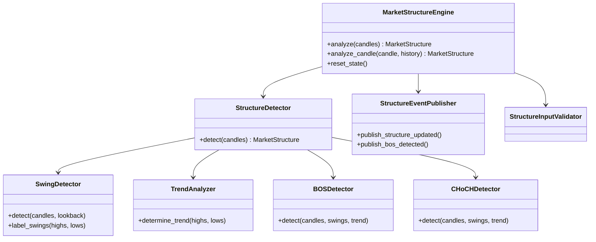

# Market Structure Engine — Architecture

**Engine ID:** `market_structure`  
**Module:** `backend/engines/market_structure/`  
**Sprint:** 2  
**Input:** `NormalizedCandle` (Market Data Engine)  
**Output:** `MarketStructure`

---

## Folder Structure

```
backend/engines/market_structure/
├── __init__.py       # Public exports
├── README.md
├── engine.py         # MarketStructureEngine orchestrator
├── config.py         # MarketStructureConfig
├── schemas.py        # MarketStructure, SwingPoint, events
├── exceptions.py     # MSE_* errors
├── validator.py      # Input candle validation
├── swings.py         # SwingDetector
├── trend.py          # TrendAnalyzer
├── bos.py            # BOSDetector
├── choch.py          # CHoCHDetector
├── detector.py       # StructureDetector orchestrator
├── events.py         # StructureAnalysisEvent envelope
└── publisher.py      # StructureEventPublisher
```

---

## Components

| Module | Class | Responsibility |
|--------|-------|----------------|
| `engine.py` | `MarketStructureEngine` | Public API, state, event emission |
| `detector.py` | `StructureDetector` | Orchestrates full analysis pipeline |
| `swings.py` | `SwingDetector` | Fractal swing high/low detection |
| `trend.py` | `TrendAnalyzer` | HH/HL/LH/LL trend classification |
| `bos.py` | `BOSDetector` | Break of Structure |
| `choch.py` | `CHoCHDetector` | Change of Character |
| `validator.py` | `StructureInputValidator` | Input validation |
| `publisher.py` | `StructureEventPublisher` | Contract event publishing |

---

## Class Diagram



---

## Analysis Flow

```
NormalizedCandle[]
        │
        ▼
StructureInputValidator.validate_or_raise()
        │
        ▼
StructureDetector.detect()
  ├── SwingDetector (internal lookback)
  ├── SwingDetector (external lookback)
  ├── SwingDetector (primary lookback)
  ├── label_swings → HH, HL, LH, LL
  ├── TrendAnalyzer → bullish/bearish/range/undetermined
  ├── BOSDetector
  ├── CHoCHDetector
  └── build MarketStructure + StructureEvents
        │
        ▼
StructureEventPublisher (SwingDetected, BOS, CHoCH, TrendChanged, StructureUpdated)
        │
        ▼
MarketStructure returned
```

---

## Internal vs External Structure

| Layer | Lookback | Purpose |
|-------|----------|---------|
| Internal | `internal_swing_lookback` (default 2) | Minor swings within a leg |
| External | `external_swing_lookback` (default 5) | Major structure swings |
| Primary | `swing_lookback` (default 5) | Main analysis swings |

Each layer produces its own `StructureState` with trend and last swings.

---

## Dependency Rules

- **Imports allowed:** `backend.engines.market_data.NormalizedCandle` (public API)
- **Imports prohibited:** Liquidity, Smart Money, Decision, Risk engines
- **Sprint 1 untouched:** No modifications to `backend/engines/market_data/`

---

## Smart Money Concepts Scope (Sprint 2)

| In Scope | Out of Scope |
|----------|--------------|
| Swing highs/lows | Liquidity pools |
| HH, HL, LH, LL | Order blocks |
| BOS | Fair value gaps |
| CHoCH | Entries / signals |
| Trend classification | Risk / position sizing |
